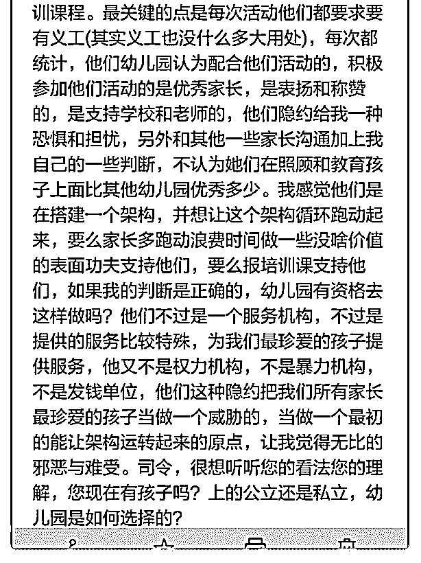

# 司令您好，太长了只

(提问)匿名用户 : 司令您好，太长了只能截图发过去。

2019-01-24

回答：结构学的结构力量你还是理解了。不管是商业还是政

治。要形成内在约束力的，肯定是搭建起一个结构，通过几

个内部的制约力量将能驱动起来。 总的来说，这里是个流量

变现的问题。小孩就是流量的入口，附属其上的各种变相方

式就如同薅羊毛一样。你们家长就是那只羊！ 商业讲究商业

模式，所谓商业模式，其实就是搭建一个交易结构。然后让

身处其中的各要素在结构力量的裹挟之下能够自动跑起来。

这里面有两个相互嵌套的结构，对于家长而言，对方握有了

关键要素。你猜错了，不是小孩，是家长的恐惧之心。赌你

一定会妥协。因为裹挟你的不仅仅是你，对小孩都无法割

舍，还有其他家长行为对你的制约。 总的来说他们那个组织

自上而下是一个统治结构。末端的执行者只是上面商业策略

的传导节点——就是你所能接触的人，其实没有决定权。但

是会利用你对他的信任进行捆绑，因为她是距离你的小孩最

近的人。也是你与那个整个体系打交道时唯一能接触到的

人。你会害怕他对你的小孩不上心或者不好。从而被迫接受

她所执行的各项商业变现要求——她们有 KPI 考核的。 如果

你追踪溯源的话，你就会明白整个体系是怎么搭建和运转

的，以及身处其中的人又是怎么被驱赶的。首先它作为一个

商业机构。在资本市场上，每一个季度甚至每个月的财报都

需要公示，都需要受到大股东的质疑，都需要受到股民的审

视。无论是大股东还是二级市场上的股民。大家都希望股票

涨，因为股票上涨自己才能获利。但是这些人与最末端的家

长们是相距很远的，感受不到——无论家长还是小孩，在报

表上都是一个数字，人对冰冷的数字而言是不会有什么同理

心的。所以这个第一驱动力就是非理性的而且欲壑难填。一

个企业股票的上涨不仅仅靠资本市场的情绪。主要还得靠业

绩，有了业绩才好讲故事，才能调动情绪和资金。这就决定 了资本资产的每一个参与主体在其实这这个企业必须不断获 取他所预期的 KPI，这样才有利于自己的利益。 企业的经营 者为了达到这个目的，一定会驱使它整个机构去加快变现的 步伐。因为如此一来才有利于自己的利益。组织本身就是他 搭建的一个统治结构。这里面有共识要传导机制，有激励机 制，有判断行为的依据，这些都是结构力量的关键支点。在 些关键这点形成了一种内部的裹挟和制约。运作组织的人， 就像草原上驱赶成千上万匹马的马倌，通过对这些约束条件 的调节驱使着整个组织向着预期的方向加速前进。 大家都是 被相互制约的力量裹挟着。被关键节点所形成的相互制约挤 压着。在固定的轨迹里面沿着驱赶的力度拼命奔跑。这是任 何组织运作的机理。高明的领导者，善于搭建这样的结构， 也善于调节这些约束条件来达驱使整个组织的目标。 所以他 那个结构的末端人员是身不由己的。资本市场人的贪婪会驱 使着他们整个组织，而组织的结构力量会驱使所有末端人 员。这些人员为了变现会用尽一切的方式去薅羊毛。他们与 你们之间是一个交易结构，不是一个统治结构。交易结构的 特点是交易可以随时撤销，这个交易之中的关键资源就是你 的恐惧。唯一能裹挟你的力量，也是你内心的恐惧。你担心 自己的小孩被差别对待，你担心得罪了老师，你担心自己的 行为与其他的家长格格不入——你内心的这种担心被人所利 用成为持续薅羊毛的基础。 看清楚了这个运作机制以后。你 就知道自己的选择和别人的选择。你就知道自己和别人被什 么东西所驱使和制约。消费有其层级，一个层级的品牌对应 一个成绩的消费群体。这个商业模式能够持续的跑通，说明 参与其中的每个要素都经过充分的揣摩和研究。知道各参与 者要什么和怕什么，从而对其行为进行预判——换句话说， 你还没有入套之前就已经设计好了要怎么去引诱和筛选以及 怎么薅。 其实那种政府背景的公立幼儿园会更好。因为那些 老师有编制，没有 KPI。所以他们能够更专注于教育本身，而 不是挣钱。为了验证我的判断，我特别找了一个家长去问。

她是一个做贸易的母亲，根据她的反馈判断是正确的。他有 两个小孩，老大以前在私立幼儿园，老二在公立的机关幼儿 园。他说老二的教育要好得多人也从容自信一些。 当然私立 幼儿园也有更好的。一分钱一分货吧。在那种收费更高的品 牌上面，他们的利润是有保障的，他的组织也就不会那样明 显的驱使它的末端人员——而且这种不驱使反而有利于那个 消费层次的品牌形象。 我说句不太好听的吧。或许你提升品 牌区间或者降低品牌选择，这种情况都会有所改善。你选择 的品牌区间，恰好是那种所谓价廉物美又契合某个群体内心 诉求的品牌...(16 赞)

评论区：

妖娆关公 : 前两天刚选了一个幼儿园。交完钱后充分接触感觉就是司令最后一段说的。正好选了一个有噱头又根本不会有

利润保障从而服务不会真正太好的幼儿园。但签了合同，钱不能退了。昨天又火速去公立幼儿园交了 200 押金占了一个明年

九月份的名额，到时候可以至少有两个选择。

