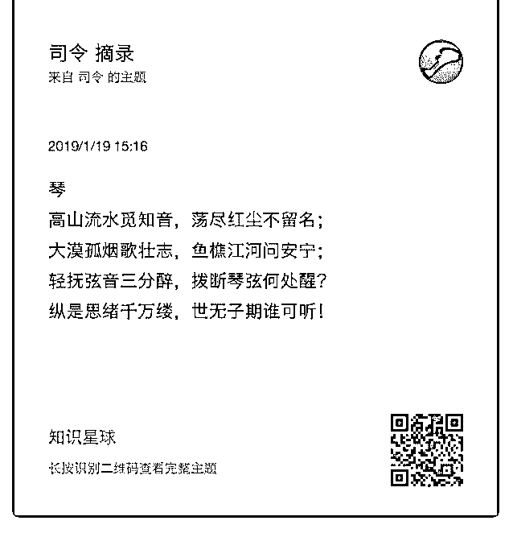
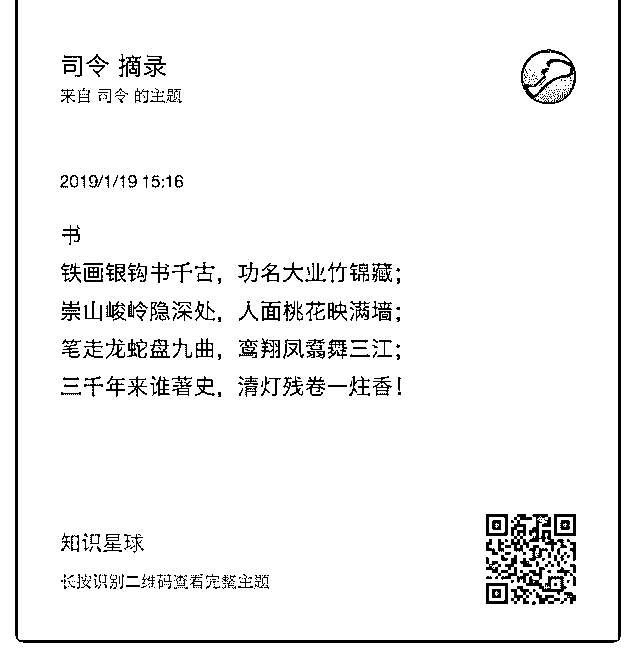
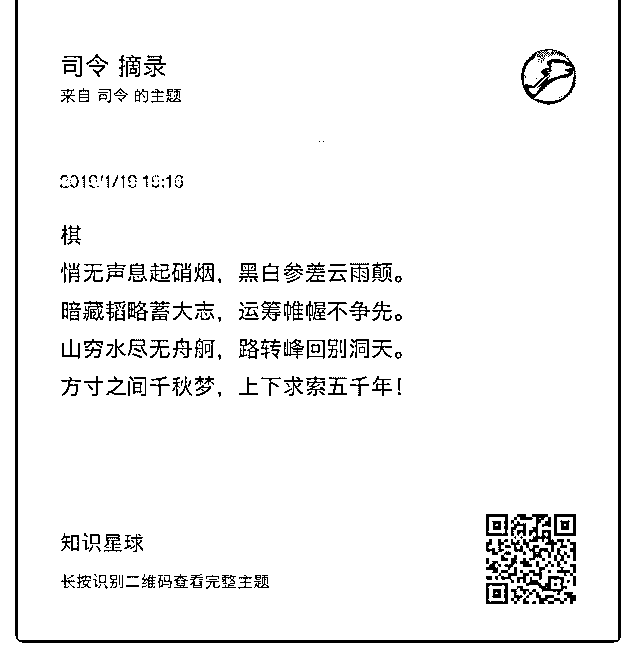
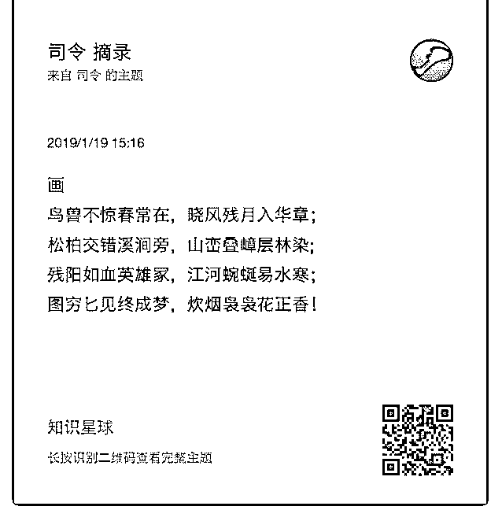

# 琴棋书画老夫今日就

老夫今日就文艺一把，赋诗以歌之！

2019-01-22(27 赞)

评论区：

司令 : 或许结构学研究的现实问题都很残酷，但我内心还是很纯净的——心底如果缺乏人文底蕴和信仰般的简洁，一旦修

炼屠龙之技，就很容易偏离正轨——魔戒是有力量，但也会反噬！[调皮]

F : 老夫[偷笑]

王布斯 : 司令这文采 李白也得害怕三分[呲牙]

白马非马 : [捂脸]司令有一颗赤子之心，蛮可爱的！

徐天护 : 宁弃数子，勿失一先。司令何故不争先？

罄 : 前路崎岖，布满荆轲。四周猎人捕羊，领头羊本是狼，螳螂捕蝉黄雀在后，尽是丛林本色！前人打上了记号，给与警

示信号。可惜狼羊猎人都有各自宿命！ 记号在那，识得者自会谨记！同类人自会分辨而无需记号。落叶纷纷冬去春来，好

一场春夏秋冬！

司令 : 方寸之间的争夺，制造出太多的春秋大梦！既然需要上下求索 5000 年，又何必争一时之先。棋盘的奥妙，不在其表，

而在其里。围棋是唯一不需要遮掩，但依然看不清楚的策略游戏。

Yavinpa : 一阴一阳，一柔一刚，大和！

