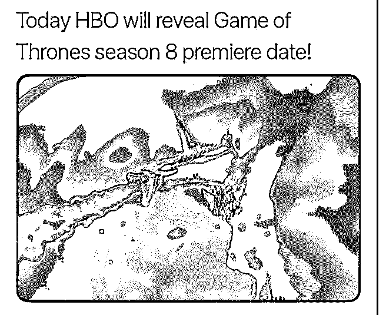

# 长夜将至，我从此刻

司令 : 长夜将至，我从此刻开始守望，至死方休。我将不娶 妻，不封地，不生子。我将不戴宝冠，不争荣宠。我将尽忠 职守，生死于斯。我是黑暗中的利剑，长城上的守卫，抵御 寒冷的烈焰，破晓时分的光线，唤醒眠者的号角，守护王国 的坚盾。我将生命与荣耀献给守夜人，今夜如此，夜夜皆 然！

2019-01-15(18 赞)

评论区：

John Smith : 第八季终于来了

冥宙 : 等死了[呲牙]

罄 : 这是你的理想？

bfhrhd : Winter is coming!

白马非马 : [发呆][发呆][流汗]珍重。

核桃里的君王 : 不死人统治世界将会是什么样的社会结构啊

司令 : 和现在一样

热咖啡 M : 又不说人话了[惊讶]

