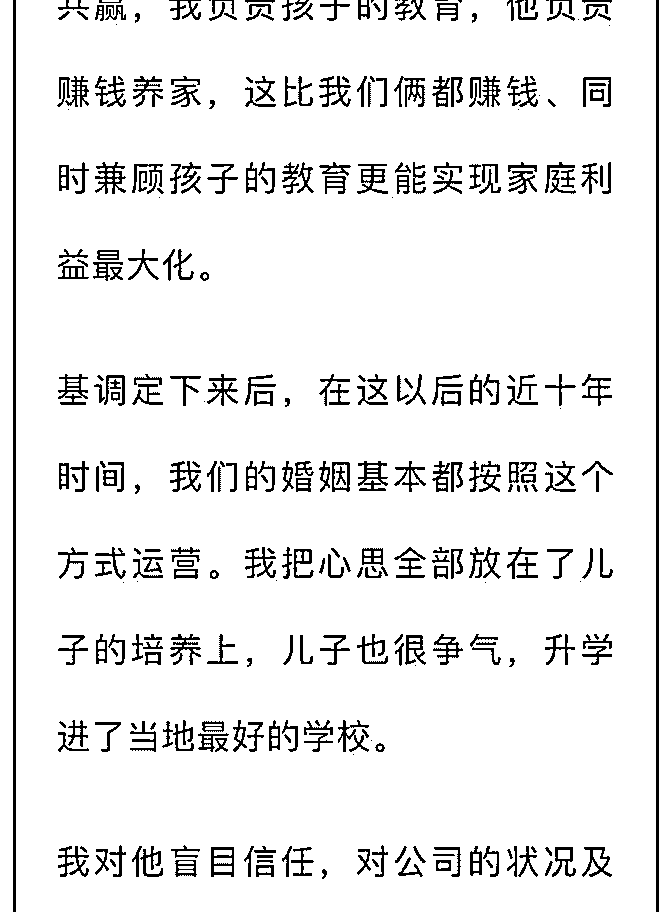

# 图片概括一下就是文

(提问)匿名用户 : 图片概括一下就是文中男人给老婆儿子留了 债务，给兄弟父母留了财产，底下网友纷纷留言身边类似的 事情。存在总有合理性，但我还是不太理解，司令能分析一 下吗…

2019-01-15

回答：这就是一个针对某个受众的心理需求写的小说。非常

不幸的是，你就是那个受众之一！这个受众是担心嫁给农村

凤凰男的城市女性，如果要改成男性版本的话，应该是一个

出生在城市的女生，对自己的父母，特别是母亲，竟尽一切

的侮辱，他母亲忍辱负重，在临终之前他才知道这种真相，

原来他的妻子对他的父母是如此的不堪。然后他的三观全部

颠覆了，相信的东西全部坍塌了。这种情绪正是目标受众所

想要的... 然后会分成两个阵营，不停的撕！各自从自我想象

的立场上，发泄心中的怨恨和恐惧... 更抱歉的是：我不想入

套，因为我没有这样的心理需求，更不想被人操控... A23 中有

这样一段：他们平常能触及的一切或许是设计出来的幻境。

社会分工密度越高的社会对人的渗透就越强，人会越来越容

易被操控——不衣食住行，时间的使用，甚至是情绪都被渗

透，喜怒哀乐都随着节奏起伏，由内而外被设计好的洪流裹

挟着，生活在分层隔离的幻觉之中——越没有自我的人，越

失去自我。(12 赞)

评论区：

王布斯 : 司令牛逼

王布斯 : 司令牛逼

小跃 : 哈哈哈

