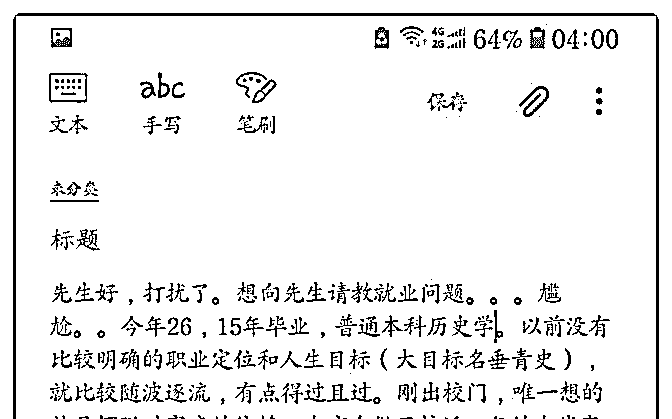
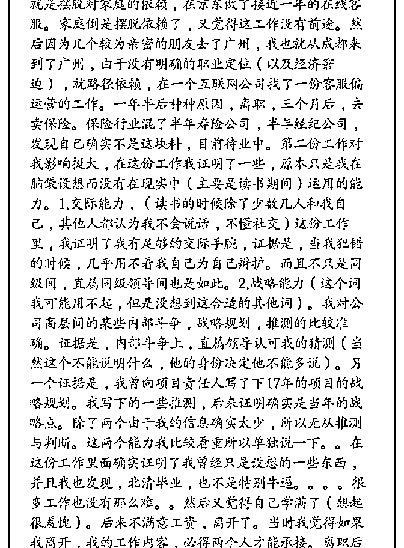
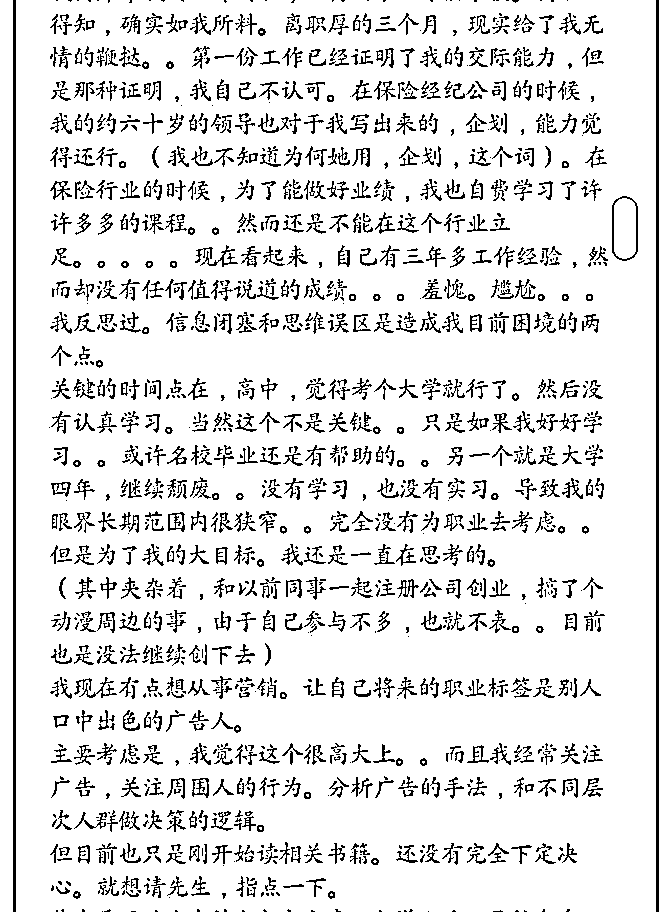
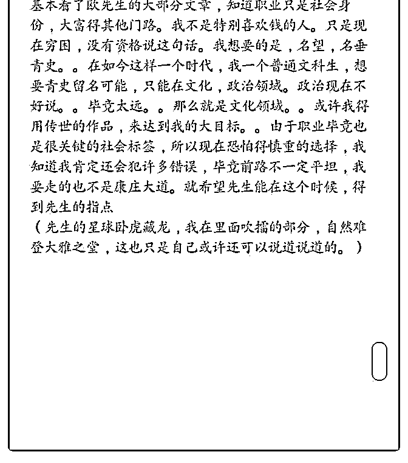

# 先生好，还请先生指

(提问)罗成 : 先生好，还请先生指点下，就业。

2019-01-14

回答：指点谈不上。你都说完了，让我说什么呢 年少轻狂

的时候都想改变世界，这很正常。我最开始创立公司的时

候，也是为了梦想。但是我后面创立公司的时候，就是为了

把它出手。没有退出机制的投资，就不再投资。甚至先想好

怎么退出，然后再开始。至于这个退出的点是时间显得长还

是短，要看自己的判断。这里面跟梦想无关，就是看到了一

个机会去验证自己的判断顺便挣点钱。我并不认为从此就变

得俗了，恰恰是成熟了！ 你表现出两种极端的冲突。你总是

想做大事，天大的事，但这种大事往往又没有具体的着落

点。另一方面，你又在现实的非常小的事情上没有聚焦，看

起来就是一种找不到出口的挥霍。 名留青史，在教科书上写

上半页。我想这是很多年轻人的梦想吧。我无意嘲笑那些年

轻的梦想，就如同我无意嘲笑校园里面的爱情一样。它是人

生阶段的产物，有其独特的美妙。但是我从你的描述中看出

了一个危险的东西。一个严重缺失的自我！如果以虚荣为目

标，他必毁于虚荣。为了虚荣，可以践踏一切规则，甚至扭

曲事实。因为这虚荣是为了满足内心的缺失。真正的梦想如

同静水深流，不浮于表面。那些从底下往上逆袭连破几级直

至登顶的人。他的志向从来就不是为了满足个人的私欲和成

就个人的虚荣或者弥补个人内心的缺失。因为这么做的人其

实存在一个潜台词：自己是世界的中心，其他人都是众星拱

月的草芥，这不仅仅是一种危险的人格，还是一种极度虚弱

的表现。你太在意，急于出头是为了掩饰，甚至会以手段为

目的。修身齐家治国平天下，这个顺序不能错！ 我大学的时

候有一个同学，我向他推荐了三本书：道德经、孙子兵法、

韩非子。我告诉他读书的顺序是我推荐的顺序。结果他先读

韩非子，翻了翻孙子兵法觉得没意思，道德经他就觉得更没

意思了。他是马基维利亚主义者，这是个很多机会，至今也 困在自己的欲望中不可自拔。自视甚高，急于一步登天，做 事又没有耐心，短视和冲动。这是一种必然的循环。你要建 高塔必须要有很深厚的基础。基座不深厚，急于立高塔，一 定会倒塌。 你还年轻，有的是时间去尝试。具体的业务方 面。自己去尝试就好。所以这个状态中的你，很容易去尝试 事情，也很容易去整体放弃。此时此刻规划对你而言没有意 义，特别是一个外人提出的规划。我想说的核心是：问题的 根源在你心里。你的内心如果能够像午后的阳光一样充盈而 饱满，干什么事情都可以。否则你的一切都是在弥补内心的 缺失，那种极度自我质疑和极度自我膨胀的患得患失。(18 赞)

评论区：

小披风 : 一针见血！

罄 : 就没看韩非子，看的荀子！

罄 : 以前觉得荀子牛啊！ 后来发现老子早就看穿看透了！比荀子他们高几个档次！

张志刚 : 题主小说和连续剧看多了，真正名留青史的人在年轻的时候不会想这么多的。不妨定个年度小目标，从小胜中积

累信心！

康师傅 : 年轻人这种迷茫的心态，被现实无情的打上几巴掌后就踏实了！

问候林 : 这……我真的服了司令！心地善良

TK : 我也那么觉得

TK : 题主是不是其实也并不是想做广告营销，应该还在迷茫，有可能是对哪个行业都不了解，类似那种见一个爱一个的状

态。要不还是现实点，哪个行业能让自己吃饱饭，又不是特别讨厌的，先进去吃饱饭养活自己再说！一般有理想有抱负的

人总会挨饿一段时间，也可能就这样泯然众人

