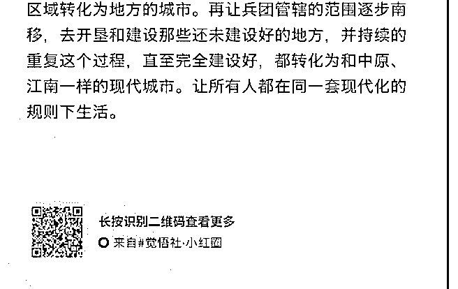

# 一篇猛的，我把一个

司令 : 一篇猛的，我把一个预测放这里：一定会强化兵团。

2019-01-10(22 赞)

评论区：

John Smith : 隔离是不行的，只有同化!

霹里啪啦 : 司令，如果你的预测是对的，但是决策者如果做错，你的预判不就做错了吗？ 会不会出现就像石原莞尔看准

了，但是不会那样做

莱士凶凶 : 决策者连这点水平都没有天国早就瓦解了

司令 : 既然叫预测，我相信他们不但看得到，而且会这么做！

徐天护 : 强悍！看得颤抖！[呲牙]

莱士凶凶 : 而且司令做的就是推测决策者的决策

茴茴 : 以前在兵团在驻扎过一段时间，兵团日益萎缩没落是事实，这两年天朝已经开始在拯救了，向甘肃贫农抛橄榄枝，

只要拖家带口落户，成为兵团一员，定期集训，就送耕地送院子送家具包装修，还有安家费。

司令 : 真的开始了吗？太好了！

