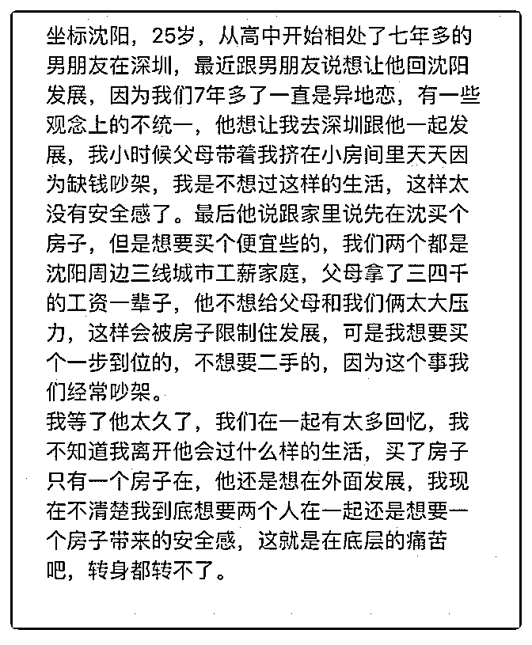

# 司令您好，我们应该

(提问)匿名用户 : 司令您好，我们应该如何破局。

2019-01-10

回答：这跟底层不底层没有关系。没有人天生就拥有什么！

想要是目标，怎么样去要到，就是实施的策略。在任何生活

结构之中，要实行正确的策略。必须要对生存结构和自己的

状况有清晰的认识。我从来不关心应该如何如何。我只关心

它正在如何如何。你必须首先要看清楚他正在如何如何才可

能制定务实的策略去破局。 你的心中有一个恐惧：没有面对

用位置的勇气。你需要安全感。你的安全感，其实你已经表

述清楚了：在你熟悉的地方，有一个达到你要求的新房子，

并且有一个让你感觉到安心的人自愿的陪伴——这就是你想

要的安全感具象化的指标。 接下来你看一下你处于一个什么

样的生存环境之中： 1\. 父母的积蓄不多，还要预防未来不确

定的各种开销，比如说生病之类。 2\. 男朋友觉得沈阳没什么

机会，想在深圳为未来打拼，不会安分守己在沈阳陪伴。 3.

你的内心不是放不下过去的感情，是你没有勇气再花好多年

的时间去建立一种让你安心和信任的关系。 4\. 无论是你还是

他都无法立刻挣到一大笔钱。 如果你对照一下，你发现每一

项都不符合。每一点都充满悖论。你要在悖论之中求得最好

的结果，但你不想改变约束条件，也不想做妥协和放弃。这

必然在心中形成焦虑和冲突！你如果把自己内心的那种安全

感的诉求把它具体量化之后，应该是这样的水准：一个能够

长期待在你熟悉的地方并给你充分的陪伴，不会感到窘迫，

让生活过得小资和惬意。这样的人需要有自己的事业，自

信，成熟，具有包容性。能够一次性买一套大的新房子，位

置不要太偏，旁边的配套要比较好，包括医院和幼儿园。因

为过于窘迫的东西会给你造成压力，激发你的不安全感。 这

样的人在你生活的圈子里占多大的比例？他们会在什么样的

地方出现？会喜欢什么样的人？你可以为他的生活和事业做

什么？你有没有哪一个特别的点满足他们内心的缺失？嗯， 在你的圈子里面有多少个和你这样的候选者? 你们有这样的人 的比例是多少？你觉得你在这么多挑战者中胜出的概率是多 少? 如果失败了，你在青春和心态上能承受到什么程度？你好 好想想吧，这些都是可以量化的选择题。 说一句不太好听 的。你的内心的恐惧在驱使着你，为了掩盖那个恐惧，你设 置了一堆的硬性约束条件。这些约束条件与当前所处的现实 格格不入。然而，在诉求和现实的困局之中，你并没有把自 己的投入方式和力度计算到这个破局的力量之中。你希望有 一个外力来帮你破局。但据我所知，所有的力量都发端于自 己，外部的一切不过是力量传导可以借用的工具！归根结 底，你的内心不相信自己能改变什么，你也不愿意做出牺 牲！ 如果内心的恐惧不能被摘除，你就必须要用外面所有的 硬性条件作为盔甲去掩护。这个破局点在心里。只有摘除这 个恐惧，相信自己想要的生活状态，是可以通过自己的努力 去争取到的。并愿意为此去承担风险和付出代价。那么很多 东西的策略就可以变得灵活。就拿房子来说吧，可以先用小 的，再换大的。可以先用二手的，再换新的。可以先用偏远 的，再换中心的。这些通通都只是策略。知道自己要的目标 就好。有了目标才有策略，有了策略才可以以小博大，并最 终实现目标。 弱首先是一种心态，然后才变成一种状态。弱 者咯首先就在自己心里！正因为心里面那个决定性的力量是 弱的。所以就会有意无意的让自己陷入充满悖论的漩涡。然 后在情绪的怂恿下动弹不得一筹莫展。最后仅剩的那点力量 都被内在的冲突不定的消耗殆尽，直至绝望。最后陷入愤 怒、偏执和恐惧的死循环...(25 赞)

评论区：

白马非马 : 感觉题主想要的太多了，又渴望先往后撤的人是男朋友。主要是两个人观念不合，一个渴望现世安稳轻轻松

松，一个有更长远的目标未来无限可能。不是很合适了。

罄 : 底层不是金钱的多少 昏迷呀！及时你有千万一样啊！

罄 : 我到觉得男友不错！非常好了！

白马非马 : 我也觉得，七年异地恋也没出啥幺蛾子，还为了题主做出妥协，可是题主一点让步都不肯做出，空拿“七年感

情”说事，无解。

Tiny : 实话实说，找个有钱人，你言语中既透露不想出去吃拼搏的苦，又想享一步到位的福，破局就是找个可以满足你物质

的人，你男友目前是不可能提供。问直白点：其实你已经想过分手，但是有点犹豫对吧？

王布斯 : 女生内心不坚定 没目标 也不愿意吃苦 喜欢依靠男人 还很贪婪 鉴定完毕

罄 : 他男友的行为非常优秀，她自己确不知道！说句不好听的，她配不上他，并且还在拖累他！他男友已经支付了代价，

她还在嫌弃，说要不是不年轻了懒得纠结呢！找不到更好的，只有这个备胎，司令怎么办啊？

罄 : 我有时候都理解为什么有 pua 这么弱智的东西了，因为需要啊，别人提供的梦之服务。梦嘛！当然价格代价高了！

