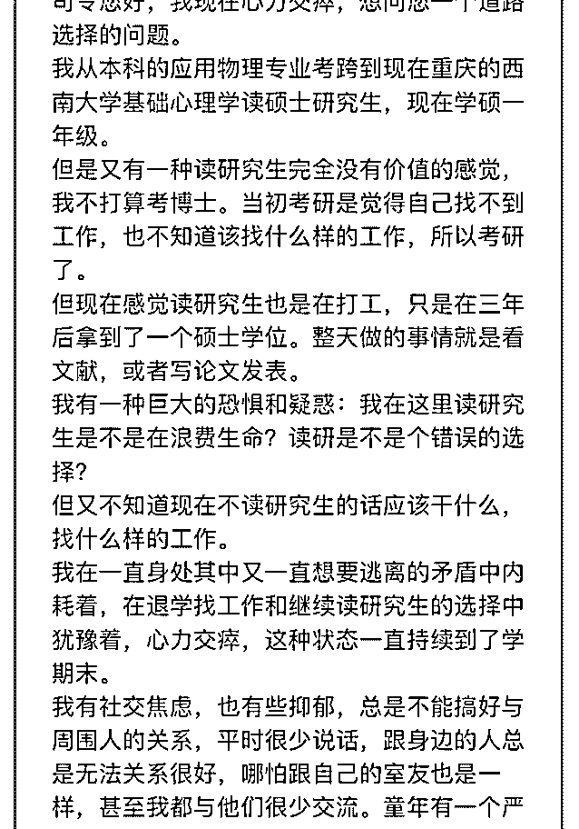
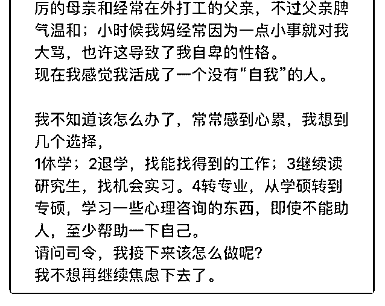

# 司令，不好意思我的

(提问)1459 : 司令，不好意思我的问题太长所以用图片发出来 了。提问的付费我在您置顶的主题下通过赞赏转给您了。 期待您的回复。

2019-01-09

回答：你还没疯，你的行文逻辑还是清晰的——这是能继续

对话下去的前提！ 我首先看到的是逃避，然后我看到的是想

再次逃避。 这个事情的关键不是你读什么专业。这个事情唯

一的关键就是你自己。问题在你心里。只要你心里的刺没有

摘掉。你还会继续在任何事事情上逃避，你总是能找到说服

自己的理由！ 我曾经去观察那种不停的在公司里面传播负面

情绪，并事事都抱怨的人。我发现有一个共同的特征：他们

无法胜任自己的工作。外部环境给他们太多无所适从的压

力。同时他们很害怕失去现有的。你会发现这是一个悖论，

但现实生活中很多人就是这样子的。它是一种掩饰，出于向

自己证明的目的。证明什么呢？证明自己的价值。你很奇

怪，为什么通过这种破坏性的方式去证明自己的价值？这种

将自己置于危险边缘的方式，就如同用锥子刺自己来提醒自

己还活着是一样的道理。其实内心时时刻刻处于恐惧之中，

总有一种声音在提醒她，她将要失去现在拥有的，总是有一

种声音在提醒她，她不配拥有。他为了抵消这种恐惧，就会

用一种你看起来很奇怪也充满矛盾的方式。将自己置身于一

种危险的边缘。如果这样都还没有失去。这就可以抵消内心

的那种恐惧。然而他需要不停的确认这一点，所以会不停的

挑战极限。直到真的失去了！一旦真的坐实了他内心一直恐

惧的东西。又会陷入懊悔和更大的恐惧之中，他的内心会坚

定的认为：原来一直担心的果然就是事实！原来自己真的不

配。这会强化它的自卑，恐慌和绝望。 一个人要逃避的时

候，会改变筛选外部信息的方式。他会把某一个细节放大到

很大很大。比如公司规定早上九点到办公室，那天早上碰巧

下雨刮风。她赶到办公室的时候，全身淋湿了。它就会把这 一点放大的很大，觉得这样的生活没有意义，付出和收益太 不成比例了，自己为此牺牲太多，这不是他要的生活！然后 就会去找公司的各种问题。把其他同事随口的一句抱怨作为 一种强有力的信号，认定公司就要崩溃了，人心全散了。既 然说服自己放弃，而且让自己相信，不是因为自己无法胜 任，而是船要沉了，大家都四处逃命，自己是迫不得已，仁 至义尽了。看见没有，逃避者一定要去找一个道德高地。这 样她才心安，才能抵消他内心对自我的质疑！ 你的问题首先 是对自己的绝望。你认为这个绝望的原点来自于你母亲。我 相信有这个可能。一个强势的母亲，如果缺乏足够的人文底 蕴，就会造成一个游离的父亲。然后训练出一个文弱、敏 感，甚至带点阴柔的儿子。你的恐惧强化了你的自我封闭， 自我封闭又强化了上面所有的特征，这是一个坠入深渊的恶 性循环。你的父亲没有给你一种简单的力量去打破它，你陷 在里面不可自拔。你需要力量的训练！在身体和精神上增强 自己的力量，然后打破封闭！ 拔刺很难，但是不拔出来，你 无论做什么，那个底色都是黑暗的。用最原始的力量去打破 它。你可以先做体育训练这种最原始的力量可以增强你的力 量感。然后建议你去听一些比如说类似交响乐这个东西。再 读一些宏大和厚重主题的传记。不要陷在小情绪里面，要有 大情怀。再交一些有力量感的朋友。哪怕是篮球打得好也 行，英语学得好的也行。就是那种有力量感的人。学会在阳 光下奔跑。学会开怀大笑。不要隐藏在角落里面瑟瑟发抖... 以斗争的姿态面对每一天的生活。(29 赞)

评论区：

康师傅 : 从一些生活中容易独立完成的小事做起，一次树立一个小目标，完成之后会大大增加你的自信！

晒太阳的海豹 : 嗯，一步一步建立起男人的自信心。

徐天护 : 司令的回答很值钱，能拯救一帮人吧。 我中学时候是个十足的愤青，在自己的情绪世界里打转。到西安上大学

后，开始疯狂运动，四处古墓探险，到戈壁沙漠旅行，甚至裸奔了一次……嘿，从此，心境大开，阴郁退散，对自我和对

他人都更加从容了。 如果心理上解决不了，就从肉体上先开始吧。跑步，运动，多巴胺会让你快乐阳光起来。

1459 : 谢谢

1459 : 谢谢

1459 : 谢谢司令

Rosebud : 谢谢司令，对我们也很有用

大山 : 哇偶 裸奔

