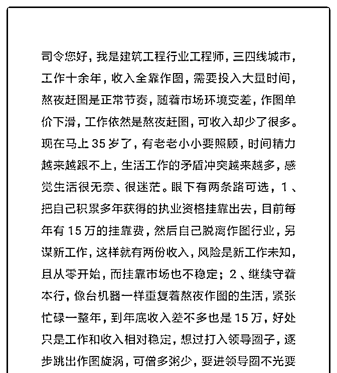
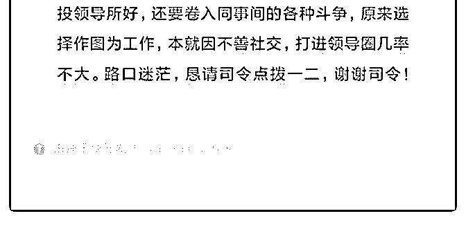

# 路口迷茫，恳请司令

(提问)匿名用户 : 路口迷茫，恳请司令点拨一二，谢谢司令！

2019-01-03

回答：生产型的单位，在整个业务流程中，是隐藏在背后

的。它的好处是不需要跟最终客户的需求挂钩，只专注于自

己的标准化专业输出。无论是设计稿还是工厂生产的产品，

都是如此。 我们一直有一种错误的思维，认为业务人员是在

把自己生产的东西贩卖给最终用户。所谓市场营销，不就是

用各种手段把有需求的人找出来。这个观念流行了 100 年，它

起源于工业革命时期。因为那个时候生产是瓶颈，谁能生产

出来就供不应求。这一点在上世纪 80 年代也表现的非常突

出，特别是家电进入千家万户的时候。因为人群具有从众心

理，只要消费能力够得上的时候，那种需求就像核聚变一样

扩散开来。而生产就变成了瓶颈！所以 90 年代的倒爷也好，

做渠道的也好，都发了大财。 如果你把改革开放 40 年分两个

阶段来看的话，前 20 年是乡镇企业能够满足一部分国内需

求，再加上贸易商，把国外的东西引入国内，以满足大家的

需求。后 20 年主要是，本土企业崛起以后的商品出口。贸易

开始转化为外向型的，跨国公司的衰落和中国企业和个人走

出国门的兴起。这种此消彼长中蕴含的是周期的轮替。我们

很多人所做的生意就在这样的波涛之中。哪怕这不是你的生

意，就是你求存的方式，也是随着这样的周期起伏。你是绝

大多数人没有察觉，因为没有那样的视野！ 现在回到你的事

情：这 20 年城市化进程加速，基础设施投资烈火烹油。这一

点你去查徐工集团和三一重工的财报就看得出来。在这样的

周期之中，它必然造成了这个行业及上下游的兴旺。绝大多

数的人对行业的选择往往具有盲目跟随的特征，同时也具有

滞后性。 一个需求的兴起，便造成从业人员的暴涨。在整个

链条之中，越靠近后端的人员对市场需求的反应越滞后。你

会发现你付出的越多，收益的越少。这不仅仅是你个人的感

受，这是所有这个模型中这个角色的感受。你去问问那些生 产加工型企业的老板。他们的业务越做越多，利润越来越 薄，成本越来越高。为什么一搞环保啊，各种查税呀，他们 就得破产。因为它们的利润率已经逐渐压到生死存亡的边缘 了。市场前端需求的变化一定会往后端逐级压缩。 你现在感 觉到了痛处，试图改变这个局面。但是你现在困惑和没有想 清楚的是：你采取的所有策略的目的到底是什么？比如你提 出了两个方案，一个是把资质挂靠出去，另外一个是混入领 导层的圈子。有非常明确的导向吗？我看没有。你就像一个 碰运气和可能改变的心态。如果目标不清晰，行动肯定是絮 乱的。这是绝大多数人的特征。忽左忽右，忽前忽后。完全 受当时的情况和情绪所影响，最后一地鸡毛。 优雅的进攻或 者防守，都是深思熟虑以后，没有任何废动作。每一个行为 都直指核心目标。目前你没有核心目标！当你没有核心目标 的时候，你不知道把你的有限资源往哪里配置，所以你满心 的狐疑。你觉得哪里都该抓一下，又哪里都不那么确定，看 看自己手上就这么三瓜两枣的，就越发的犹豫和纠结！ 好， 我们抛开所有表层的装饰，就看一下最核心的东西是什么。 核心的东西是求存！求存的方式是做业务。要做业务，你把 这个业务的链条铺开来看。看你有哪一段，缺哪一段，去找 人合作把那些缺的地方补上！ 我说的更具体一点吧。你画图 是为公司画图，对么? 公司能够画图，是因为第一有资质，第 二有人能够把客户的需求找来。那这个市场上存不存在有资 质，但没有其他的单位。绝对存在。这个市场存不存在那种 跟客户非常近了解客户需求，但是如果你能把它补齐后面的 东西，他就可以把这个业务做了的人。大把存在！那些开拓 业务的人，就是这样的人。如果以这个目标去找合作者，这 个范围是不是可以扩充到很大的范围？只要能够转化成一 单，你是不是可以找到大量作图的人，组成一个专业的团 队？这样你就变成了这个生产的管理者。那个有资质的人只 需要他提供资质就行了，什么都不用他干，他可以分红。接 下来就是那个开拓业务的人。这样的人有很多，对他们而言

只要把业务找过来，后面的事情就全部能转化了。他又何乐 不为呢？那么这盘棋是不就活了呀？坐井观天看到的肯定永 远就这么大。你得把自己嵌入到一种结构之中去。如果这个 结构不存在，就要搭建它。(26 赞)

评论区：

星星 : 赶紧打赏[愉快]

王梦梦，怡人 : 战略顺序是宏观分析、行业分析、最后才是自己分析。上来就只分析自己手头上的牌是有点一叶障目了。

