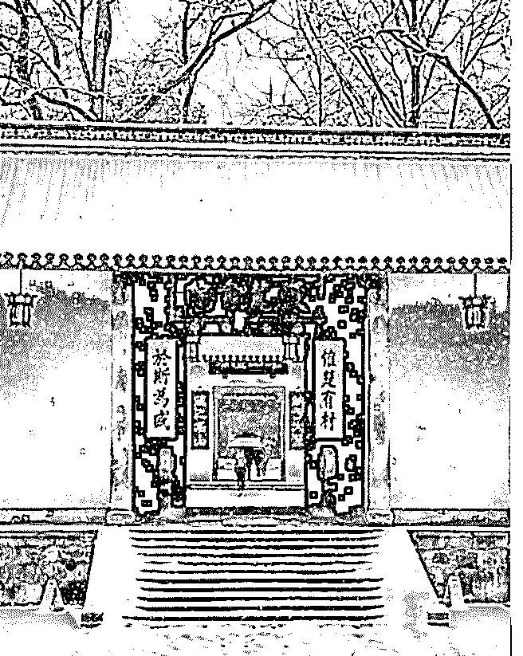

# 大家新年好！此时此

司令 : 大家新年好！

此时此刻已正式进入 2019 年。2019 年会是一个充满挑战的年 份。我们正是在各种挑战中变得更加的强大，更加的睿智， 更加的淡定——成长就是一个把哭闹调到静音的过程。没有 人回望过去的时候不觉得以前的自己很傻逼。正因为如此， 我们才感受到实实在在的成长。很多东西不是想要就能要的 到，首先自己得配得上——这也是为什么必须自我修炼的原 因。

四个多月前，一个机缘巧合，我为一个二级市场做投资的朋 友写了一篇预判贸易战是否会发生的文章被转发出去引来了 很多人，从此一发不可收拾，需要每天花点时间来输出内 容。黄河 提议我注册一个知识星球，我就注册了 守夜人总司 令 这个知识星球。当我没与这个世界去沟通的时候，我是 我；当我用这些文字与这个世界沟通以后，我依然是我。我 写的实践总结和观察研究不管有没用，对我而言，它目前就 是零散的手稿。如果碰巧还对你有点用，那就是额外的价值 了！

我无意向谁传播什么，更无意说服任何人接受我的东西。结 构学是一种社会应用之学——我认为这个世界不管多么的繁 杂，归根结底都是生命体在其生存结构中，为自我存续所采 取的各种策略。个体的精神结构决定了每个生命体都对外部 世界进行了筛选和抽象，并活在自己的抽象之中。由个体组 成的群体，也就是更大的生命体。个体精神结构中的共识部 分形成了整个生命体的意识形态，从而确定整体的立场—— 文化天然有其自我遮蔽性，正源于此！

当生命体处于某种立场之中，不管是浑然不觉，还是被相互 约束裹挟着，其行为轨迹和思维方式都必然在这种内在制约 的束缚下沿着某种轨迹前行... 人所有的智慧都是在不确定中 寻找确定，人所有的安全都源于有章可循——如果历史不能 为当下和未来的困惑提供决策的依据，没有人会在乎历史。 博弈中最大的弱点正是行为可被预测——无论是个人、组 织、社会，概莫如此！

生命体陷在自己的精神结构之中，必然不断的自我强化，这 种强化会让认知、行为、目标、约束条件和检测标准，都越 来越偏离事实。因此你可以看到很多陷入逻辑自洽模型中的 聪明人犯愚蠢的错误。因缺有需，故而造出万千幻像；能量 守恒，必然反朴归真！所谓创造奇迹，无非就是能跳出各种 各样具有自我遮避特性的预设立场，以冷眼旁观的理性去思 考和行动。我不奉任何一种学问为唯一真理，任何学科都是 认知生命体在生存结构中寻找出口的工具！

东方文明过于强调高度概括的哲理性格言。这格言虽然放之 四海皆准，但无法用它对具体的问题做判断。结构学的立论 之点也只有一句话：生命体在生存结构中的存续之道！驱动 这一切的是“基因传递对能量的无限需求与能量的有限转化之 间的终极矛盾”。

哲学家确立法理原则，法理和事实之间存在着演化过程—— 律师、政治家，企业家所做的事，就是通过观察、思考和实 践，构建并验证连接二者的规则——整个人类社会和所有资 源配置就在这些规则之中运转。在核心原理和对现实问题的 判断和决策之间，存在一个传导体系——它就是结构学！

2019 年，我会花些时间把它逐一展开，搭建出逻辑严密的完 整体系，并以直观的形式呈现出来。然后会围绕框架补充更 多维度的工具，让它应用于现实问题，比如投资，营销，管

理及生活中的取舍等。再次祝大家新年快乐！

2019-01-01(94 赞)

评论区：

Rosebud : 感恩司令新年快乐 一路陪伴成长

王傻傻 : 感恩司令新年快乐 一路陪伴成长

张志刚 : 感恩司令新年快乐 一路陪伴成长

白马非马 : [愉快][愉快]感谢 2018 相遇，2019 继续随司令远航！

水月天行 : 新的一年，继续跟着司令前行。

唐嘉鸿 : 感恩司令新年快乐 一路陪伴成长

BruceXu : 18 年最大的收获就是读了您的系列文章！！！

老道 : 感谢司令

