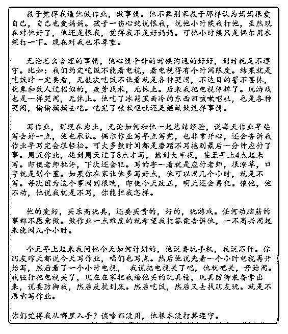

# 司令你好，我家孩子

(提问)匿名用户 : 司令你好，我家孩子现在有点失控，很多管 教没效果，也没上进心，希望司令指点一下。我是孩子妈 妈，今年 41 岁，孩子 9 岁，男孩，上四年级。他刚上小学一年 级我就和他爸爸离婚了。我的收入养孩子没问题。孩子爸爸 一个月连看孩子一次也不能保证。不给抚养费，不管孩子， 但见孩子日子就是买玩具日子。

我儿子儿童医院测试专注力不好，可专注力不好也不影响他 做事没有一点责任心，没想过要做好。我不知道是不是因为 专注问题，正向刺激少，还是别的问题。他 6 岁前我忙于工 作，可小学这几年，我关掉自己经营的小公司，几乎没做事 情，他一放学回来我都在家，做作业有任何问题，我都可以 教他。可现在说实话一塌糊涂，越来越灰心，自己都想放弃 了。

2018-12-31

回答：有一个东西叫感统失调，很多人还没有意识到这种问

题。其实不仅仅是小孩，大人都有。只不过因为没有认知，

所以不当回事。我在高速上开到 150 的时候与对开的车近距离

插肩而过，我都一点都不恐惧。但是我把车开进那种需要转

圈才能下去的地下室商场的时候。我会本能的紧紧的抓紧方

向盘，生怕车侧翻。其实我也知道不会侧翻，人家设计就好

的，车也设计好的。这是感觉系统中某一部分过于敏感造成

的。 我认真学习了相关知识以后才知道这些。有一种小孩的

触觉过于灵敏，会对外部反应要么过于灵敏或者过于滞后。

前者表现为急躁，没有耐心，缺乏注意力，甚至富有攻击

性。这不是他所能控制的，他只是感觉到恐惧，以这种方式

来应对。我觉得首先要去检查一下，有相关的专业运动训练

可以改善。我记得好像是几百块钱一节课，坚持一年应该会

有效果。这个需要先去检测。 除此之外还有一种情况：他内

心不安，有强烈的缺失，采用一种消极对抗的方式在掩饰。 他不是恨你，他恨自己。他在不停的向自己证明他很烂，你 越失望，越表现得急躁，越无可奈何，就越契合他内心预设 的结果。这就像给他送某种精神毒品一样，你掉入了那个循 环之中，剂量会越送越大！ 对一个六岁的小孩来说，可能不 能理解父母之间那么复杂的事情。我想你们双方都没有向他 讲清楚。根据人那个年纪的认知水平，他会觉得这是自己的 过错造成的结果！冰冻三尺非一日之寒，您与他父亲走不下 去，肯定有一个漫长的酝酿期。在这个酝酿期之间肯定充满 了失望和纠结。我记得我两岁就会记事了，四岁的时候，有 一次父母吵架，吵得很凶。我爸为了避免失态扩大，自己走 出门了，我妈可能觉得没吵完就走了，气不过。就把家里的 脸盆都砸了。他们以为我睡着了，其实我醒着呢。那一刻我 觉得天都要塌了，对这个世界的外表的质疑，或许就是从那 一刻开始种下了一颗种子！ 之前写过一篇文章叫《》。父亲 和母亲的角色关注点行为模式都完全不一样。母亲无法向男 孩传递一种力量。更无法向男孩传递一种原则，更多的是向 男孩传递一种包容。对于男性长辈，我们在称呼上会称为敬 爱的 XXX，所以，这种爱是首先是尊敬——是因为尊敬才会 爱戴，因为爱戴才会服从。不是靠朝令夕改的妥协和逼其就 范的蛮狠。我十几岁的时候，最讨厌我妈逼我穿毛衣。有一 次我不愿意穿她织的一件毛衣她就威胁不给我下个月生活 费，我身无分文转身就搭车走了！结果她又让我爸送到我学 校，我由衷的鄙视这种威胁，更不把它当回事儿了！要么就 来真，狠得下心，反而能确立规则。这种事情只有男人能干 得出来：有一次，我被冤枉了。我就跟父母赌气不进家门， 我要他们向我道歉。你知道中国的父母不管付出多大代价都 说不出口对不起三个字。我妈试图和稀泥，我没理他。我父 亲开始置之不理，天黑的时候他出来说了一句稍微软的话： 行了，这事就过去了！ 我知道，这就等同于道歉了。但是那 天我那根筋搭错了。我就是不进去。我父亲三次警告以后就 把门关了。他是真的关了，丢下一句狠话，吓得我妈不敢开

门。然后就去睡觉了！我穿了件单衣，坐在门口冻了一个晚 上。第二天一早，这事就真的彻底过去了，最后搞得好像我 错了一样。暴力是最后的仲裁力量，一次给到位就能确立边 界！这个时候人心中不会有怨恨的。恰恰是点不到位，才会 有怨恨，男人就是这么贱，就是愿意匍匐在力量面前！ 确定 能让人感觉到安全不确定性，才是让人无所适从，才会心存 侥幸，才会忐忑不安。为了掩饰这种不安，这些焦虑这些说 不清道不明的情绪。人就会“作”！这种“作”是一种拖延和掩 饰，其实是在自己认定的安全范围之内无理取闹和发泄！不 是有一句俗语，西方的女权只对绅士有效，遇黑人则怂，遇 绿绿则止。原理其实是一样的！ 综上所述：1\. 先做检查，看 是否存在某种感觉系统，过于灵敏，通过专业科学和有针对 性训练，先在生物层面排除问题。 2\. 能解决小孩内心缺乏安 全的问题。他需要一个有强有力的榜样性的指引，哪怕是舅 舅或者表哥也行。就是一个既能给他带来安全感，又能指引 他，让他发自内心尊重又狠得下心能为他确立边界和原则， 管得住他的人。3\. 你不用过细的抓紧和过度满足生活细节， 男生匮乏一点没关系，让他明白没什么是不需要付出代价就 能轻易获得。4\. 不要在他面前抱怨她父亲，指责他父亲，贬 低他父亲，人会自我代入。如果你潜移默化在他心里营造一 种很不堪的男性形象，他就会有一种生为男人的耻辱感！如 果他父亲那你说不出口，在家族中总是有优秀的男性吧，难 道那些人为人处事的方式和形象不是更适合构建他的自我认 同么？5\. 你可以继续搞你的事业，以身作则让他知道取得成 绩的价值和荣耀感。我相信你是一个很好强的人，你对很多 事情希望追求完美，所以会拼命抓紧，这种仅对自己和他人 都是一种压力。我认为应该抓大放小，适当隔离。一次成绩 没考好，无关紧要。抓一堆鸡毛蒜皮的细节，即便多合格， 核心的东西没有矫正，就像沙中建塔，挫一下全塌了！(21 赞)

评论区：

小跃 : 我爸就是没意识到男孩不能宠溺和为获取支付代价。什么都替我哥提前铺垫。搞得我哥就变成那种不知道为自己想

要的东西支付代价

白马非马 : 这个孩子的种种举动特别像我之前向司令提问的那个问题小孩[捂脸]那个小孩的妈妈最后放弃了…她就是没有确

立足够的规矩，她会打他打的很狠，并跟他说“你今天不做作业就给我滚出家门”，这小孩就真的穿上衣服就走……然后到

点儿了他妈又把他找回来了…就是这样…没有边界没有规矩没有原则，又爱又气，最后心力交瘁直接放弃了，因为所有的

东西已经根深蒂固了，他已经上高中。您家孩子还小，尽早按照司令说的来吧！ 罄 : 乱棍出孝子!是真的吗

猫姐 : 司令分析的第二种原因，安全感确实和消极对抗更符合。这个年纪的孩子还来得及，家长和孩子需要一起努力， 建议尽快找专业的少儿心理机构做分析和制定游戏和心理课程，如果在北京可以帮忙推荐，其他地方的话可以多问问了解 一下

