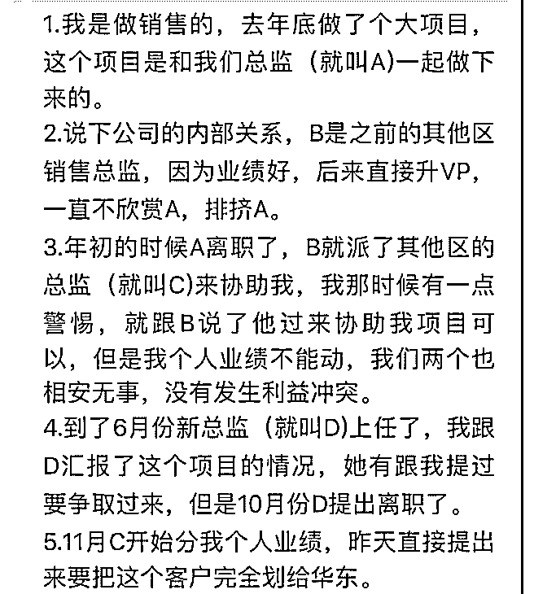

# 司令，截图人物面对

(提问)匿名用户 : 司令，截图人物面对的困境是不是一开始没 有和 B 结成联盟导致的？是不是职场上必须站队…已到此地 步，他是不顾其他保住这次的业绩后离职止损，还是损失这 次业绩以示投诚，有更有力的方法进行斗争甚至扳倒 B？

2018-12-30

回答：看不出形势，很幼稚的行为啊！ 当 B 升 VP 的那一刻，

局势就奠定了。那项目是你和 a 一起做下来的，因为作为总监

都能放手。你觉得你舍得住？所以底层特征就是这样：看不

清关键节点，只关注蝇头小利，还想当然的一厢情愿。 投

诚？既然你打算投诚，早干嘛去了？A 离职的时候，你就对他

不再负有道义上的责任了，你要投诚，这个时候拿着项目做

见面礼。b 或许会考虑接受你，并观察和测试，如果都过关

了，搞不好日后这个总监是你的也不一定。但是你没有这么

做！你不但没有这么做，还对他派来的人采取敌视和警戒状

态。傻子都知道，另外一个地方的总监派过来，从哪方面说

都是走走过场，人家不会占你的坑。正因为没有利益关系，

他可以更好的超然事外，观察和评价也不带立场。你到好，

预先设置敌视态度，这就表明了你的立场。这立场就不是针

对 c 这个无关人员，而是直接针对 B！这是第一个错。 错上加

错就是向新来的，毫无根基的 D 献礼。C 肯定要向 B 汇报，对

吧？你觉得 b 怎么看这个事？这是什么意思啊���恶心人也不是

这样恶心的吧！ C 是负责华东的对吧？你们的区里面没人挑

大梁，也没有值得信任的人，把有价值的项目拨给信得过的

人那里去，符合正常流程，也符合公司利益呀！你愿不愿意

都是一样的，你完全没有博弈的筹码。 这里不存在于什么投

诚不投诚了。你已经被宣判了！至于斗争了，你都能站得住

才能斗啊。问题是你站不住，而且过于悬殊。向天上吐口水

掉在自己脸上是愚蠢的行为，这种自取其辱就不是什么斗争

了。 给自己留点最后的尊严，离职走人吧！(17 赞)

评论区： 白马非马 : [捂脸]

bfhrhd : 败军之将，怎敢言勇！何况提问者只是败者手下的喽啰而已，应尽快傍上强大势力，向正在坍塌的地方踩上一脚[右 哼哼][右哼哼]

罄 : 斗争都是平级的斗啊！ 不对等的谈不上斗。只能挖墙角，使阴的!

