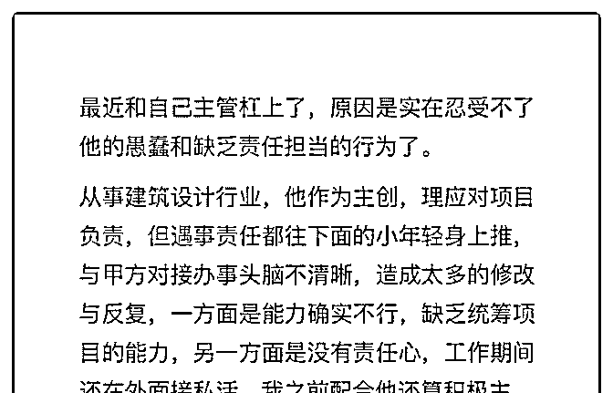
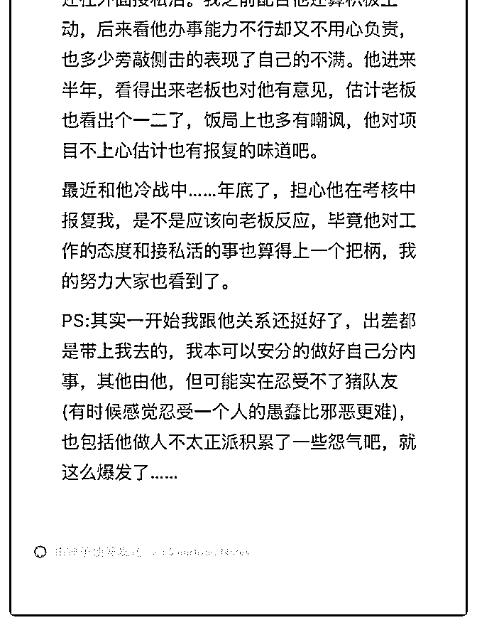

# 司令，可以帮忙支个

(提问)匿名用户 : 司令，可以帮忙支个招吗

2018-12-27

回答：什么都不做！ 按你的一面之词，既然你的贡献有目共

睹，既然老板对他不满意还冷嘲热讽。那么他本人的信任已

经破产，他做的判断和评估也不会有人当回事。 你之所以想

到威胁，是你内心认为他的判断会有决定性的影响。你内心

其实认为老板还是会听他的评估，还是会把事交给他，没让

他走人。你很情绪化，你准备用新的情绪化行为去掩盖上一

个情绪化行为可能造成的恶果。既然结果你承担不起，你为

什么要那样做呢？你的底层特征非常明显呀！ 你现在什么都

不用做，静观其变。(7 赞)

评论区：

黄 河 : 从头到尾没有说自己的问题，个人感觉太主观了。站在老板的角度考虑，未必是你这么个感觉。否则他怎么当上主

管的？

Hisoka : 很佩服一些人和什么人渣相处都能够既不吃亏也不闹僵。

airyxia : 司令，你老说底层特效明显。具体底层特征是指被情绪左右？

(提问)大山 :