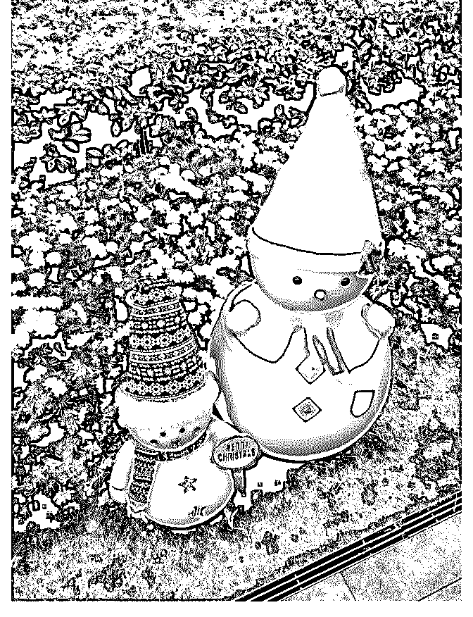

# 今晚是平安夜，祝大

司令 : 今晚是平安夜，祝大家圣诞快乐！

刚才在跟牧师探讨一个终极问题：神与人的关系——神如果 不能满足人的诉求，神就不会被人所接受，对人而言神也就 不存在。如果神符合人的诉求，神的边界就是人的边界！

牧师虽然没能回答我上面的问题，但他背诵的这段经文却给 我很大的启示：纵然走过荫死的幽谷也不会害怕，你永远与 我同在，你的杖，你的杆慰籍着我，直到永远...

世间的灵魂都是孤独的，或多或少处于被裹挟的禁锢之中， 所以会向外界寻求回应，不管是以亲情、友谊还是爱情的名 义。当有人回应你的时候，你就会把对方当成上帝——人在 向上帝乞求回应的时候，同时怀揣着感激之情和错失眷顾的 恐惧之心。

所以神只存在于一个距离之上：神如果太远，就完全没有交 集，对人而言神也就不存在，因为跟自己没有任何关系。神 如果太近，就会降格为人，变成两个人满足彼此的诉求，卑 微和虔诚都会荡然无存，失落和怨恨反而会油然而生。因 此，神对于人而言，就如同拍照时对焦的焦距——只有恰好 处于那个距离的焦点之上，对方在你心中才会是神一样的存 在！你会无怨无悔，满怀着期待和虔诚...

如果你拥有足够的洞察力，你会发现人在追逐亲情，友谊， 爱情之时，无不如此！

2018-12-24(30 赞)

评论区：

德大人 : 司令，圣诞快乐。

F : 碉堡了

正阳 : 圣诞快乐！

小贤 : 司令，圣诞快乐。

有点意思 : 司令是基督徒？

司令 : 没看懂吧？你觉得我这样的异端会成为某个宗教的信徒吗？

司令 : 好好读一下《C2》

王布斯 : 司令安好

