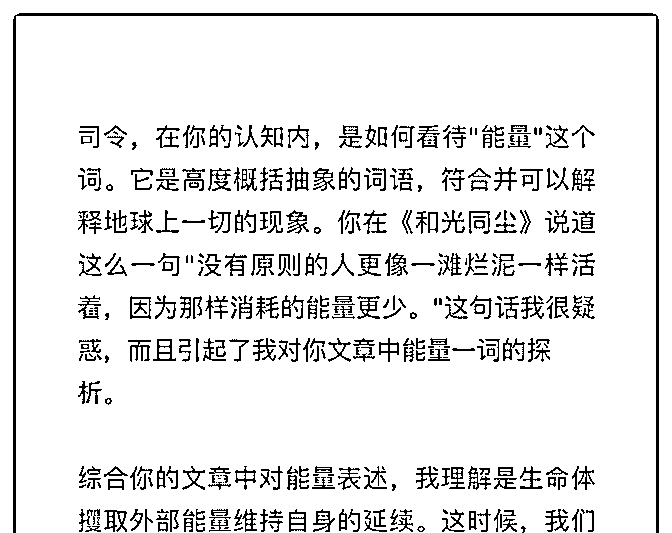
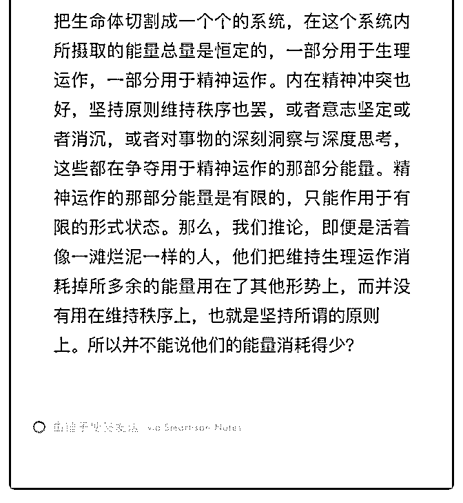

# 司令，在看《和光同

(提问)779305594 : 司令，在看《和光同尘》想到的问题。

2018-12-20

回答：既然是发在 觉悟社 里面的内容，你为什么不在那里问

呢？你在用机械的目光看待事物。如果你把你这个视角用来

看待经济体系的话，那一定是计划经济那一套。 生命体维持

自身的存在，需要从外部攫取能量，对吧？生命对资源的占

有欲望是不是无穷无尽的？绝对是！它基于基因对流量的无

限需求。所以你身上才有那么多多余的脂肪。所以你吃东西

的时候好吃才会没有节制。所以才对某些事上瘾！所以它会

由内而外的驱动人的行为。所以这个能量不是恒定的，他会

无限需求，只要没有外力能阻挡，也会无限的去满足，直到

崩溃。 现在回到你的问题：为什么毫无原则活得像一团烂泥

的人对能量的消耗最低。人体中的能量没有泾渭分明的分百

分之多少给精神消耗，分百分之多少给肉体消耗。它们是一

体的！就如同松软的地壳和渗透到缝隙中的地下水的关系一

样。快速的抽干，地壳就会塌陷。 何况人的肉体是由神经系

统驱动的。在法律上怎么定义死亡？大脑完全死亡的时候定

义为人死亡！维持人体最正常运转的时候，神经系统需要消

耗百分之四十以上的能量。发生异常的时候，这个消耗量会

更高。所以人体的其他方面就会很虚弱和萎靡——因为驱动

力不足啊。 日常生活中任何建立秩序的行为，就如同宇宙飞

船的一次变轨操作，都需要你的神经系统消耗能量去形成驱

动力。而神经系统消化能量形成的匮乏，又会驱动你整个人

体去获取和补充能量来维持自身。如果你不断的获取，建立

起秩序，不断的获取，又建立起新的秩序，就会形成一个正

向的循环。但这个东西是需要能从外部持续获得补充来维系

的。如果外部很匮乏，你无法获得。你就会走一个反向循

环。不断的摧毁秩序，最后像一滩烂泥一样，什么都不做。

你的精神是荒芜的，不需要做任何变轨操作，就像顺着河流

被水推着走一样，走到哪里算哪里，如果被推到深渊里面， 死了就死了。反正你认定别人不会在乎你，你自己也不会在 乎。你不会觉得你的存在有什么意义，那是一种彻底的绝 望！ 这个时候就会形成几个显著的特征：贪——希望天上掉 馅饼。一个人老是遭受挫败，发自心底的绝望，就特别渴望 瞬间逆袭和一步登天。靠——不顾一切的吸附他人。总试图 走捷径，追逐不劳而获。等——无力和不负责任。总以弱者 自居，毫无信义和廉耻，没有原则也不会遵守任何承诺，也 不会负起任何责任，端起碗吃肉放下筷子就骂娘。(16 赞)

评论区：

779305594 : 谢谢司令指出这一问题，现在能理解得更深一点了。我看到能量一词，基本认知体系里直接跳转联想到物理学

中的热力学定律，接着以能量守恒去分析人类精神状态。——它确实是一条普适的定律。还需再练基本功。没去觉悟社问

是因为这个词在各类文章中普遍出现。我觉得是基础知识，我想要透彻掌握结构学，必须把最基本的概念与定理搞清楚。

才能推论与延伸[呲牙]

Nuage : 咦，我还有一个角度：拿自己和 AI 对比然后复盘做事的动机

airyxia : 和光同程，是本书？还是公众号？

779305594 : 是司令发在觉悟社的一篇文章，后来变成了 A18 分层隔离是对的那边文章。

