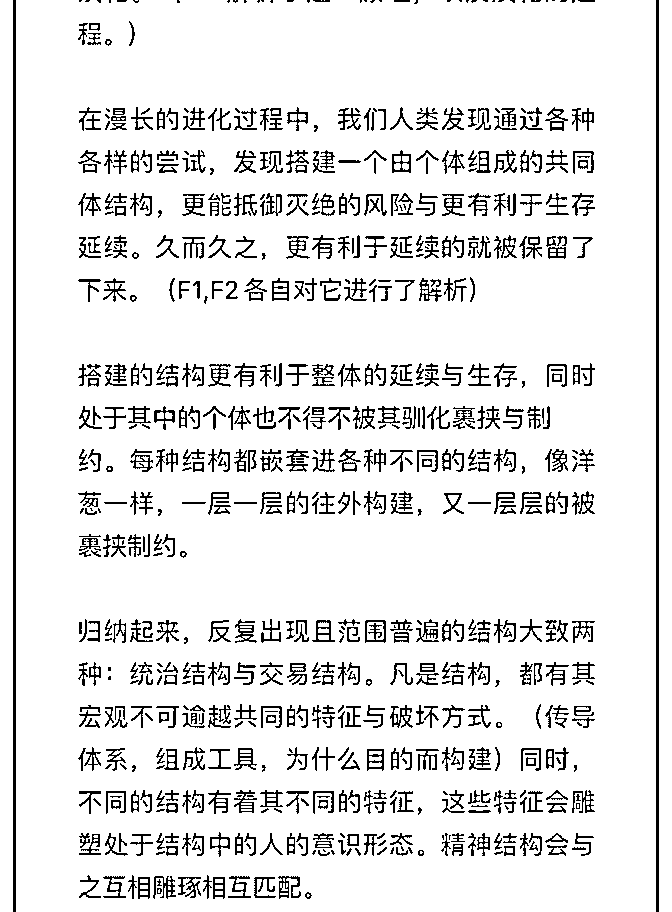

# 司令好，重新再读了

(提问)779305594 : 司令好，重新再读了一遍 F1.F2.E1，捋了捋 脉络。司令看看这个脉络与司令理的脉络是否接近？因为只 有把握了脉络，才能知道阐述的支线是从哪个枝干延伸出来 的，以及可以更好的利用。再读了一遍，越来越感觉震撼， 结合你延伸 C 系列，越来越通透。

2018-12-11

回答：不错不错，摸到门了!(21 赞)

评论区：

779305594 : 司令在提点下吧，我想登堂入室[捂脸]。

司令 : 等我写完框架吧

779305594 : 我在这个推导的过程中，换位思考在想，司令你是怎么得出这整个体系的。司令应该是从某个点切入进去的，

从这个点往前追溯，往后推导，中间在延伸。其实就像一颗树，根部是底层逻辑，土壤与环境是边界，树的主干是原理，

分支是原理的推导与应用。一层套一层，但根贯穿始终。

779305594 : 好，还得在反复读框架。总觉得还有点模糊，有些东西目前感知到了，但没理清楚。

乔伊斯 : 司令对现实的推导直达本质！我们都尊崇这一本质，但是这个本质的东西因为每个人的利益诉求都大致相同，但

是资源却有限，所以每个人都会在不同的结构中进行博弈。识别结构如同识别信息真伪，识别结构关键点如同识别信息中

的最关键信息！

易水寒旗 : 佩服

大山 : 可以啊大兄弟

青云梯 : 不错[鼓掌]

