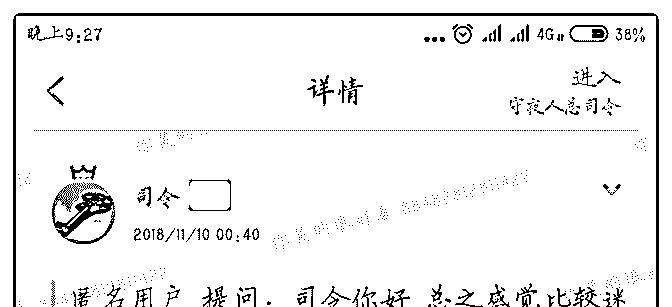
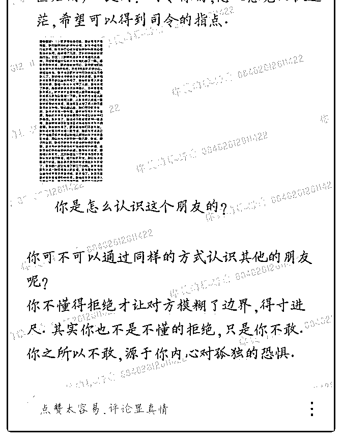

# 司令，看你精华的文

(提问)匿名用户 : 司令，看你精华的文章看到了这篇，你的回 答说提问者是回避型冲突人格，是不是在他这个问题中，与 司机正确处理的关系就应该是提问者这种方式，因为基于司 机与乘客的特殊场景关系。 老实说在给你提问题的时候我很 犹豫，是不是给你提，我想了下我犹豫的原因是怕因为你不 回答而别人嘲笑，即使没人知道我给你提了这个问题，如果 你不回答我仍然感觉会被嘲笑，在生活中，我做事也是这 样，最怕的就是被其他人嘲笑，最最怕别人嘲笑我。一旦想 到有人会嘲讽我，做事的积极性就全没了

2018-12-07

回答：别人都很忙，没空嘲笑你，你想多了。 我知道，我这

样说也没用，你改不了的！ 你渴望得到外部的肯定，所以极

力的去臆想一个完美的形象。你在拼命的维持你那个虚拟形

象。你需要这个梦境，这个梦境为你筑起一道安全的墙。你

就躲在墙里面才会稍微感到安心。 其实你内心特别渴望被关

注了，但是你希望别人关注的不是真实的你自己，而是关注

那个虚拟的你。在现实生活中，你是不是偶尔还会吹牛逼

啊？吹完以后的一段时间内会有一种轻松的感觉，但过段时

间又陷入深深的焦虑和恐慌之中。其实你挺绝望的，你看不

起自己。也恨自己。你有时候会对自己咬牙切齿。等过了这

阵之后又瑟瑟发抖，想找个安全地方呆着。 安慰的话和鼓励

的话我都不说，因为这玩意实在不顶用，心灵鸡汤解救不了

你。你敏感多疑自卑。做事瞻前顾后，欲言又止。放不开，

又抓不住。你对自己的质疑，已经达到绝望的程度。 但是，

你并没有万念俱灭，否则你就自杀了。你对生还有渴望，你

有牵挂的东西。你不管是去指责别人，还是对自己充满了愤

怒，潜意识中都是在做一件事情：自救！ 你在与彻底的绝

望，万念俱灭做抗争。我劝你放弃这种抗争！你干脆就烂泥

扶不上墙。任凭自己彻底绝望，你去体验一下那种彻底绝望

以后的宁静。他会有一种宁静的，你不需要抗争什么了。这 就是你，接受它。不管它是一滩烂泥还是其他什么，都是 你。接受他，你就不需要挣扎了。不挣扎你也不需要在乎和 关注别人怎么看你了。你想干点啥就干点啥。你想怎么干就 怎么干。反正死马当活马医，死猪不怕开水烫。当他们当着 你的面嘲讽，指责，奚落你的时候，你的心里没有一丝波 澜。你就完成了第一步。 第二步就是去做一件你想做的事 情，不管这个事情是什么，你去做。成和败都那样。反正你 也没啥期待的，别人也没啥期待的。不管结果如何，你都继 续做。万一一不小心做成了。你就具有了"自我造血"的功能。 第三步是关键的，等你慢慢回血以后，你会遭受一次打击。 痛苦懊悔不甘，恐惧，退缩全来了。这个时候咬着牙顶下 去，咬着牙继续做，你会时时恐惧纠结。但是咬着牙。哪怕 心里恐惧得全身发抖，也要咬着牙继续干。一口真气不散。 只要挺过去了，你就真正的活过来了。(20 赞)

评论区：

乔伊斯 : 司令也挺适合上脱口秀讲段子的，这描绘的[偷笑]

罄 : 我能说我提问 5 个问题，司令都没回呢！不过我不会想他嘲笑我，我会想是不是提的问太 low，下次换个，直到换到司令

回复。哈哈哈！

罄 : 只要是实际解决当前问题的，司令都会回[偷笑] 司令别怪我提问太多啊！[微笑][微笑]

Rosebud : 耐操一点。

司令 : 你可以提，没关系，有时候是我看不到，这里问题太多了。当然,有些问题其实已经回答过，就是不看，还反复提。

没空呀。

罄 : 嗯！以后就抓重点回答就好！太 low 的问题屏蔽掉吧。反正我是没问题的。当然如果有人真的急的跳，就问吧！我觉得

司令心肠很好，思维灵敏会看出来回答的。

白马非马 : “置之死地而后生”

cris : 司令是经历过吗？感觉有如置身其中

