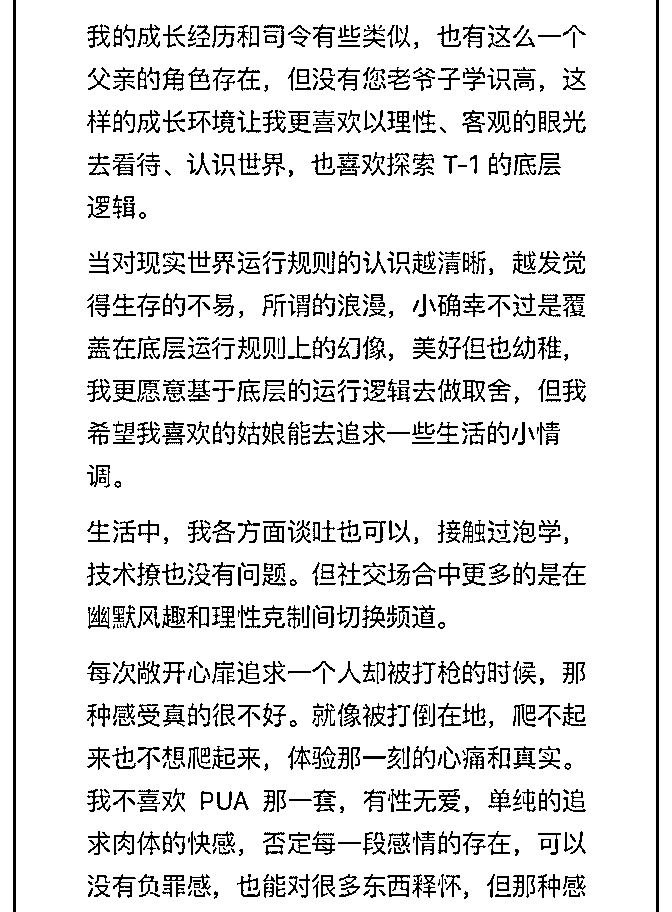
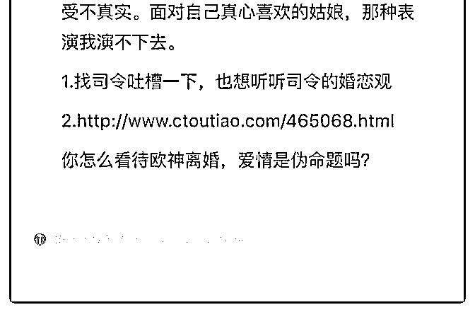

# 1.找司令吐槽一下

(提问)匿名用户 : 1.找司令吐槽一下，也想听听司令的婚恋观 2.

[你怎么看待欧神离婚，爱情是伪命题吗？](http://www.ctoutiao.com/465068.html)[欧成效：我有几十](http://www.ctoutiao.com/465068.html)

[个房产证你凭什么看不起我](http://www.ctoutiao.com/465068.html)[-](http://www.ctoutiao.com/465068.html)[创头条](http://www.ctoutiao.com/465068.html)

2018-12-05

回答：这个事情你是很看重的，但你又本能选择了免费提这

个问题。那么这个事情到底在你心中是一种八卦的闲聊，还

是一个启迪式的拷问？我觉得两者都有，前者偏多。之所以

前者偏多，是因为你没有答案，你也不相信能够得到答案。

你说你就说你，你何必把别人扯上了。你了解他吗？你跟他

深入的聊过吗？你没有，你远远的看着，你看的都是表象。

这样表现能对你起到什么样的作用呢？为自己的无力找到一

种掩护？ 你很慌张，也很渴望。所以饥不择食的时候，还会

学些表层的技巧。那所有的技巧都如同招式。你就算手里握

着屠龙宝刀和倚天神剑，也舞不出那个韵味，只有稀稀拉拉

的招式。 你觉得吸引人的是招式还是韵味？是那种由内而外

散发出来的东西在吸引人。它是你的一部分，不需要刻意！

如果你觉得我说的太抽象，那我就说点具象的：人会被自己

内心匮乏的东西所驱使，那种饥渴感被满足就是所谓的幸

福。能量只能在两个差不多的人身上流动。你有她所需要

的，她有你所需要的。这样才能奏出美妙的音符。过于高亢

和过于低沉，普通人都欣赏不来。因为那样拿捏不好就容易

破音。 爱是一种综合性的能力，而不仅仅是一种愿望。它就

像一个国家的软实力一样。没有达到那样的能力，也就不配

拥有那个层级的体验！ 市井之人，在 40 块钱一个小时的 KTV

里面，可以扯着嗓子乱喊。这也是一种发泄，你可以冠以音

乐之名。但真正的歌剧必须在有专门建造的殿堂之中。那房

子的结构是遵循声波传播的原理刻意设计的。表演者和配合

者，对每一个细节都追求完美到一种精致的浪费。这一切的

一切，所有的不可思议，仅仅是为了提高那么一丁点的体 验。 值吗？值！ 什么是文明？ 我认为文明就是一种精致的浪 费！ 如果仅仅是为了繁衍，人类那点破事，可以随便找个地 方对付。但是描述同一件事情，《诗经》上写的你会感觉到 原始和粗矿，而唐诗上写的，你则会感觉到一种精致的美 好。你是不是觉得唐诗所展示的体验更有文明的仪式感?人总 是会追求更高的纯度。甚至不惜巨大的浪费，仅仅是为了增 加一点点的纯度——越纯的东西越吸引人！ 所有的愁苦在于 错配，以至于能量不能在两个个体之间正常的循环。就如同 河水被拦截了，然后泥沙就会淤积；一潭死水，必然滋生病 菌。 这里有个天然的矛盾：人一方面会追求更纯的体验，那 种饥渴感会一直驱使着你，另一方面，错配又会让能量无法 正常流动，从而生出肿瘤——所有的怨，所有的恨，所有的 苦涩。不都源于此么？！ 如果以上你都没有听懂，只想获得 一个技巧。我只能长叹一声：出门右拐的路边可能有卖各种 秘籍，你可以去看看，恕不远送！麻烦顺手把门关上，谢 谢！(31 赞)

评论区：

Lina : 她说的不能给她浪漫感觉，应该主要是指穷，丑或兼而有之。所以从这两点精进改善先。

核桃里的君王 : 这让我想到了一个电影好像叫木乃伊归来。里面有这么一个评语，不要爱上不该爱的人。弱者求存，强者

求体验。爱情就是强者的糖有了就滋润一下自己，没有也无所谓。不要吧奢侈品当必需品。

水原十口（水原管家） : 今天的主题是「为人处世」

白马非马 : 哈哈哈哈哈哈哈哈哈哈哈哈哈哈~ 我笑是因为司令说话很率性[呲牙]，边批评题主（有点恨铁不成钢的意思在，

应该是希望题主不要过度沉浸在失恋的悲伤中，想让他振奋起来[皱眉]）还边把道理讲出来了，还表明了自己的态度[强]

“人类那点破事，可以随便找个地方对付！”——哈哈哈哈哈哈哈哈

林恒羽 : 分析的透彻！装得一时装不了一世！用真实面目跟爱人相处才是真的爱她！

白马非马 : 正经地说哈，我觉得如果题主一直追姑娘追不上，是否应该考虑一下目标定位和自身实际情况差太多呢？所以

适当的调整一下目标或者调整一下自己都是可以的。当然，如果仅是偶然一次失败就不用太把那姑娘的话当回事，嗯，也

许只是你刚好不对她的胃口。

小南 : 双边关系的不稳定性越明显，作为对冲，对仪式感和形式的追求也会越来越明显。

Lina : 请嗦国语

