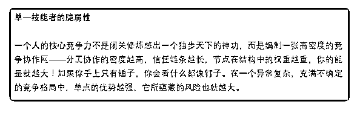

# 读完《去不掉的产能

(提问)不枉 : 读完《去不掉的产能过剩》一文就几个问题请先 生赐教 1.如图，如何理解“编织一张高密度的竞争协作网”中的“竞 争”与“协作”是往大局考虑制作一个链条（个人理解成老板意 识）还是把不同行业的专业知识融汇？ 2.施工企业是否能规划到文中所说的生产贸易侧？下游是原材 料和劳务，上游是业主，但是施工企业生产出的产品又不能 卖……所以一直很好奇工程算产品吗？

2018-12-04

回答：各行业的专业知识汇总干什么呢？炫技? 你还不是用来

解决问题的。确定什么是问题，什么是要解决的问题。然后

自己的资源，技能，知识就变成解决这个问题的一个关键节

点。这个需求是你创造的，你发现，你提出解决方案，你的

资源就是你的解决方案里面的关键节点。反正你就是别人解

决我方案里面的一个流程，一个环节，一个单点。 施工是服

务呀！服务产品化。产品化的服务才可以批量，才可以控制

成本。(6 赞)

评论区：

大山 : 比你说的上下游更低一个维度。举例我是软件实施，只是下游的一个落地的环节。

不枉 : 谢谢

