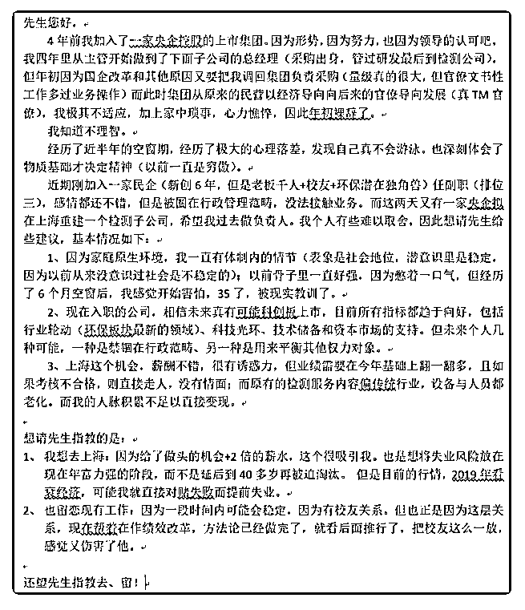

# 烦请先生解惑！另外

(提问)匿名用户 : 烦请先生解惑！另外请问如何付费提问？

2018-12-02

回答：这就像养在动物园里面的老虎，突然放归山林之后被

饿得奄奄一息。然后无比的怀念在动物园以王者形象与人合

影的时刻。 我这么说吧，可能比较伤人：你潜意识中追求的

不是事业心而是虚荣心。追求事业心的人不会害怕，也不会

在意那些东西。这一点我自己太清楚了！ 环保政策一定会转

向，环保部门的职权也会逐渐消弱，现在的风口是智能制造

和科技创新。今天很多 IPO 的公司都是倒挂的，资本市场的困

境超出你能够理解的状况，现在再榜的企业都没有交易量。

在内外压力下，金融市场一定会整顿和规范，过去那种炒概

念和疯长的时代应该一去不复返了。未来的金融市场要打造

成为一个池子，在土地作为融资的方式之后，作为新的主流

融资的方式。当然这条路还很长，但每次危机都是挖肉疗

疮，推进改革的时刻。 我说一句，你别介意的话，你可能并

不适合做老大，你更适合做老二。你对风险的承受能力比较

弱。你的内心权衡太多，你可以把事情做细，这是你的强

项，但面对对未知的时候你不敢加做判断，更无法承担责

任。 一家公司花重金去聘请人的时候，一定是自己内部遇到

危机和困境，需要有开拓的人打开局面——不太能容忍失

败，更没有耐心。你如果想去挣笔快钱，你可以试试，但是

如果你想把它做一个事业并让自己站到一个主导的台面上，

它不适合你！ 我觉得你做现在的工作可能做得更好。而且这

种做得好，可以赢得信任，信任可能会赢得新的机会。你适

合在稳妥和安全的环境之中逐步推进。野心谁都有，虚荣也

人人都有。但有一个前提，不能让它把你拖进你承受不起的

漩涡 付费问题，让其它人教你吧。之前有人截图过展示如何

提问的时候选择付费，另外也可以打赏。(13 赞)

评论区：

John Smith : 面子也是一种收益，折算成人民币就知道值不值了 三明先生 : +1 [呲牙][偷笑][强][抱拳]

小跃 : 我真的哈哈大笑了。哈哈哈[呲牙][呲牙]关在公园的拍照老虎

