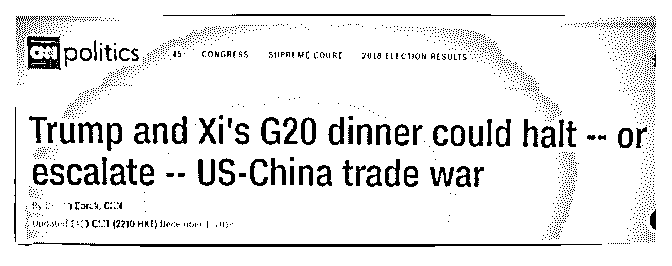

# https://t

司令 : [`t.zsxq.com/zBy3vfq`](https://t.zsxq.com/zBy3vfq)

2018-12-02(5 赞)

评论区：

响亮的生活 : 好怕怕，明年会有失业潮吗？

核桃里的君王 : 为什么只关注阴的力量而不看阳的增长。国内本土企业呢。最关键是，打死了一批小企业消除了不稳定

性。

精分书虫 : 川普加速危机形成，不惜在本国经济崩塌处踹一脚，更是在所有国家经济崩塌处踹一脚。其他国家全崩溃好过

米国自己崩溃。同时在全球经济衰退时候，米国影响相对最小，有利于自身再发展。中国作为潜在替代者，受到特殊对待

不稀奇。自损八百短期不利，长期为保持领先有利。

赵船长 : 最后好像谈了

水样 ID : 股市来一波

司令 : 不会有什么动能... 没有任何实际内容。城下之盟而已，中国需要采购一堆东西，首先要为美国农产品去库存。美国

没有做任何让步，只是把增加关税往后拖 90 天，连停止的承若都没有。去完这波库存，一切回到原点。

可寄 : 比较认同这个 [准确评估中美谈判结果：请记住一句话](https://mp.weixin.qq.com/s/lhGZCYq_uZm9lkCH9IT6vQ)

Essie : 被删除了

