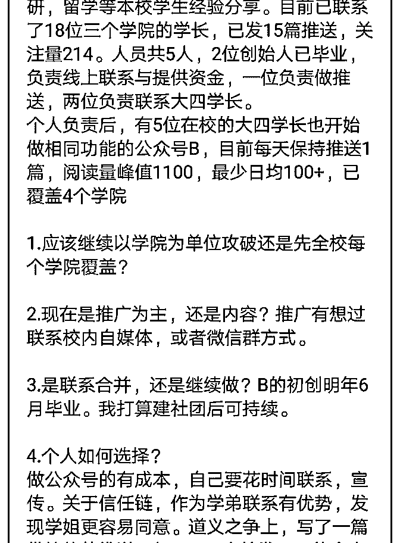
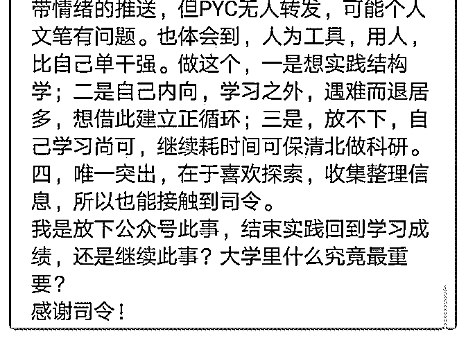

# 受字数限制，请司令

(提问)趋静 : 受字数限制，请司令查看图片。

2018-11-29

回答：对你的表述逻辑上有点乱。你不但在策略上不确定，

而且在做这个事情做还是不做上也不确定。你说你要实践我

的结构学。你还没有很好的理解它，而且框架我还没写完。

我记得我说过，搭建结构就是创造一个可以使用的工具，但

是你创造的工具必须有一个清晰的目标。因为没有目标，你

根本就不需要工具，显然你的目标不清晰。 我当年军训的时

候，我的教官告诉我一句这样的话。如果你想给别人一杯

水，你需要有一大桶水。你们的阅历和经历都太浅，有没有

一桶水，你也给不了别人一杯。 这个时候资讯一点都不闭

塞。我们上学那会儿只会上校内的 BBS。今天每个人拿个手

机，可以找到各行各业最专业的保研，出国留学的资讯和服

务。为什么需要你做个搬运工呢？ 结构学的应用，首先你要

了解你处于一个什么样的结构中，第二你要知道这个结构中

的关键支点是哪几个，显然你并不清楚。我觉得你还是先集

中时间和精力去保研吧。 如果你想搞清楚如何生产产品，如

何铺渠道，如何运营。以后有的是时间慢慢了解。(9 赞)

评论区：

Marz : 创业这个事，先自己跳下水去游吧，岸上教再多也没用。

趋静 : 谢谢司令指明！看的多了，又一无所有，总是会比较急切。希望以后能有机会司令实践[抱拳]

