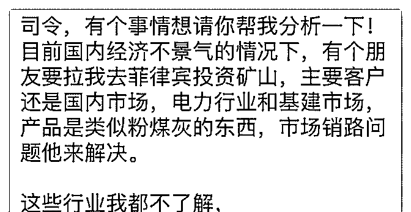
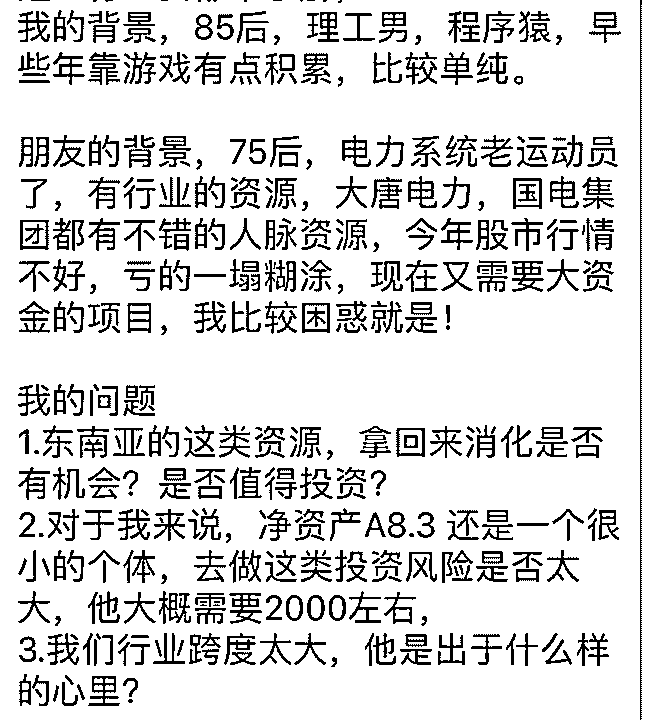

# 问题字数限制，只能

(提问)匿名用户 : 问题字数限制，只能转图片，请司令帮忙分 析一下，感谢！

2018-11-29

回答：你不要去！ 菲律宾那个国家是各家族各霸一块的。他

的总统和副总统都不来自于同一阵营。嗯，杜特尔特来自老

棉岛，他当总统以后，把老棉袄的市长交给他女儿了。她女

儿为什么能够轻易的选上呢？因为老棉袄是他们家族的势

力。他们在那里有好多代的势力。所以，那样的国家搞基础

性的东西，即便找到政府都不一定有用。他的中央政府势力

很弱，就是以国家投资都不一定周全，何况个人！十多 20 年

前，朝鲜的铜矿很有市场。那些投资朝鲜铜矿的老板，最后

哭的地方都没有。因为出了问题，即便政府出面，也最多打

个招呼，而对方的政府也最多摆个姿态。他深入不下去，也

解决不了问题。 我有个朋友在电力行业多年，国家对电力的

规划是按照 GDP 的五倍来规划的。目前电力行业最大的问题

是不挣钱，都是靠补贴。它的发展都是战略方向的，并不存

在供不应求的那种紧迫。(8 赞)

