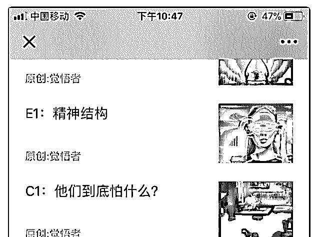
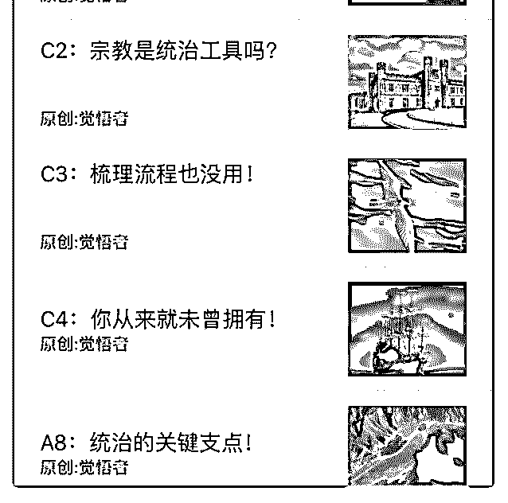

# 司令 您好！在水库

(提问)光影间 : 司令 您好！在水库的引领下 入您圈内，感恩 分享！

正在系统阅读结构学诸篇 但发现 篇幅名字有点糊涂 能否介绍 一下 abcdef 各自含义 以及阅读顺序！

望不吝赐教 谢谢您

2018-11-28

回答：这个问题之前不是有回答吗？Framework Extend

Context F 是框架，类似宪法 三篇目前写了两篇，还有一篇 F3:

结构力量 还没写 E 是对框架的补充，类似宪法修正案 C 是对

框架的各关键要素的解释 A 暂定为应用 B 是商业应用(8 赞)

评论区：

John Smith : 可以设置为置顶了

罄 : 我问一次司令都不告诉我

司令 :

