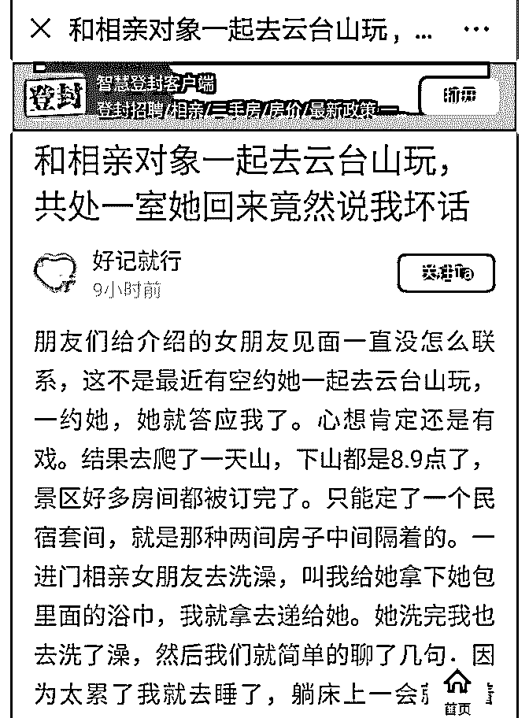
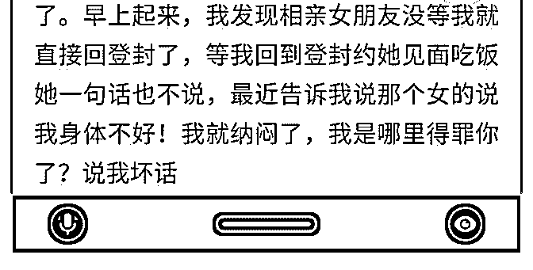

# 司令请教你一个原始

(提问)温心 : 司令请教你一个原始问题，男人面对自己爱慕的 女人都会心疼或者珍惜，甚至连发生性关系这个事情在一部 分人身上都是如此，把同睡一张床上克制自己不发生性关系 当成对心爱的女人最大的爱，所谓的珍惜。但现实中这样的 男人往往都是失败者，就如上传的这种情况一样，被女人当 成了有病。你怎么看待分析包括性在内男女思维的差异，就 以性为例子吧。

2018-11-27

回答：这是相亲，不是谈恋爱！ 相亲可以看成是一种交易，

显然这个女生对这个男生是很满意，我说的满意就是超出她

的心理预期。就好比你拿了自家酿的酒，到市场去卖，你本

来觉得你的酒只能卖 20 块钱。现在有个人，他出 200 块钱买你

的酒，他还把钱掏出来了，但是半天没给你。你可不心急如

焚。在心急如焚的时候，你会怀疑他耍你，或者觉得他的钱

是不是假的。这个时候把钱给她，她心里更安，她心里就觉

得实实在在赚到了。 一个男人邀请一个女人单独去某个地

方，大家都不太熟，而那个女生居然答应了。这已经很说明

事情了！ 相亲的意思就是我有什么你有什么，我要什么你要

什么。看看大家能不能匹配。匹配上了，这就是结构性的稳

定。至于覆盖其他的东西嘛！文艺点的话，可以营造一种恋

爱的感觉，不喜欢刻意也无所谓，本来就那么回事儿了。(7

赞)

评论区：

Tiny : 这个是娱乐版新闻吧？星主居然也认真回复了～

温心 : 如果前提是谈恋爱呢？[偷笑]

司令 : 现实生活中真的发生了这样的事情，我听说过。

司令 : 谈恋爱不会按这个套路出牌，女生不会轻贱自己。如果是自己特别喜欢的人，事后也不会不理。反而会心生感动

晒太阳的海豹 : 把钱给她=生米煮成熟饭。

罄 : 女生恋爱心理司令都知道？

大山 : 本来就是交换，诚意人家给了，你没反馈

白马非马 : 经司令一分析，拨云见日 …我为啥想不出来…

