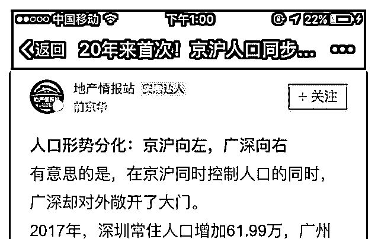
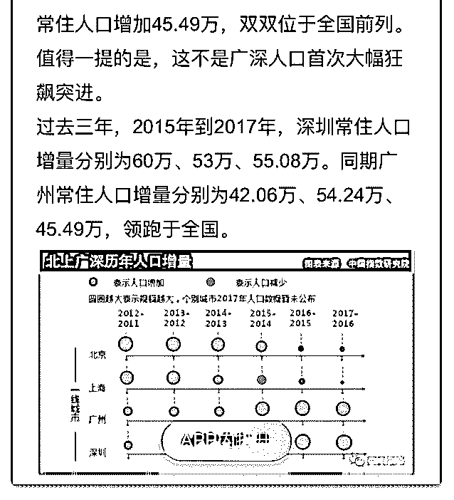

# 司令，如图京沪与广

(提问)John Smith : 司令，如图京沪与广深的政策差异，是否 意味着大事将在东海-JP-关岛一线发生？

2018-11-26

回答：不是！ 现代战争没有前方后方，怎么可能画条线出

来？能打到上海的导弹一定能打到深圳。打到西安也不成问

题。 你只看到人口数量的增数，没看到人口的基数。上海和

北京都是 2000 多万人口。同样分工协作密度的深圳才 1300 万

人口不到。这个基数决定了，它还有一段增长的空间。再加

上产业的变化。上海处于产业更替的周期之中，那北方就更

别说了。 你等着看吧，接下来几年杭州的人口会增加不少。

不要拿一个预设的立场强行套。要真打起来，西安以东都无

法幸免，西安以西一定会趁机作乱。目前不会打的。(9 赞)

评论区：

乔伊斯 : 上海有不少都转战杭州了

温心 : 为啥单列杭州？

John Smith : 龙兴之地+浙江帮？

水样 ID : 互联网新产业聚集地

