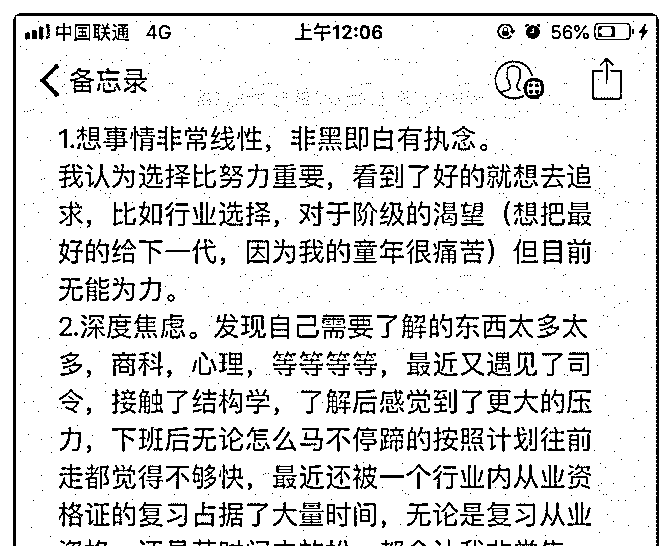
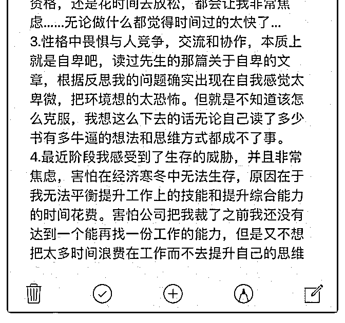

# 先生您好，性格上的

(提问)匿名用户 : 先生您好，性格上的痛点，原谅字数有点 多。 不愿意逃避问题，不愿意否认问题的价值，更不愿意虚拟一 个自我……所以现在真的非常焦虑……读过 E1 精神结构之后 终于知道为什么最近感觉到这么累了……伴随失眠…… 有的时候真想和身边大多数人一样，什么事情都会说走一步 看一步，活得也逍遥自在！但是我就是做不到。

2018-11-26

回答：所有的恐慌都源于还没有发生的事情，先预设一个最

差的状况。所有的力不从心都源于同时处理太多的需求。如

果很多辆车在同一时间堵在同一条路上，是不是会拥堵？ 那

如果现在已经堵塞了，你怎么疏通交通？后面的车不要再过

来，前面的车快点开走，应急车道必须保持畅通。发生一点

小摩擦，小碰撞不许堵在路上，必须马上走，加快流通的速

度！这叫抓大放小，关注核心问题。 你同一时间处理太多的

需求肯定力不从心。你越力不从心就越会感觉自己匮乏和无

能，然后产生新的情绪，这个时候，你大量的精力就不得不

去响应情绪了。因为对大脑而言，它的优先级更高。你发现

没有？就是个死循环，它不断耗掉你的能量，让你精疲力竭

越发匮乏和无力！ 事有轻重缓急，一个时间只做一件事。提

升你的综合能力，是一个漫长的过程。不是看某本书，做某

件事就马上可以获得的，而是一种融会贯通。它真正的价值

是面对不确定的未知时作出正确判断。当置身于迷雾之际，

能看清真相，不轻易的掉入无力挣扎的陷阱。比如几个月前

不断有朋友叫我炒币，我看清楚这玩意儿在现阶段的状况，

死活没买。还深入行业实践写了一篇总结文章，可惜一个人

都没劝住，该掉坑里的一个都没落下。 你的毛病总结起来就

一句话：你有一个亿的欲望，却只有半天的耐心。用我们家

老头子的话说就是：像猫抓烂一条鱼一样，不知道从哪里下

嘴。你试图把一切往怀里揽，但并不知道此时此刻你真正需 要什么。你要学会往外面扔，而不是不停的揽，去做减法而 不是做加法——放下，放下，放下！如果你什么都放不下， 你就会永远背着一堆用不上也不会用的东西，在任何方面都 力不从心！ 害怕解决不了任何问题的，你害怕在经济寒冬之 中无法立足。我觉得第二个害怕你不用去考虑了，大势来的 时候谁都挡不住。打个比方吧，如果你公司没把你裁掉，但 是经济危机把你公司弄垮了。你又如何面对下一步的生存 呢？再放大一步。比如你公司没有把你裁掉，经济危机也没 有摧毁你的公司。但是经济危机引发的社会问题让战争爆发 了。你又如何在战争那种状况下生存下去呢？那个时候你什 么技能都没有，可能连粮食和水都短缺。所以如果你一定要 担心的话，它有无穷无尽不可控的东西会发生。你会发现你 没有一样有应对之策！所以这种事情就就不用担心了，车到 山前必有路。实在没有路，不就一死么？天下无不死之人， 无不亡之国，无不掘之坟。魏文帝曹丕的这句话简直振聋发 聩。我也是这样的心态，所以不焦虑，听到英雄壮志未酬的 挽歌最多伤感片刻。 我觉得你既然害怕与人交流，害怕与人 合作，害怕与外界打交道。这倒是个非常具体和实在的东 西，你可以逼着自己去做。你如果在这种现实之中能够有所 突破的话，你的紧张和焦虑会放下好多。他就是你的突破口 啊。我估计你从来不会向别人求助，这样会害怕，你会害怕 别人质疑你的无能。你甚至会害怕自己质疑自己。我估计你 总是想关起门来闭门修炼，练成绝世神功，然后让所有人惊 叹不已，一级绝尘，独步江湖。这是一个屌丝，无力的幻 想，这是个精神的鸦片。先鼓起勇气戒掉它吧。以最真实的 自己示人。不管他多么的不堪，多么的无能。至少它真实， 它是生命，有着生命本源的张力和活力。你不需要靠伪装和 铠甲保护自己。生命本身的力量就足以让外界肃然起敬。因 为它是活的，其他都是死的！因为是活的，所以可以变化， 可以长大，可以变得越来越不一样。而死的一切就是那个样 子。你懂吗？！ 抓住一个生活中最具体的点突破的，从你最

害怕的东西开始。当你做到的时候，你会发现你激活了生命 的活力。他就像一个沉睡的怪兽，慢慢的睁开眼睛，突然醒 来。你会感受到它的力量，而这种力量会牵引着你！ 我说过 了，12 点以后不回答问题。这不是付费不付费的问题，是我 明天早上还有事。当我看到你写的这么多，我知道你现在处 于这种痛苦的状况，我都睁不开眼睛了，闭着眼睛给你回 答。我希望你能够脚踏实地的找到一个点改变过来。(49 赞)

评论区： 白马非马 : 质朴

無華 : 司令真是善良！

承载 : 所有恐惧都来自恐惧本身，人天生对未知充满恐惧。

罄 : 现在除非别人一刀捅过来，我都不会恐惧个什么了，后来想想我有防备捅过来也能解决掉，我没防备，都死了，恐惧

个毛!

罄 : 天下无不死之人，无不亡之国，无不掘之坟。我都睁不开眼睛了，闭着眼睛给你回答。我希望你能够脚踏实地的找到

一个点改变过来。 这个人只用看这几句话应该就知道怎么做才对!

明文 : 点评中肯，自己也有很多这样的缺点

张志刚 : 司令点评到位，什么都不是一蹴而就的，包括你目前的困境，也不是立马能改变的，慢慢的建立信心吧！加油！

Lindalu : 司令很有爱心[爱心]

