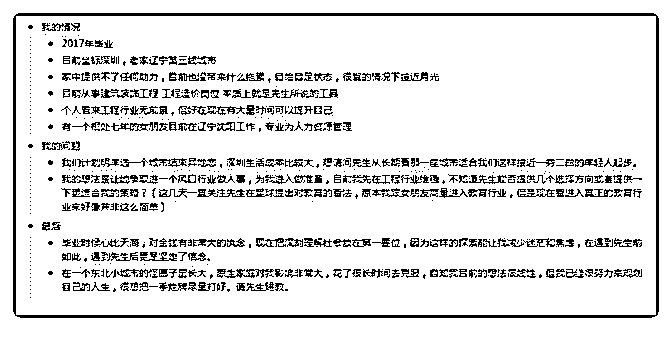

# 请先生赐教

(提问)匿名用户 : 请先生赐教

2018-11-24

回答：綜合來說，你有幾個問題吧： 第一，选择在哪里生

活？ 第二，选择什么行业? 第三，如何把牌打好？ 第一，选

择在一线城市。虽然生活压力大，但机会也多。顶过去了就

活下来，还能长大。 第二，风口切换的太快，每一年都有风

口: 2016 年是共享经济，2017 年是直播，2018 年是区块链，我

估计明年是人工智能。看到没有，风口只能持续一年！ 经济

危机迫在眉睫，大的形势趋于全面对抗。凛冬将至，还是先

求存吧... 机会是分圈层的,这个我前几天讲过吧。在同一圈层

内跨越不同行业的相关岗位都可以做，不限于某一个具体的

行业。当你的综合能力提高的时候，你也可以在另外一个圈

层去获得各种相关的机会。很多人相信的定一个行业，希望

押宝一个行业。行���有周期，企业也有生存周期，但综合能

力没有周期啊。 至少你在描述问题的时候，逻辑是清晰的

1234 表达也还是蛮具体的。这说明什么呢？说明你思考问题

和处理问题的时候，直到先后顺序，有条理啊。这属于综合

能力，某一个行业里面的专业技能，其实，要求并不高。最

大的门槛是不让你进去。进去以后你会发现，考核你的那些

东西通通没用上。装逼都是装给外人看的，内行人都知道，

每天所用到的东西都非常的浅显。因为组织不需要个人多么

的牛逼啊，它是一种综合性的输出，每个岗位都按最低要求

设置的。招人的时候，为什么又要抬得那么高呢？筛选！筛

选得越厉害，逼格和门槛就越高，内部的凝聚力和优越感也

更强，外部不清楚情况的也充满敬畏。以前我招个某知名互

联网公司的一个产品，他跟我说，我们对外 pr 的时候天天说

大数据。其实我们内部都知道那些数据之间没有任何关联

性，就是一堆没有毫无价值的零散数据。外面的人不知道，

还以为真的多么多么的牛逼和神秘。 大数据是数据中能挖掘

和呈现多维度关系的判断价值，而不是一堆死数据的总和。 很多人在忽悠的时候，他们搜集的那些数据毫无价值，他自 己都组织不起来，更别说对这些数据进行挖掘和分析出有价 值的信息。 总而言之追求的是综合能力层级的越升级，同一 级别的各个行业的同类机会都可以，不陷于某一个行业。至 于追风口的话，我不提倡，因为风口太短，你现在还处于没 有定型的状态，又不是准备好了，去抢个机会搏一把。(12 赞)

评论区：

张志刚 : 题主缺少不是专业能力，而是人际资源，我也是在深圳建筑业混，希望我能给你提供一些资源，有需要私信我。

温心 : 人工智能普通人有什么参与的机会？

罄 : 能去这相关的企业就行了，不管做什么。。

