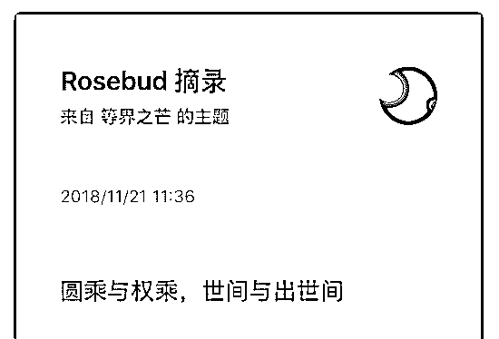
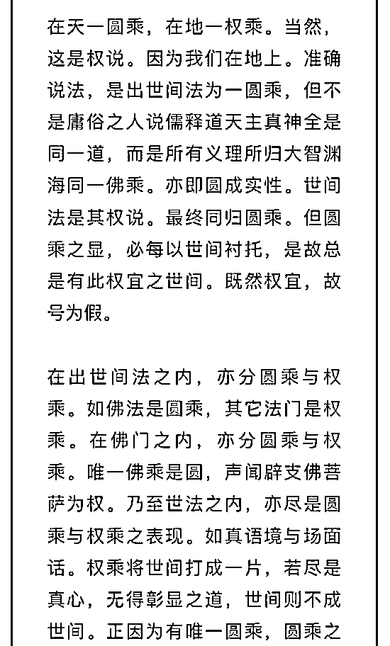
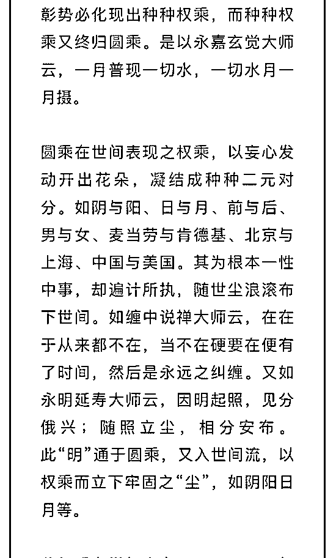
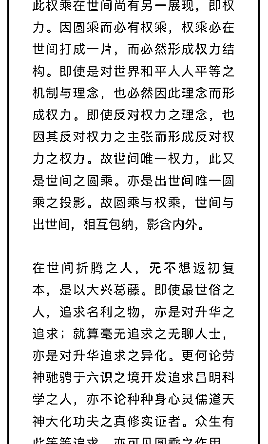
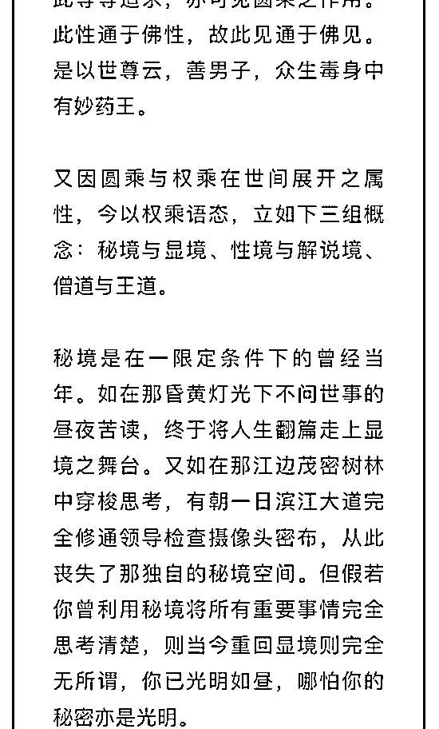
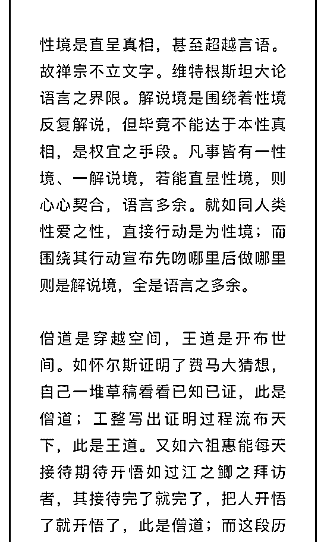
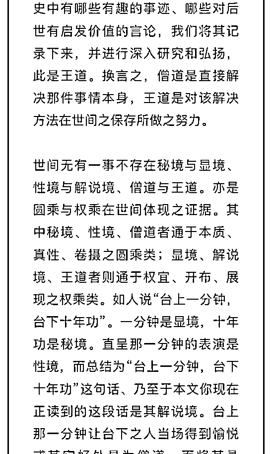
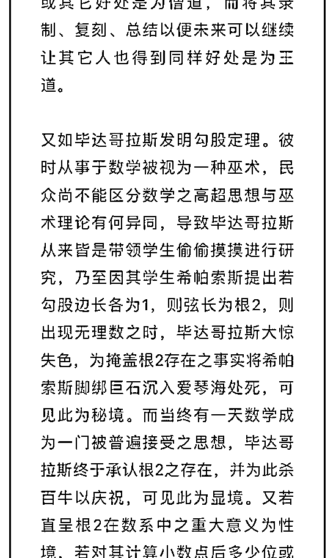
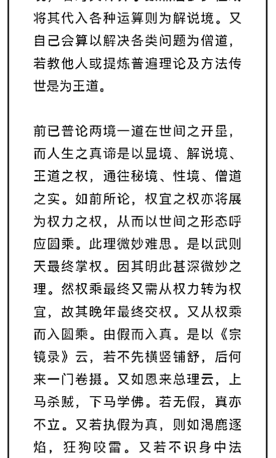
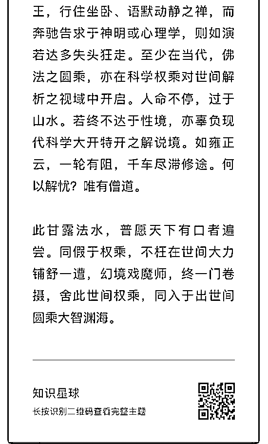

# 先生我花了一万元进

(提问)Rosebud : 先生我花了一万元进的知识星球星主文章， 你帮我看看此人段位怎么样？还是现在退款？

2018-11-22

回答：退吧！ 我真不明白你进这干什么? 你求什么呢？ 他反

复用各种罗列和强行类比，让你相信世界上有一种唯一的存

在，世间万事万物都是它的表像。他强行用了太多二元对立

的辩解，你要喜欢这个，马哲的辩证法更加的通透。 如果你

喜欢哲学，就去看那些经典哲学。如果你喜欢辩证法，你去

看当年的教科书。如果你心里面想求个安稳。你有两种方式:

1\. 用短刺激麻痹自己。2\. 搞清楚你的恐惧和不安来源于何

处，然后有针对性的解决掉。 关于宗教，你读这篇：(8 赞)

评论区：

司令 : 你这样很容易上当受骗呀，难怪你对比特币这么狂热。

晒太阳的海豹 : 1 万元。。。

水月天行 : 这个人把各种宗教理论杂糅在一起，很有点神棍的气质，我喜欢[呲牙]

余生 : 大兄弟你还不如花一万元找司令做心理咨询。。。

Rosebud : 真的，进了这个星球，感觉自己越来越悲观了。

Rosebud : 你也可以加入

黄 河 : 司令救得了他一时，救不了他一世。换个地方，还是要被收割的

Rosebud : 司令收费，我就花钱。

