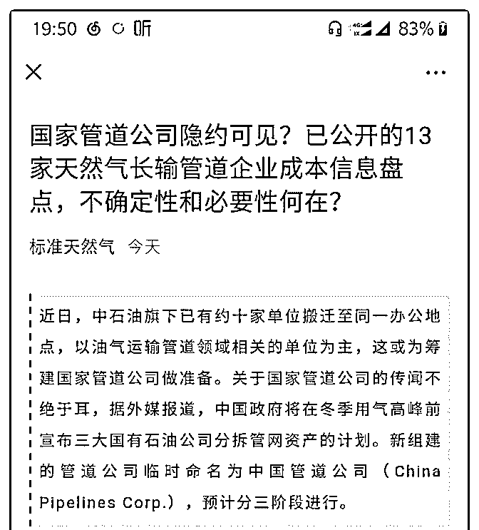
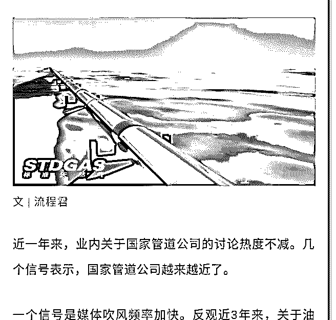

# 司令你好，关注多时

(提问)吴枫 : 司令你好，关注多时。我们是油气管道设备代理 商(产品进口和国产的都有)，链接中三桶油成立国家管道公司 的本质是什么，此种动作对于我们业务开展和客户关系的方 向有什么重大影响和启发吗？

[如果司令关注过这个话题或领域，还请不吝赐教。](https://mp.weixin.qq.com/s/KUDCCM0-Zk4cE2ISK2V4Og)[国家管道](https://mp.weixin.qq.com/s/KUDCCM0-Zk4cE2ISK2V4Og)  [公司隐约可见？已公开的](https://mp.weixin.qq.com/s/KUDCCM0-Zk4cE2ISK2V4Og)[13](https://mp.weixin.qq.com/s/KUDCCM0-Zk4cE2ISK2V4Og)[家天然气长输管道企业成本信息](https://mp.weixin.qq.com/s/KUDCCM0-Zk4cE2ISK2V4Og)  [盘点，不确定性和必要性何在？](https://mp.weixin.qq.com/s/KUDCCM0-Zk4cE2ISK2V4Og)

2018-11-20

回答：任何一个生意在开拓的阶段，都是从头到尾一条龙打

通。供需双方在这种格局中完全不对等。何况能源是工业和

城市的生存基础，那个供应方天然的具有定价权。他的这种

定价权也合情合理。因为从源头的开采，提炼到输送都是它

负债弄的，如果他不弄，你就完全没有。我们不从个人的情

绪视角，而从商业的视角来看这个问题。他前期的投入是需

要后期的回报来支付的。但是当它的利润已经盖过之前的投

资以后，没有人会收手。因为这是一个需求端不具有议价权

的垄断利润。企业要追求自己的利润，这是天经地义的。没

有人会为了道德去放弃不费吹灰之力就能拥有的利润，更何

况国家并没有减少它们获取利润的 KPI。 这个商业结构中，

它之所以能形成垄断的关键点在哪里？ 在流通渠道！ 我不管

你的油提炼的多好。你送不过来，你就没有资格参与竞争。

我就是敞开门给你，你也无能为力，因为你最后还是要卖给

我，才能送到末端市场。这样一来，末端市场的价格就由我

决定，而不是由你决定。我是谁？我是流通渠道！所以你会

发现，所有的油气公司都在自己铺设流通渠道。它要把命脉

握在自己手里！30 年代阎锡山治理山西，他把铁路修的和全

国其他的铁路轨道的宽度不一样。所以南京政府的势力永远

渗透不到山西。因为不管是人员还是物资，到了那里就要下

车。所以管道才是这门生意里面的核心部分！ 一个事情是否 被支持还是被反对，往往就看利益分配。三桶油都不会愿意 交出自己的管道，这是命脉。一旦交出去，不管他是谁。他 都成为真正具有定价权的那个人。而三桶油只会成为他的供 应商。 即便是换汤不换药——由他们的人来管理这个渠道公 司。并且有他们控股这家公司，就是保证人事和财政权不 变。他们也是不乐意的。因为之前的定价权在自己手上，现 在的定价权需要去博弈！更重要的是，这会打开一个缺口。 以前他们自成体系，针扎不进水泼不进，就是独立王国。打 个比方吧，虽然人事由中央任命，但是名单是由他们递上去 的。中央又不知道谁能干哪个活。还不是你说谁能干，他就 盖个章。所以从某种意义上来说，他们完全是独立王国，是 独立王国就有了博弈的筹码。当年朱相国为了打破南天王的 势力，不让搞大亚湾，要从三峡向广东送电，老江都要打圆 场，暗地里帮着朱相国说话。可见那控制这种命脉型独立王 国，有多么大的博弈的力量！ 这是一步好棋，一部削藩的好 棋！当然这个阻力会大得多。我估计，这个方向一定会坚 持。但是会做一些妥协来缓冲这个反弹。比如说允许末端乱 涨价，美其名曰按市场波动。再比如说，不要搞得一竿子捅 到底，抓大放小。还比如说，利益还是让给他们，只寻求人 事的破局。 第一阶段它可能是个空架子，但这个空架子，日 后会慢慢的做实。我觉得你们要树立两个策略。一个是短期 策略，一个是长期策略。短期策略是该怎么做生意还怎么 做。因为第一期能够搭个空架子，并立足于抓住核心主干线 就不得了了，甚至还是分大区管理，而不是全国一盘棋，这 里面需要很久的时间去博弈，主要不是业务的对接，而是人 事的控制。这个主干业务你们一下子也切不进去。你们能拿 二线或三线的业务就不错了，这一块的业务了，不是很受影 响。该拜什么码头还得去。 另一个长期策略呢，就是要做好 准备。那个空架子慢慢做实以后，他就成为真正掌管命运和 定价权的主角。要先去搭根线，此时此刻，他们没有什么权 力的时候。你给予尊重，并陪着他们慢慢做实。等它们大权

在握的时候，你就是那个值得信任的人! 到时候他的权利需要 能搞好业务的人把它贯彻到具体的点上。(18 赞)

评论区：

吴枫 : 受教！总结起来我们要做的是维持原有业务，同时积极寻找长远的支点。静观其变，伺机而动。谢谢司令！

Dilink（撸房帮* : 讲的真的很透彻了，结构学的应用。

大海 : 嗯 管道 电力 5 大发电集团在国家电网（输电网络=管道）面前太渺小了

小艾 : 参照铁塔公司

温心 : 南天王是哪位？

陈校长 : 李鹏吧

