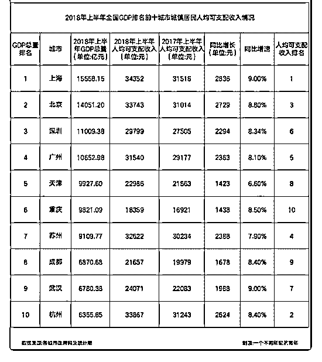

# 司令对杭州怎么看？

(提问)匿名用户 : 司令对杭州怎么看？据说，北上广深要变成 北上深杭了，杭州的人均收入超深圳广州，浙江省的各地级 市也富裕。

2018-11-19

回答：等我有空寫一下杭州，浙江是龍興之地，中南海的主

要班底就是當年浙江的那套班子。衹要老大在位，這種傾斜

都是不可避免的，也是政治正確的。杭州的市區好像要擴大

一倍。(5 赞)

评论区：

jhonason : 司令，有空也说一下广州呗，千年商都，爹不亲，娘不养的，还要帮一帮穷兄弟，快丢掉一线地位了，未来该怎

么办？

xl : 国家对郑州是不是只需要好好种地，保障国家粮食安全，就没其它指望了？[捂脸]

正阳 : 看到有种说法，郑州的作用是北京向南吸血的一个屏障

大山 : 这个非常期待，因为我也是想在杭州发展的

水样 ID : 杭州，风口上的城市。

