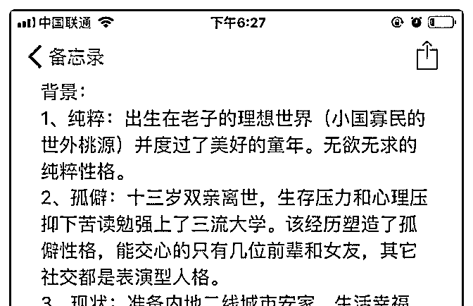
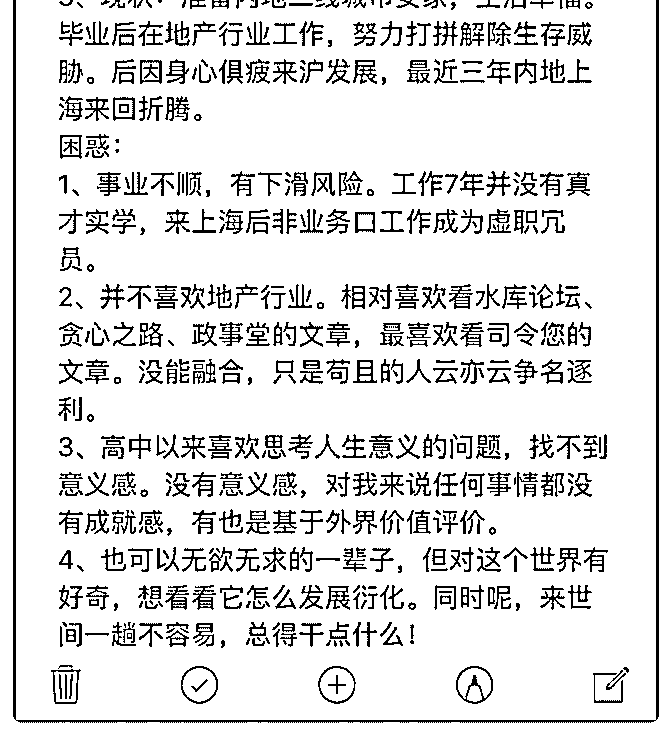

# 司令您好！找不到生

(提问)匿名用户 : 司令您好！找不到生命的意义感，如何破题 呢？

2018-11-19

回答：找不到人生的意义就没有行动的動力，本質上是一種

拖延，如果有一個問題，你不知道怎麼處理，你的潛意識會

把它先拖延一下，如果馬上出結果，往往容易引發自我的質

疑，拖延一下，就可以把這種恐懼往後延。在這種狀態下人

是很舒適的，看起來無欲無求。事實上就是營造一個臨時的

幻覺，跟沉浸於遊戲，或者進入夢境，沒有本質的區別。都

是因為在當下找不到出口，需要一種自我麻痹來緩解一下。

你列舉你所喜歡的那些東西，其實是一種轉移。 這篇文章讀

了吧？我不知道你讀懂了沒有。如果你讀懂了，你就發现它

的價值。其實它是我自己花了三年的時間砸進去超過 1000 萬

的真金白銀，親身實踐寫的總結。你會發现，我們倆所獲得

的那種頓悟的快感是一樣的！唯一不一樣的是：我耗費了時

間和成本，而你不需要就獲得了一樣的結果。 這樣看起來，

我好像虧大發了。它對我而言是一種探索。對你而言是直接

可用的工具，甚至可以直接用於你的項目。但我發现一個你

可能沒有發现的地方：我發现對這篇文章理解的深度與那個

人本身對商業理解的深度或者親身實驗的程度有關。越是深

入的人理解就越深。換句話說，遇到另外一種問題需要探索

的時候。對一隻未知的新問題理出頭緒的時候。你可能會一

臉懵逼，我可能不會慌亂。 你的自我價值感太低，你對自己

的質疑比較深。每當你對自己質疑的時候，你會把所有的點

點滴滴都串起來。所以在現實生活中，你需要一些東西來支

撐而不敢以最真實的自己示人。因此，你陷在一種由外力牽

引的結構之中。之所以是說牽引，是因為你既被它裹挾，又

需要它的支撐。這種內外的能量的消耗相互抵消，那你沒有

額外的能量去打破這種平衡。你內在創造不出一種勢能，外

部也不會打破你這種穩定。但是你知道這種狀態就如同在斜 坡上推著一塊大石頭。隨著時間的推移，就會越發體力不 支。一旦撐不住就會被滾下來的石頭碾壓。這是你心中的恐 懼根源，你焦慮的不是當下的狀態，你恐懼的是未來這種平 衡不可持續。 我覺得這種狀態下，你要麼長痛不如短痛。直 接把石頭放手。自己跳出去，讓石頭滾下去。以最真實的自 己示人，卸下所有的包袱。然後自己選擇一條上山的路，一 步一步走上去。或者咬著牙，一個腳印一個腳印的把石頭往 山上推。你不用去看山頂，你就看你腳下每一步往前推一 點，每一步往前推一點，搞不好在你不知不覺的時候還能把 他推上去。這比你站在原地，東張西望心懷恐懼要好得多。 (16 赞)

评论区：

罄 : 别想太多，走好自己每一步。

白马非马 : 司令还是用简体字吧[捂脸]

Rosebud : 司令怎么换了 zi' ti

司令 : 我用的是語音啊。應該是訊飛切換成繁體了。

张志刚 : 想办法融入这个世界，让自己开朗一点

一陌 : 司令你怎么可以写的这么好，这么的透切。

airyxia : 有哲学思考气质

林恒羽 : 深有体会

