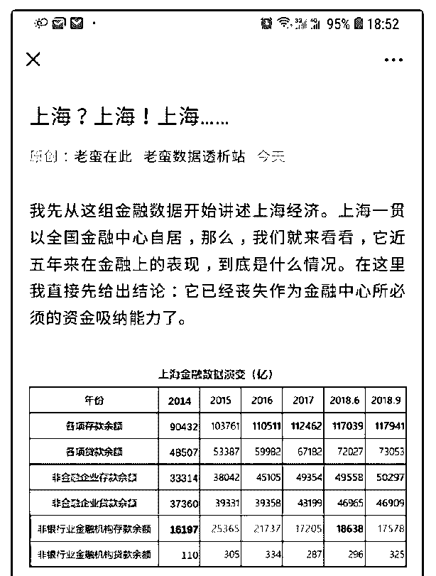
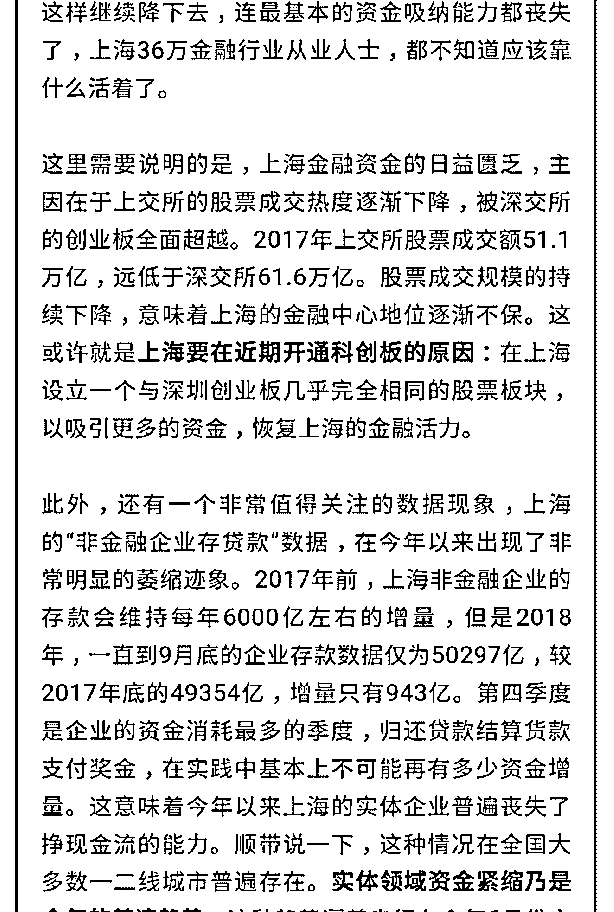
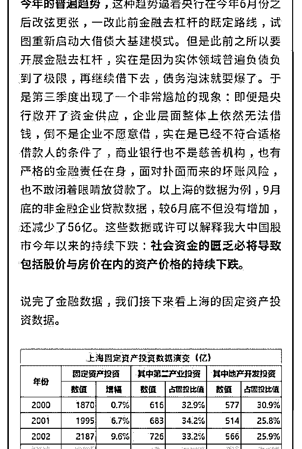
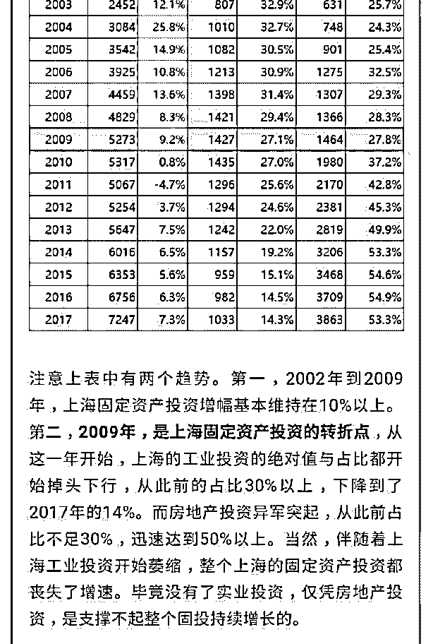
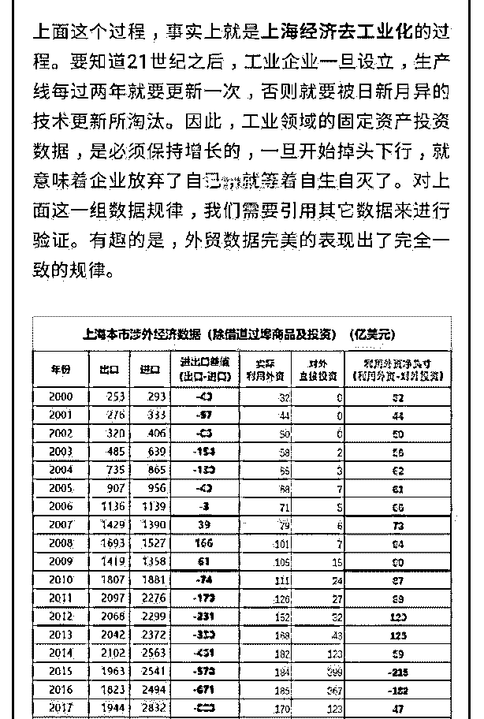
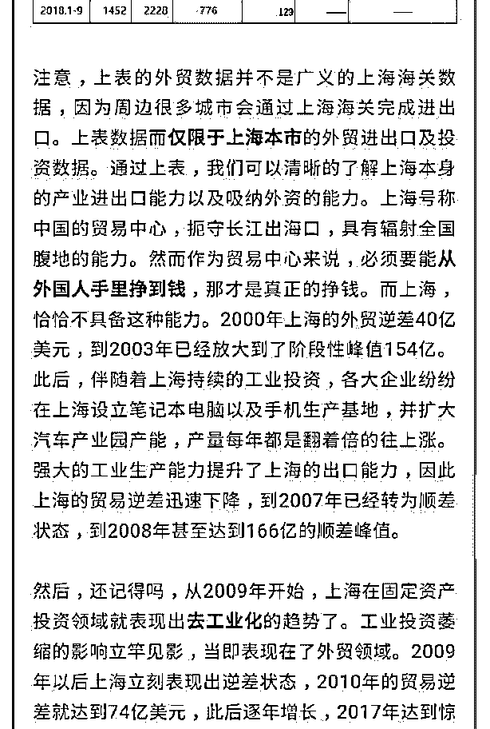
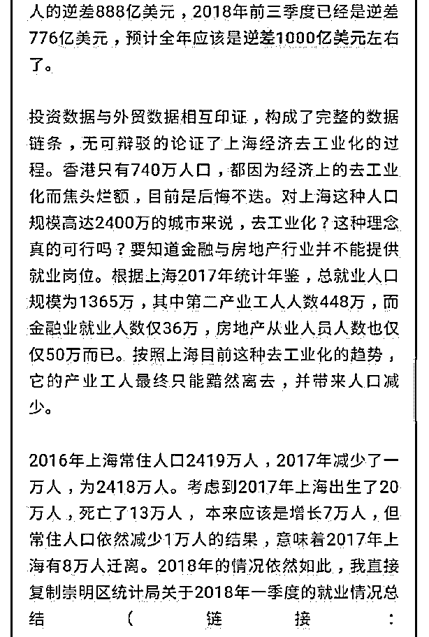
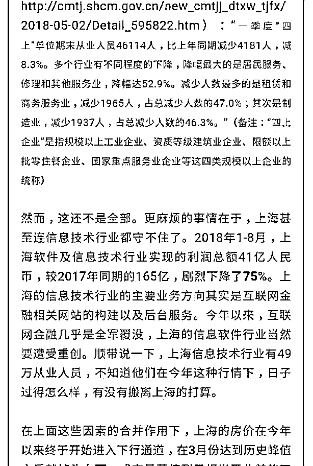
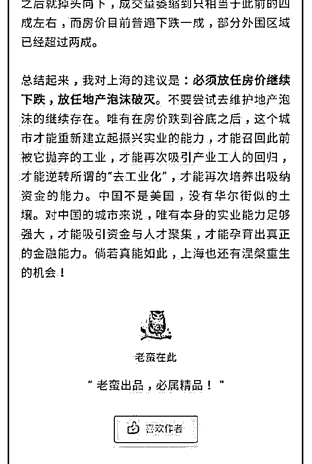

# 老蛮这篇，被上海连

(提问)水样 ID : 老蛮这篇，被上海连夜封号。 司令，盼您发表意见。

2018-11-13

回答：作者的数据我没有去查证，但是我相信不会偏差��

大。 前天我在跟踪天猫的区域数据，因为一线城市的渗透率

最高。我看到上海的数据是: 浦东新区遥遥领先，其次是闵行

和宝山。你看地图就会发现，这三个区域包围市中心。而且

闵行和宝山是上海的重工业区。市中心的徐汇区，地价已 10

万/平方，包围市中心的浦东是 5 万多，宝山和闵行才四万多。

落差很大，这种势能一定会向外溢出。最直接的影响就是对

地价的影响。间接的影响就是对产业的影响。租金和环保成

本很高，制造业下行的情况下，特别是老的制造业转型的情

况下。产业就会发生变迁。产业的变迁可能会很快，但人口

结构的变迁会很慢，因为需要生活配套设施。 浦东新区成为

第一，我们不奇怪。浦东新区是中产聚集地区。而且在成熟

的城市区块中面积最大。宝山和闵行的消费能力上来，显然

不是重工业区里面的生产工人消费的。 产业是有其周期的，

上海不管重工业还是轻工业，都有很多几十年上百年的老

厂。我曾经跟上海两个改了制的百年企业合作过，他们生产

机器设备的。嗯，他们的总部还在上海。但是他们的生产基

地已经搬到嘉定那边去了。在上海的外围城市有很多民营企

业也是做生产制造的，甚至是不错的知名品牌还出口的。上

海本地的制造业企业很多是国有企业，不管改制与否，他们

都面临一个产业周期切换的问题。你说消费领域的光明吧，

光明集团今天走入绝境了，快破产了，那是一代上海人的记

忆。前段时间还发起了一个鼓励大家去买，去拯救光明的活

动。你觉得这是所谓的去工业化造成的吗？不管是蒙牛还是

伊利。他们都属于现代化的乳制品企业，他们已经完成升级

了。而光明更像一个传统的企业。这样的企业要么自己破

产，把资源释放出来。要么自己完成升级。就好比开线下店 一样，小米之家，虽然也是线下店。但是它是升级过了，他 从管理方式，成本控制营销，客户体验，甚至从业人员的构 成。都升级了，同样一平方店面，利润会高出 25%，产业升 级，并不是换一台机器。他有可能是换一拨人来做这件事 情，以另外一种方式。它必然有一个下降的通道，然后再有 一个上升的趋势。这么说吧，上海就是把房地产全部摧毁， 他也无法让已经迁到嘉定，常州，昆山等周边地区的制造企 业再回到市区。经济周期，产业周期和债务周期是谁也绕不 过的。我觉得还不够，应该要加快这个速度。加快了那些老 的破产，现在呢，为了数据好看，或者为着各种各样的原 因。政府还动不动去插手输血，吊着反而不好，早死早投胎 反而符合产业升级周期迭代。 这些年金融领域，玩法很多。 每一种玩法都在分流资金。展示出来的只是统计到的一些渠 道，还有一些渠道根本统计不到，比如那个区块链投资暗地 里吸纳了海量资金，主要平台都是在上海啊。 全国各地的存 款总额，增幅大于上海这并不能说明什么呀。存款额度增 加，一方面说明大家都有点钱了，另一方面说明大家没有投 资渠道。社会金融服务不充分。到底是上海的金融服务更充 分，居民更愿意拿钱去投资。还是因为全国人们这些年都有 钱，就上海人没钱？我知道深圳的创业团队融资全部是去上 海的。为什么各种新的金融平台，首先从上海兴起？其次就 是深圳？为什么不是成都，武汉，重庆长沙？这跟电商是一 样的，首先兴起的地方肯定有一班容易接受的群体。 自从 2015 年来，中国股市一路下挫，韭菜都跑完了。这跟股市本 身的缺陷有关，不改革制度，而怪罪于区域，这是欲赋新词 强说愁。上交所的主板和深交所的创业板。他们所代表的不 是两个地区或者两个交易所代表的是产业的发展周期。就好 比五六十年代的东北一样：不是因为东北的干部牛逼，而是 自俄国人日本人以来，在那里建立了配套的重工业体系。而 重工业是国家在经济周期的那个阶段最重要的产业。所以他 就特别的牛逼，特别的闪耀。今天的东北还是东北资源还是

那些资源，但是产业周期切换了。今天重工业不断在萎缩， 占比越来越低。你就是搞得最好，他在整个经济占比中也越 来越小，这是周期性的！ 上交所的背后是些什么样的企业？ 是上一个周期的企业，但是，他们还是当前主流的产业，体 量也是非常有份量的。那些企业都集中在上海吗？没有，它 集中在全国。这是因为上海的融资能力下降吗？是因为全国 的这种企业的融资能力下降！ 最后，社会融资困难。是的， 确实融资困难。但是他不是又没钱。那是要钱的主流主体， 不符合借钱的标准。这种钱借出去是有去无回的，银行和金 融体系已经不能再背负这样的无底洞债务了。这种输血没有 任何意义，就应该让他们都死了！ 作者有一个预设立场，好 像一说到制造业就是好的。其他的资产和产业都是差的。我 敢打赌，作者没有搞过制造业，现在那些制造业对人的缺乏 比资金的缺乏更为严重，因为低端没有人愿意去，高端还没 有培养机制。但人的成本高到一定程度的时候，就在大量搞 无人的智慧工厂。我认识一些老板，他们的企业做得很大。 但他们的小孩留学回来以后，都不会去接管他们的那个产 业。他们在做新的东西，新的产业。这就很说明问题了！真 正做制造业的人在用脚投票。而真正赚钱的制造业，根本就 不缺资金。现在这个社会有好多东西需要升级。只要你能够 升级，有人愿意给钱，大把的。问题是大多数人做的那个东 西已经过时了，也过剩了，既不升级，又想像十年二十年 前，产业刚刚兴起的时候那样，每天躺着就日进斗金，可能 吗！ 我认为在上海搞新的金融创新。包括搞贸易创新。会搞 清制造业的创新。上海的潜力在于它能疏通整个长江沿线。 上海人以职业经理人为荣，他们更适合把成型的东西做细做 精。而不是在跑马圈地的时候一鸣惊人。深圳更适合做这样 的开创性工作。我认为珠三角了，是实验田。长三角是对试 验田里成熟产品定型，并释放结构力量的产业链。雄安那个 区域是最后搞垄断和发市场准入牌照的。(19 赞)

评论区：

Essie : 一开始觉得这个作者很厉害，后来看久了发现他社会阅历不足，预设立场太多，很明显的学者派而不是实干派~跟司

令没法比

唐宁 : 欧神有一篇文章很合适这个主题。[上海没有错失互联网](https://mp.weixin.qq.com/s/Znu1W7VrnoTkUBZvLsrEww)[+#F1480](https://mp.weixin.qq.com/s/Znu1W7VrnoTkUBZvLsrEww)

唐宁 : 这个作者看过一篇还不错关注了，后来发现不行，取关

过重湖光 : 著名的 17 到 18 年全国遍地两脚羊的原创者，然而这 18 年都要过完了。。。水平真不咋行，还特别狂，一言不合就

拉黑[抠鼻]

Essie : 啥是两脚羊[囧]我之前都是看看他数据，觉得还可信。但这次经过司令文章点播发现其实有数据什么都代表不了，数

据跟背后原因的对应关系非常容易被简单化或想当然化。

过重湖光 : 你理解为尸体就行了。。。我关他比较早，因为说话危言耸听所以初期很抓眼球，但看了一阵就觉得他的逻辑

很成问题就取关了，但拦不住人气旺哪哪都能看到他[抠鼻]

