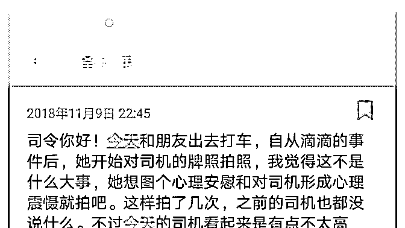
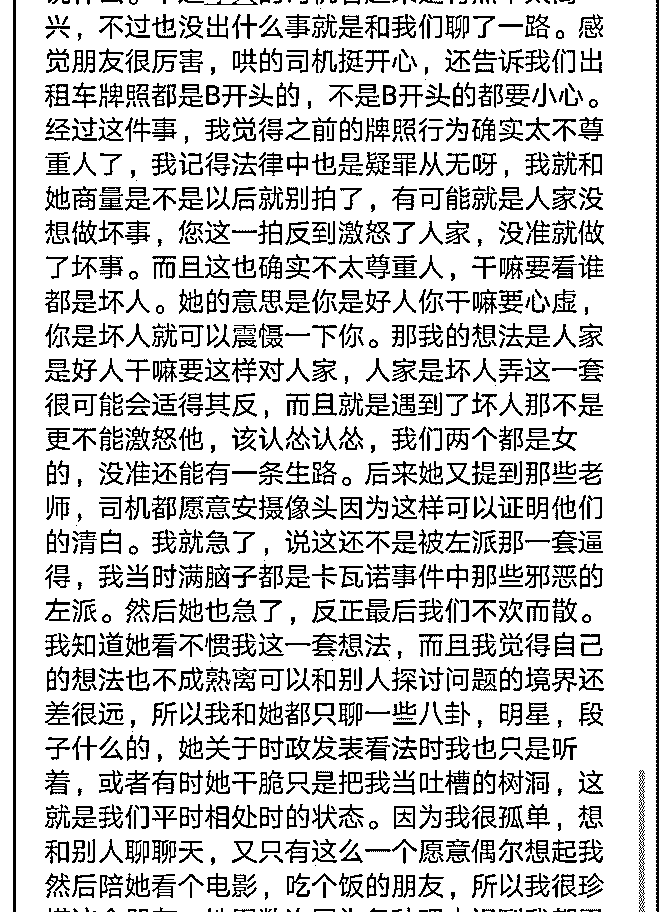
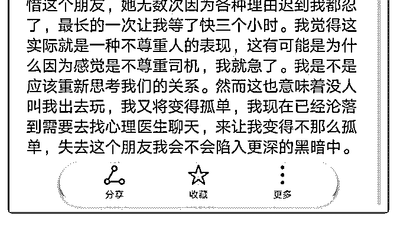

# 司令你好，总之感觉

(提问)匿名用户 : 司令你好，总之感觉比较迷茫，希望可以得 到司令的指点。

2018-11-10

回答：你是怎么认识这个朋友的？ 你可不可以通过同样的方

式认识其他的朋友呢？ 你不懂得拒绝才让对方模糊了边界，

得寸进尺。其实你也不是不懂的拒绝，只是你不敢。你之所

以不敢，源于你内心对孤独的恐惧。 从你处理与司机关系的

策略上来说你是理性的。但是我也看到了一点别的东西。那

个东西就是你害怕冲突。你希望通过回避冲突���获得安全

感，获得内心的宁静。 你为何如此的封闭自己？显然你对外

界的恐惧。以及你对外界所有危险的想象都被你的内心放大

了！你对这个朋友的不满，表面上是因为他不够尊重你，她

的很多行为突破了边界。但深层次的原因是你的内心感觉到

她的不可控——你害怕她的这种不可控，会将你拖入危险之

中。所以你想逃走！ 我早几天回答了一个关于自卑的问题。

我从原理上讲清楚了这个恐惧是怎么产生的。你可以往前找

一找，看看那个回答，搞清楚它形成的机制以及破局的方

式。 你对外界的恐惧，很多是基于你的想象。而你这种想象

放大了外部世界和你自己之间的比例尺。从而越发发现自己

的渺小和外部世界的不可控。于是你会渴望找到一个能够确

定的地方躲起来，那样才让你感到安全。 军队中有一句俗语:

再凶猛的猎狗第一次听到枪响的时候也会害怕。消除恐惧和

自我封闭的最好方式就是用现实突破想象。这玩意就像鬼一

样，听说的人多，见的人一个都没有。都是自己吓自己！我

九岁的时候从外婆家回自己家要经过一座坟岗。我提了一个

煤油灯，一个人走。走在路上的时候，看了个影子晃了一

下。因为那个煤油灯照不远，光也不聚焦，不像手电筒。我

不靠近的话就看不见，但是我要靠近的话，那就和鬼直接面

对面了。我咬着牙大喊一声冲过去。结果把那个坐在坟头抽

烟的人吓坏了！ 你已经退无可退了不是吗？那就狭路相逢勇 者胜。你主动约一个人一起去做一件事情。为了减少风险， 你可以一起去人多明亮的地方。嗯，比如说去买衣服啊，逛 街呢。你多试几次，找不同的人，你就不会那么恐惧了。 孔 子说，因材施教。你的内心戒备过严，你可以凡事不要想得 太深。因为你内心有个预设立场，则以深究，一定会想出问 题来，自己把自己先吓住了。另外你不要有什么心理负担， 把它当成一种不正常。恐惧和孤独是人之常情。我前天晚上 给人写个广告，不照样描写了某个瞬间的孤独感。我并不觉 得我有病啊！ 如果你实在没人聊天，你可以在私信里给我留 言。我保证不泄露你的身份，也不收你的钱。不过我不无法 做到实时的回复。我有空的时候，看到了会回复。 开心些， 这个世界虽然不完美也还值得期待！迈开你的步伐，你会发 现一切都变得不一样了。(26 赞)

评论区：

白马非马 : 司令好善良啊…

余生 : [捂脸]司令你.... 牛[捂脸]

张志刚 : 赞赞赞

为 : 司令的时间利用应该非常棒

罄 : 哇，好感动!会不会喜欢上司令呀！

Vincent.方 : 司令没结婚?[偷笑]

清云 : 我想和你聊天，可以吗？

司令 : 任何人都可以，上面有私信。不过我没时间实时回复，有空看到了才会回复。

