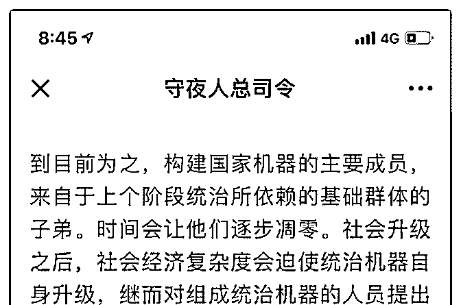

# 司令，这里说的“前

(提问)匿名用户 : 司令，这里说的“前期教育投入，成为筛 子”是指什么？

2018-11-08

回答：教育投入的成本会成为门槛，把跟不上的家庭和人群

都排除出局，最后筛选出来的就是社会统治力量的子弟。国

家机器的组成人员必然由他们充任。从而完成对国家机器的

接管。里面已经讲了：他们集 道义认同、组织能力 和 利益捆

绑于一身。拥有最强的组织动员能力，拥有最符合道义所标

榜的个体。换而言之，新的意识形态必然从他们所代表的群

体中产生，统治机器为他们所代表的利益群体服务。(4 赞)

评论区：

小披风 : 请教司令这个阶层具体指什么 是拥有资本的这批人吗？

cris : 马云等人的孩子

乔伊斯 : 权贵后代，资本的后代

airyxia : 司令，资本是关键点，为啥教育成为门槛？

Marz : 认知

