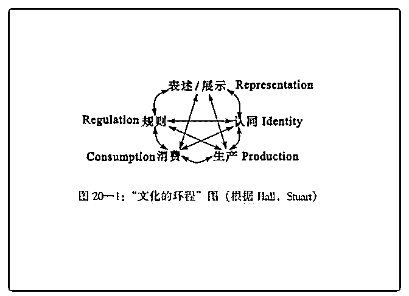

# 求助司令大大这个“

(提问)匿名用户 : 求助司令大大 这个“文化的环程”该如何理解啊，是指文化的意义在几个不 同的行为和过程中［循环］么？

可是读了司令的文章后，深深认同文化是一种生存策略，为 生命延续服务，并不存在所谓的这种“文化的环程”…

2018-11-07

回答：嗯，文化是一种生存策略，根据生存环境的改变雕

塑。他也有一种惯性和延迟。嗯，这个图应该是表示这种文

化如何作用于现实世界。它存在这几个节点。关于文化如何

作用于现实世界？嗯，这个以后在结构力量里面详细阐述(3

赞)

