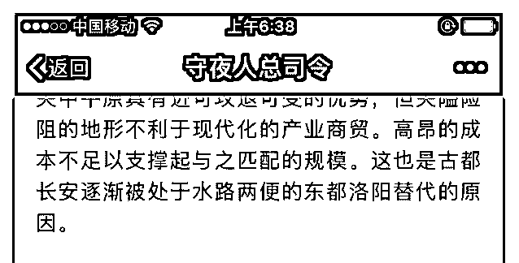
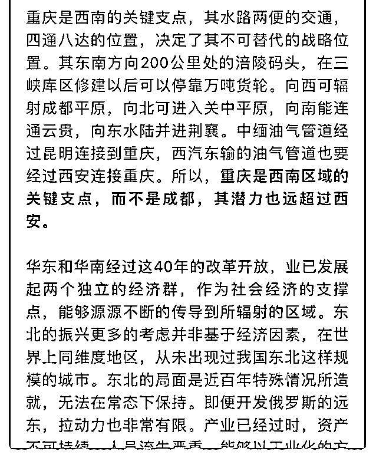

# 关于重庆，区位优势

(提问)John Smith : 关于重庆，区位优势和潜力毋庸置疑，但 从政治角度分析，其与成都的地位未来 10 年内应该是平起平 坐，有以下几点分析： 1、天下未乱蜀先乱，天下已治蜀后治。 中央为防止一家独大，需要两个支点互相制衡，譬如美领馆 事件，若无成渝制衡，不会这么轻易平复； 2、成都在战略上也是西南的区域中心，特别是成都对藏区的 辐射和控制作用，不仅直接影响一部分藏区精华（阿坝、甘 孜），川藏铁路更是深入藏区腹地的世纪工程，政治上也会 有不少不计成本的真金白银砸下； 3、古有扬一益二之说，关键就在于人口密度，虽然长三角在 海洋外贸机遇上先行一步，但人口带来的市场潜力也不容小 觑。

司令的看法如何？

2018-11-07

回答：成都是重庆的辅助，不会形成完全平等的双中心的。

整个大西南的支撑点是在重庆。 成都能辐射，就那成都平

原，嗯，往西去对于西藏那边的影响其实有限。因为你看地

图就知道那边都是山。即便在那个险峻的山中开出路来。无

论在战时还是平时，都太脆弱了。而且这种投资除了安全需

要以外，没有任何经济价值，维护本身就是不断的输血。而

且印度对大西南的影响非常有限。喜马拉雅山所阻隔的。不

仅仅是我们无法把势力渗透到。南亚次大陆。同时南亚次大

陆的势力更无法越过喜马拉雅山威胁道我方。所以它是一种

以小博大的羁绊。 倒是云南却是一个很重要的支点。它不仅

仅有经济效益，还有能源通道的安全，更重要的是能够把势

力投射到东南亚。我以后去研究一下昆明。 至于人口密度，

成都平原的人口密度再大，他和珠三角一样都是区域性的。

而且珠三角是外向型的。你知道黄市长为什么在重庆搞那么 多的产业吗？他甚至不惜以违背经济规律的行政手段压制那 个房价。就是为了建立他的产业体系，他还在那里建了个海 关。长江上游的产业布局，完成以后。那个工业化的漩涡就 能形成。 一个城市，首先他要具备现代产业那你建立的低成 本优势。其次，它的产业是处于升级状态。你像东北的产业 周期已经过去了，如果要重建的话，等于把原有的东西全部 拆掉。这个就比较难了。一个公司转型都很难，何况一座城 市。因为你的主要业务是什么，他就决定了你的人员配置你 的企业考核标准，你的上下游配套。这些就是一个产业结构 啊，他会把你绑死在里面。 其实汉中的生活习惯和四川几乎 一样。但是硬生生把汉中划给陕西了。就是为了打破区域的 封闭性。否则的话，关起门来，他们就自己玩自己了。千百 年来都是这样。嗯 2000 年前嘉陵江的上游和汉水相连，可以 直达渭水。后来地理环境的改变。嘉陵江就在四川盆地自己 流了。这就更加大了它的封闭性。为什么把重庆单独摘出 来？他那个位置具有打破地域封闭，同时联通四面八方的优 势。更重要的是他有能够建立现代产业的潜力。(20 赞)

评论区：

Vincent : 期待司令昆明的分析～

machelshan* : 重庆把世界四大 IT 产业引到重庆，而且重庆的整体设计是面对辐射整个东南亚，有国际眼光和战略眼光，以

点带面，客观上重庆模式记一大功

徐天护 : 厉害了。人在成都，确实感觉有些陷溺其中，蜀犬吠日。

