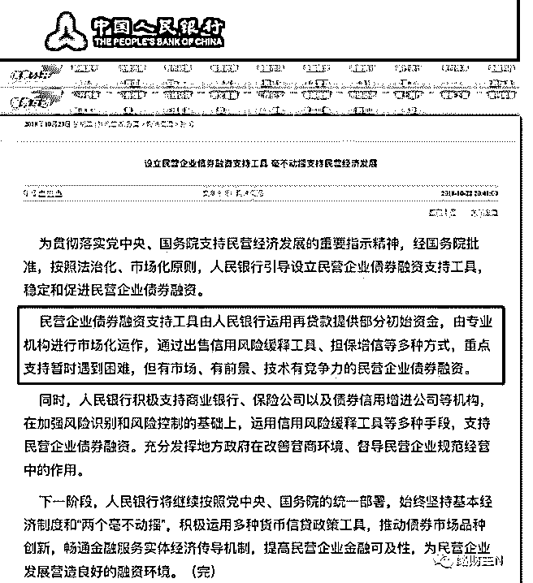

# 央妈为民企债务兜底

(提问)强哥不砍树 : 央妈为民企债务兜底儿，是否可以看作是 对新兴力量的妥协？这种政策对经济运行会产生良好的作用 吗？

2018-11-03

回答：这都是情理之中的事情啊！ 当然会啊，如果放任质押

风险爆仓，那等于自杀呀。90%的就业是民营企业创造的。

70%的科技创新也是民营企业创造的。经济的三大产业，农

业，工业服务业。民营企业集中在工业和服务业，特别是服

务业。这个服务业不一定是送他的，这种才叫服务业。 所有

为社会分工协作增加经济密度的服务都是服务业，包括金融

也是服务业。越初级的经济体，他的农业占比就越高。其次

就是它的工业占比。越发达的经济体，它的第三产业就越繁

荣。社会末端的渗透和协作就越强。 国有企业代表的是国家

意志。民营企业代表的是社会日常生活。丹顶鹤不是提出来

国有企业垄断上游的资源。民营企业去控制产业的中下游。

以前从来没有这样的提法。 目前金融市场上不够成熟，没有

办法以金融市场的方式来做长周期大规模的融资。那么现在

主要这样的融资是依靠政府力量，所以这样的投资都是国企

在做。随着市场化的金融市场的完善以及相关配套的政策的

改变，现在已经被迫妥协做这种改变。当国有当民营企业，

也能够通过金融市场做大量资金的长周期大规模投资，那么

中国的三星也会诞生，民营企业控制的产业会逐渐向上游渗

透。(9 赞)

评论区：

清云 : 现在已经坐到桌子跟前了，下一步就是上桌子。

强哥不砍树 : 梳理的好清晰！

