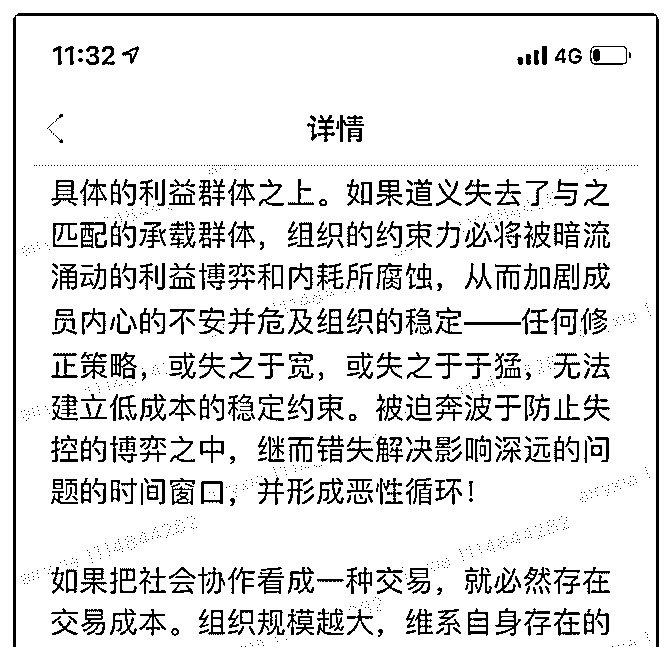
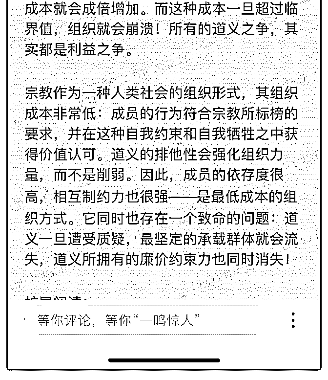

# 司令，这里说的组织

(提问)匿名用户 : 司令，这里说的组织包括政府机构，民间社 会机构，企业等？如果是，一个人在不同组织中，不同的共 识如何做到兼容，内心冲突如何应对？

2018-11-03

回答：每个组织有其自己的意识形态，它无法兼容，如果都

可以兼容的话，那组织就会瓦解。因为意识形态为组织的存

在给出了合理性。就如同宗教都是排他性的，如果当这个宗

教能够兼容所有的东西的时候，这个宗教一定会消亡。这种

封闭性越强，它的内在控制力就越强，内部成员的归属感和

成员的服从性也就越强。他不会允许游离分子的存在，这样

的成员越多就越容易瓦解。 如果你读懂了这篇文章，你会发

现一个意识形态必须深深的扎根于一个独立的群体，这个群

体集道义认同，组织能力和利益捆绑于一身。组织会让你获

得你意想不到的荣耀和利益，同时也让你失去它的时候无法

生存。在五六十年代当国企员工想收到他们没有支付成本

的，免费的教育，医疗，住房，公共设施社会福利的时候。

是以什么为代价呢？如果你被开除公职，你一无所有无法生

存。为什么组织度高，动员力强？为什么道义的认同感非常

强？因为不但有三次，还有惩罚，赏是你获取不到的，罚是

你承受不起的。正因为如此，任何上面的指令可以瞬间传达

到末端没有人敢反抗。因为任何质疑，不执行，反抗，都是

拿生命在开玩笑。 你知道资本是如何控制那些明星创业者

吗？你少年得志，搞出点小东西。然后资本会成群结队的为

你站台，为你鼓吹，让你在聚光灯下迅速膨胀，给你无法企

及的享受，人脉和虚荣。然后开始收网。当把梯子撤走的时

候，你发现你的人脉和资源也消失了。你空顶着一个虚荣下

不来台。这个时候你就像脖子上套了根绳子，想要你怎么叫

你就得怎么叫。所以人要认清自己，要低调，不追求虚荣。

扯远了，如果你同时从属于不同的组织中。你必须有自己的

生存策略和自己的信仰，这种信仰超脱于所有组织，他们都 只是你的工具。因此你跟它们之间只是一种交易关系。当然 你也不可能深入到它里面的资源。也不能够充分的利用到那 个组织的力量。他对你的利用有多浅，你对它的利用也有多 浅。 要挣钱就一门心思挣钱，要当官就一门心思当官。只想 大把挣钱又想拼命升官。这种自相矛盾会害死人的。在统治 结构中，对位置的争夺非常残酷。在这个信息时代，没有什 么是藏得住的。被人抓住把柄了，一定会死得很难看。(10 赞)

评论区：

Allen : 马爸爸看得明白

