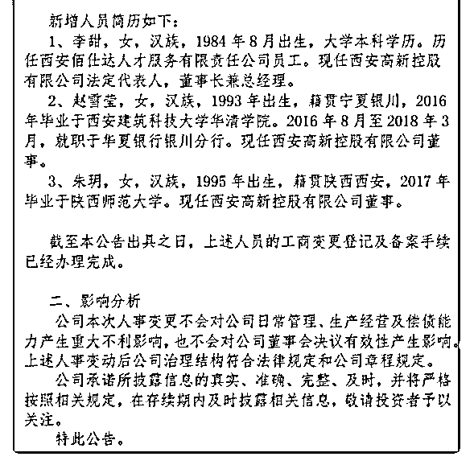

# 95 年女生出任千亿

(提问)匿名用户 : 95 年女生出任千亿资产国企董事 去年刚毕业 无工作经历

这样的，稳定性还存在吗？[文章详情页](http://m.btime.com/item/router?gid=31gp6ito0a08ss98fi40o5sc8oq&from=timeline&isappinstalled=0)

2018-11-03

回答：稳定！ 预设立场和情绪化判断是人之常情。但是安抚

愤怒和挑拨情绪不是我的强项。我只关心真实世界背后的运

行逻辑。 我不喜欢做时评，因为它会浪费太多的时间，也没

有什么太大的价值。我的目标是把结构学提炼出来。我认为

搞明白的人自己可以得出结论。因为你去关注那些时事也

好，热点也好，零碎的信息也好，你之所以关注，可能是对

你比较重要，这些东西对我一点都不重要。如果对你重要，

你肯定是想通过这些信息作出符合你利益的判断。 我所提炼

的结构学，就是帮助你去获得自己判断的。我只讲原理，以

及关注这种原理是如何作用于现实世界的。 一个结构的稳定

与否，取决于它的关键节点。关键节点之间相互支撑，又相

互制约。用通俗的话说，它自己有一个纠错。生命对资源的

占有是本能的，它源于基因的贪婪。任何个体都会用尽一切

办法去占有资源。这是本性，他之所以停止占用，是有所制

衡，这就是结构内部的制约力。只要在边界之类，都不要

紧。 这篇文章讲述了如何去识别统治结构的关键节点。我们

先讲了结构本身，然后讲到结构里面的内在制衡。这篇提前

给个实用的技巧。(5 赞)

评论区：

machelshan* : 最欣赏司令这种冷眼旁观的冷静和理性，请问如何才能做到冷眼旁观！[微笑]

唐宁 : 德不配位损失的是谁的利益？能给你也能拿回去去，靠运气的战战兢兢，患得患失。靠实力的，衡量利弊。

大山 : 你看的只是位置。 但如果这个位置不是关键节点呢？ 何况如果是关键节点，你怎么知道认知是一般人的层面?而且

背后没有智囊团? 再退一万步，就算是关键节点，人也德不配位，结果无非就是节点重构，又能怎么样呢？

