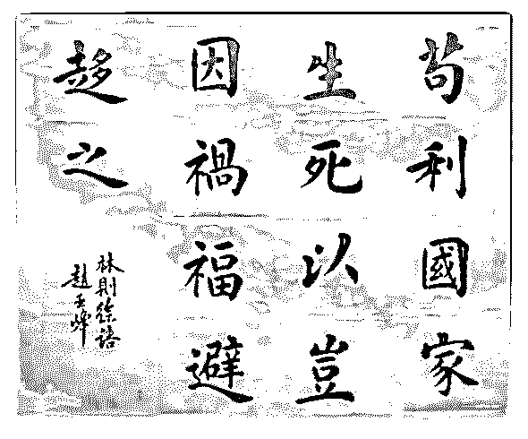

# 司令好，我进入水库

(提问)匿名用户 : 司令好，我进入水库后，看房 200 套，在这 个过程中，建立起一套成本评判标准的过程。然后，我发 现，呈现在我面前的东西，都会自动辨别成本，辨别性价 比，计算回报率，我会自动屏蔽那些“不划算”的项目，对大 部分人或者事，按照成本～回报来计算。问，“苟”是个非常 难以得到回报的事，哪些有情怀的“政治家”，为什么要义无 反顾？要知道损失自身，对自己家族是极大的损失，就算苟 能成功，也需要活着的你才能享受到，你挂了，成为先驱 着，有名分还好，没名没分那算什么？我有听说香港那边， 做十年卧底回来都是直接退伍的，根本不像电视剧里描述 的，卧底回来还能升级。既然前途无量，回报率几近为 0，我 干嘛要去做？

2018-10-29

回答：看过《肖申克的救赎》吗？高墙最开始是限制自由的

障碍，最后会变成给自己内心带来安全的保障。人的生存结

构和精神结构会相互雕琢，最终达成一种平衡。其实，人并

不关系真相，人真正在乎的是：安心。外部的环境或者内在

的冲突打破了这些平衡才会引发各种不适。 人类和人工智能

最大的不同在于，人工智能有唯一的评判标准。这个评判标

准是外部输入的。比如说，虽然人工智能下出来的围棋各不

相同。但是其目的是一致的，就是为了赢。更重要的是赢的

标准是一致的！ 而人类就不一样，对人类而已，什么算赢，

这个事情本身是各不相同的。你的精神结构决定了你的赢是

什么。我们讲述过，精神结构包括三者: 1\. 你对自己的认知。

2\. 你对自己与外部资源之间关系的认知。 3\. 基于两以上二者

在面对存亡绝续的策略。 根据大脑对信号的筛选机制，前两

者天然具有自我遮蔽性并会自我强化。基于此形成的策略也

各不相同。一个置身于巷子中无法转身的人和一个在旷野上

的人，面对迫在眉睫的危险的定义是完全不一样的，据此做

出的取舍也各不相同。你从自己的视角去看待取舍，而他和 你没有处在同一个生存结构之中，拥有完全不一样的精神结 构。你们面对不一样的存亡绝续的选择。 他在他那个结构里 面所做的取舍，会得到他的那个结构的奖励，而且这种奖励 符合他的那个结构的导向性并让他感到安心。 我举一个最简 单的例子吧：你穿一身名牌，你要想打击到别人的话，除非 他和你有一种共识。你们一定要有一个同样的结构导向性， 面对同一事物有同样的取舍。没有这样的共识，你既无法说 服他，也无法打击到他。就如同面对极端恐怖分子的时候， 你没法谈判。在你看来，他的所有行为都不值在他看来，他 的一切行为都符合他的那个奖励机制。 如果你能够更想得更 深一点的时候，会引出另外一个问题: 在生命的层面中，是不 是有一个共识？那为什么他宁可放弃自己的生命？这是个很 好的问题，可惜是我提出来的。[偷笑] 生命是基因传递的载 体，载体的多样性才能更好的适应各种不同的环境，以保证 与基因的传递。因此单性繁殖进化成两性繁殖，就是为了追 求多样性和适应性。在此之上，又进化出另外一种东西。以 意识形态把个体生命组成一个更大的生命体，让基因在这个 更大的生命体里面传承。那么个体生命就成为一个更大生命 体里面的一个部分。在一个结构内部会有一种激励机制让他 的部分，以更有利于整体的方式，去做取舍。这也是为什么 战士们愿意慷慨赴死，他们的自我牺牲是为了守护整个族群 的生存。我在《E1:精神结构》的末尾部分阐述了，个体生命 的精神结构是整体生命体的意识形态能够产生和发挥作用的 基础。 林则徐心中的信仰是士大夫那个群体对自己与整个族 群关系的判断，驱动行为的是结构内在的奖励机制。如果每 一个个体都被这个机制所驱动，那么整体的生命力将会更 强。这也是为什么？虽然我研究人性中最冷酷的部分，但是 我一直主张阳谋的根本原因。重剑无锋，以静制动。(21 赞)

评论区： 彭刚 : 365 值!

彭刚 : 听君一席话，胜读十年书。

Mushroom : 那个层面的利益你不理解而已 所有的利益都是主观的，所谓 perceived interest

陈校长 : 看完水库过来拔草解毒[皱眉]

ARCTERYX : 结构不同，想法怎会一致。

齐天大豆 : 人生何处不相逢[呲牙]

大海 : 看元素周期表 物质变得越来越复杂 生命也变得越来越短暂 为了生存只好相互媾和 产生出多样性 所以个人理解单性

繁殖进化成两性繁殖 不是因为为了追求多样性 而是为了追求稳定的活下去！

