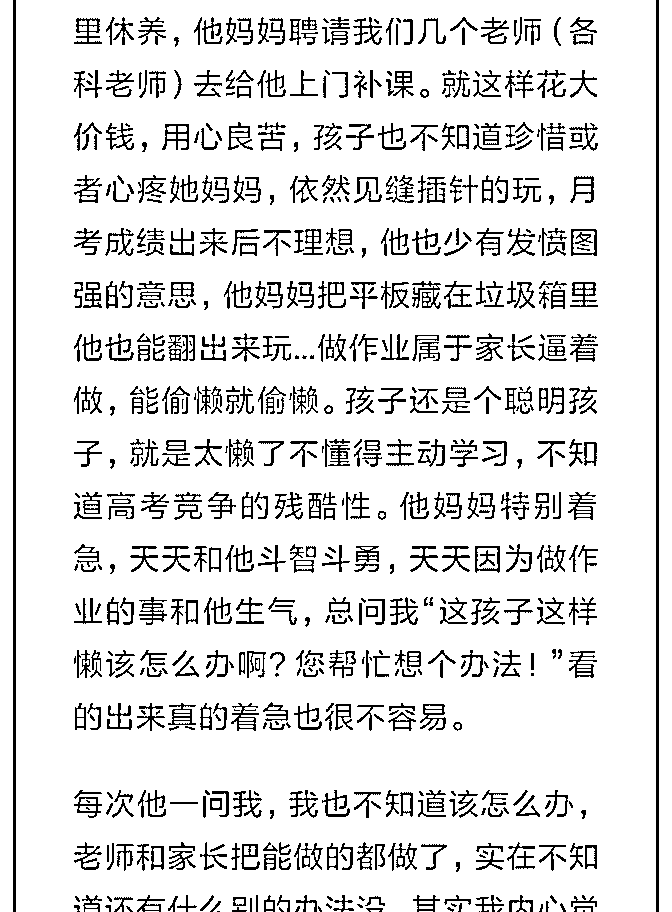

# 司令麻烦您帮忙看一

(提问)匿名用户 : 司令麻烦您帮忙看一下这个问题，谢谢 2018-10-28

回答：每天消息太多，这个小孩的成长环境中缺乏父亲角

色。我不是说一定要给他找个爹，我是说哪怕是舅舅也行

啊。我儿子一直是父亲角色，父亲角色会有一种责任，我觉

得父亲对男孩溺爱不起来，所谓同性相斥吧。男孩在成长环

境中有父亲这个角色，他会潜意识会去模仿。这就是男性特

质的传递路径。 显然这个小孩子成长环境之中没有这样的角

色，也没有这样的传递。传递的是他母亲的那种女性角色的

东西。父亲的怕和母亲的怕不是同一种。父亲害怕男孩子没

有担当，不够聪明，性格怯弱，承担不起他的责任，无法在

未来的生存竞争中也有占有一席之地。而母亲的怕，是怕他

照顾不好自己，怕他受伤害，怕他不受欢迎。所以女性特质

比较强调结果同时又容易妥协。对于执行过程中的规则以及

路径，不是特别在意。 因为在善于连接的女性世界之中，一

个好的连接，瞬间就把整个东西全部改变了。这中间的过程

几乎不重要。所以女性会特别强调结果，而且特别在意维护

与外部的连接。在这样的生存竞争中，抚慰和满足情绪是第

一位的，原则是第二位的——爱是无比珍贵的，几乎能够给

予一切，包容一切；但又是那么的廉价，随处可得，泛滥无

边。 我不知道你观察过没有，父亲不会轻易给予，哪怕是一

个肯定的眼神。说的露骨一点，这个父亲的角色，要肯定一

个东西的时候，是因为你符合他的心意，符合他的要求和标

准，或者像他本身。 阐述清楚这所有的原理以后，最后的结

论是: 这小孩的问题不在学业上面，如果这种生存环境不改

变，他的精神结构也不会有任何调整，它天然缺乏内在的驱

动力。他的母亲会自食其果！根据我的观察，如果是母亲与

儿子相依为命的家庭，而且是从幼小的时候开始的。这样的

男孩都极度的狭隘，偏执，暴戾和敏感，感觉全世界都欠他

的，而且全世界都应该为他让路。(6 赞)

评论区：

司令 : 错别字好多！ 上面第三句是：我觉得只要是父亲角色，父亲角色会传递一种责任。

白马非马 : 谢谢司令，司令分析的很对，我认为基本就是这样的。 好在这孩子性格除了喜欢偷着玩，懒，没有进取意识，

（比如他经常说的一个词是“挺好的”。不论我说啥，他都会说“挺好的”，有次我说他就快不及格了，考不上大学了怎么

办，他还是下意识地说“挺好的”……我？？？）其他方面还可以，没有出现暴戾恣睢的一面，有时还略显天真蠢萌，问我

一些哭笑不得的问题，不知是只是没有展现在我们老师面前，还是怎样。 可以看出来他母亲的精神世界就是他儿子。 他确

实长期生活在一种女性世界里，除了他妈，他亲姨经常去家里串门，没什么男性榜样的确立。 所以这个问题也是无解的，

作为老师我们也不能对人家私生活指手画脚是吧。[调皮]

司令 : 不干涉私生活，你讲清楚原理还是可以的。清楚原理之后，她一个大活人不知道该怎么办吗？

白马非马 : 好吧，那我下次委婉地提一下吧[大哭]我是听明白了，但是我怕我讲不清楚，引起误会，我尽量吧。

白马非马 : [呲牙]

猫姐 : 西方有个角色，类似教父，家里的男性朋友或兄长，作为男孩子成长中的榜样和朋友，可以倾诉，得到力量

大山 : 中国其实也有，叫干爹。可惜现代被曲解成另一种了

白马非马 : [愉快]谢谢提醒，我知道该怎么跟他妈妈说了。[耶]

