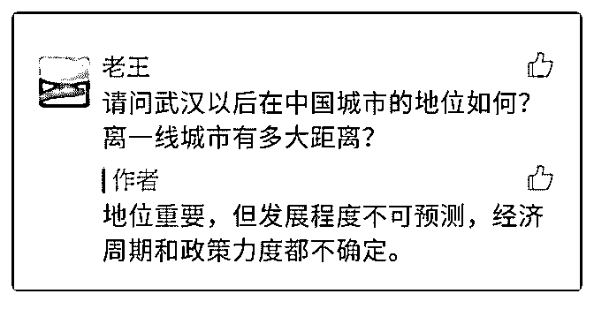

# 司令您好，看您在《

(提问)匿名用户 : 司令您好，看您在《雄安》文下回复如图。 请问您：我是武汉土著，上海大学大三，工商管理专业，家 里是市区几套房的拆迁户，没有背景。我考虑毕业去向，沪 深或武汉，目前的求职环境，武汉远不如沪深，但又觉得武 汉前景远大。我该怎么选呢？谢谢司令作答！

2018-10-27

回答：城市之间的迁徙不是随意的吗？ 你想在哪里工作和生

活都可以啊。 配置资产和人在哪里生活毫不矛盾。(7 赞)

评论区：

水样 ID : 欧神也说过：买房去重庆，职场去深圳。

唐宁 : 欧神被叫做“灯塔”，就是绝大多数人就等着灯塔给一个答案，从此人生巅峰。他也说过人是极懒的，即使给了全部心

法，你还是要来问。然后做了星球。

王梦梦，怡人 : 深圳上海，混不下去了再回去嘛[呲牙][呲牙][呲牙]年轻就是闯荡的资本哈，而且你家还有房[捂脸][捂脸][捂

脸]你到底是来提问还是来炫富的，不知道有啥好纠结的，男生又不需要早结婚[捂脸][捂脸][捂脸]

大山 : 早结婚是要有资本的呀。

