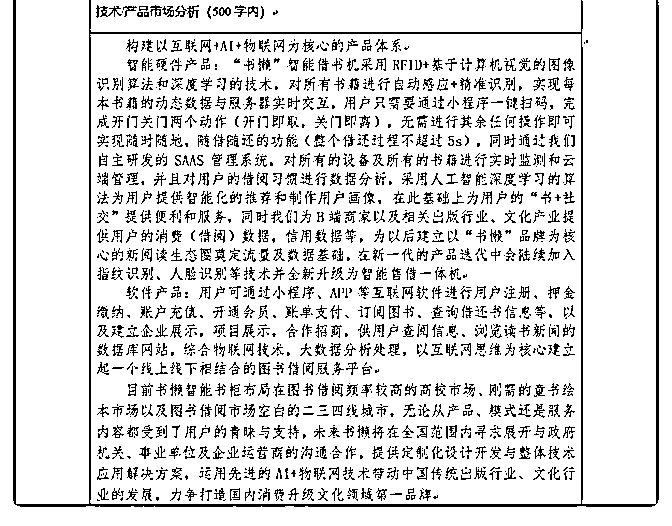

# 司令，我看到一个大

(提问)易水寒旗 : 司令，我看到一个大四学长是 ceo，申请了 多项专利，成立了一家公司，从他 QQ 上发的信息看，我大概 搞明白是做智能借书机，采用一些新技术，但本质我认为就 是校园内书籍共享。 我不能理解的是，我觉得书籍共享完全就是伪需求，书的价 格低廉，基本买就行，顶多图书馆借。 而多建一个共享站的成本太高。我觉得划不来。 这样的企业能够创造效益吗？而根据他朋友圈的信息，从学 校资助到省资助到国家资助，一路拿钱，参加比赛一路获 奖。成立公司也开始要上市，并且计划今年敲钟。总之，他 得到了足够多的利益，但这和我以前的想法完全不同。司令 能解答一下吗？

（图片来自他的说说，如果不合适我再删除）过了十二点， 不求您现在解答我的困惑。

2018-10-27

回答：非常无聊！ 我终于明白大学生创业是个什么扯淡的事

了！ 我都懒得回答，以免留下记录贻笑大方。 创业比赛，一

路拿钱，创建公司，计划今年敲钟... 从朋友圈里看到！ 先去

做一个产品，做到有用户，有流水，先不要求盈利。 李相国

这个大众创业万众创新害人不浅呀！这帮人没有出过校门，

没有受过最基本的商业和社会训练，开始做着春秋大梦。(7

赞)

评论区：

易水寒旗 : 不是啊！我是觉得这不行的！但我理解不了为什么他可以凭借这个和各路人有了关系，哪怕你说他做的是错

的，但对他个人来说，他在这阶段得到的更多的是人脉和相应的资源，这些是实打实的啊

乔伊斯 : 估计比较会忽悠和搞关系！参照贾老板！

易水寒旗 : 多谢司令的这个解答！！！

