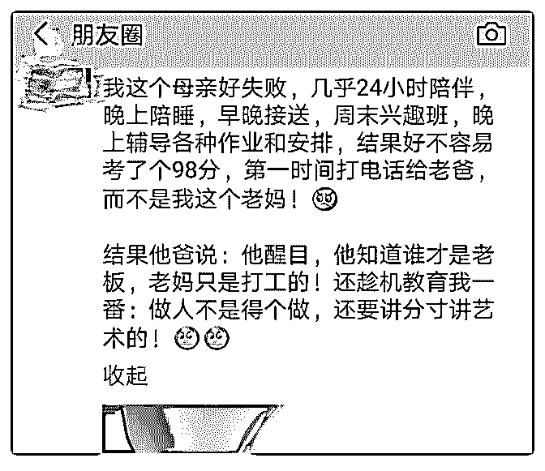

# 一线城市，母亲照顾

(提问)匿名用户 : 一线城市，母亲照顾三个分别是 8，7，5 岁 的孩子，婚前投资得当，现每年有固定收益约 20 万，平时兼 职收入约 15 万。父亲某上市公司老总，独生子。家里有一保 姆，孩子兴趣班约 600 元每小时。如何看待父亲的家庭观？母 亲该怎样教孩子对自己对家庭比较好？

2018-10-26

回答：我觉得他父亲是开玩笑的。人把目光聚集到一点的时

候呢，就会放大它的影响力。你知道如何让自己变得紧张

吗？你就反复去想那件事情，不断的把那件事情的重要性在

上面加码。最后你就发抖，就会越想越火，越想越不值。 小

孩在取得成绩的时候，想获得象征力量的那个角色这肯定是

一种本能。我小时候我父亲把我吊起来打，但是我心里面最

渴望的还是得到他一句肯定。这就好比权威盖章一样。所以

那个生活中缺乏父亲角色的小孩，往往没有主见，比较细

碎，缺乏担当。为什么会这样呢？因为生存结构中起仲裁的

那个角色是暴力。家里面有个男性角色，哪怕他什么都不

干，他都给那个小孩心里一种定海神针的感觉。嗯，如果那

个男性角色不够鲜明，小孩在长大成人以后，对父亲的恨发

自肺腑。这一点我在生活中亲眼观察过好多案例。 不要去争

这个角色！ 我以自己成长的环境举例。我小时候躲着我父母

去打游戏机。我爸找到了我，但他不动声色。他居然站在我

背后站了一个小时，等我打完。然后突然拍拍我的肩膀说:差

不多了！我回头一看，差点吓死。然后他不露声色，沿途还

跟别人谈笑风生打招呼，搞得一副父慈子孝的样子。回到家

去就用竹条打的我背上皮开裂，鲜血直流。他说在行使军

法！即便如此，我依然不恨他。因为他居然能够潜伏那么

久，不动声色。让我这个青春期的叛逆少年，不至于在众人

面前感到耻辱。关起门来，那有言在先，规矩在那里，他只

是按照规则执行。有一次我很顽皮，把公共的自来水管接口

搞断了。他二话没说顶着 40 度的烈日自己去修，修好了回来 再打。打完我也心服口服。因为他先承担了自己的责任，没 有一句抱怨，没有像别人家娘炮父亲那样埋怨一路。他什么 都没说，先解决实际问题，再予以惩处！ 正因为如此，正因 为这个角色非常的鲜明。那么，作为成长中的孩子，内心也 在一直寻求安全感，寻求这种确定性的鲜明力量。这是人 性！别说小孩了。你看那些被文革搞得死去活来的人，他的 内心深处，对施加暴力给他的那个最高领袖，依然心存崇 敬。人为什么这么贱呢？力量！人渴望那种能够带来安全的 力量感，并且自我代入。 所以不要去争这个角色，你争不 了。我母亲就是没搞清楚这一点。你愿去争这个角色，却争 这种关注度，就会越让小孩觉得，你这人太没有存在感了， 到处喜欢乱插一杆子，这跟你有什么关系呢！ 你知道公司里 面有那种干部吗？他心里存在感比较低，什么会都会不停的 发言，有的时候能发言，跟主题毫无关系。然后他见人就会 告诉他，你看我为公司付出了多少？所有的行为其实在掩饰 内心的一种恐慌和对自我的质疑。 这珍珠不管埋在沙子里， 还是放在盒子里，它都一样的光彩夺目。珍珠不需要去证明 自己的价值！他本来就值。 我觉得你应该好好考虑一下，除 了父亲那个角色以外，还有另外一个不可替代的角色。如果 说，象征暴力的男性角色给予安全和信任感。那么宽容，淡 定，宠辱不惊，以及人与外部维持复杂的又恰到好处的连 接。这个角色不是那种单刀直入或者争强好胜的男性角色能 替代的。要知道在生存竞争中，不只是一种策略。重剑无 锋，不争一时之胜，慢慢的像下围棋一样形成一种磅礴之 势。这种力量往往更为重要。所有伟大的人都会想念起她母 亲的那种以静制动的巨大能量。总是试图把一切抓得很紧， 往往忽视了真正的力量和真正的角色。(28 赞)

评论区：

黄 河 : 现实生活中，很多人天天想着要去做别人，却做不好自己！

核桃里的君王 : 司令小时候好皮啊，挨了不少揍。

白马非马 : 小孩子为什么获得好成绩后第一时间告诉父亲呢？因为父亲经常不在身边啊，而唯有好成绩能让小孩子借机和

父亲说上话，得到盖章肯定。做母亲的有点敏感了。☺

齐天大豆 : 非常正确，让父亲有一点带娃的存在感和自豪感，他会越来越更多的参与。

TK : 司令小时候好皮

te skam : 我们小时候都皮啊，但是我妈抓到了我就是直接在游戏厅门口开打。。。。

c z : 已收藏

