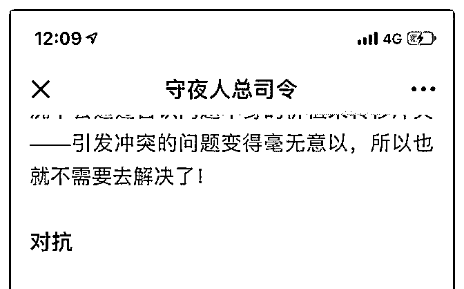
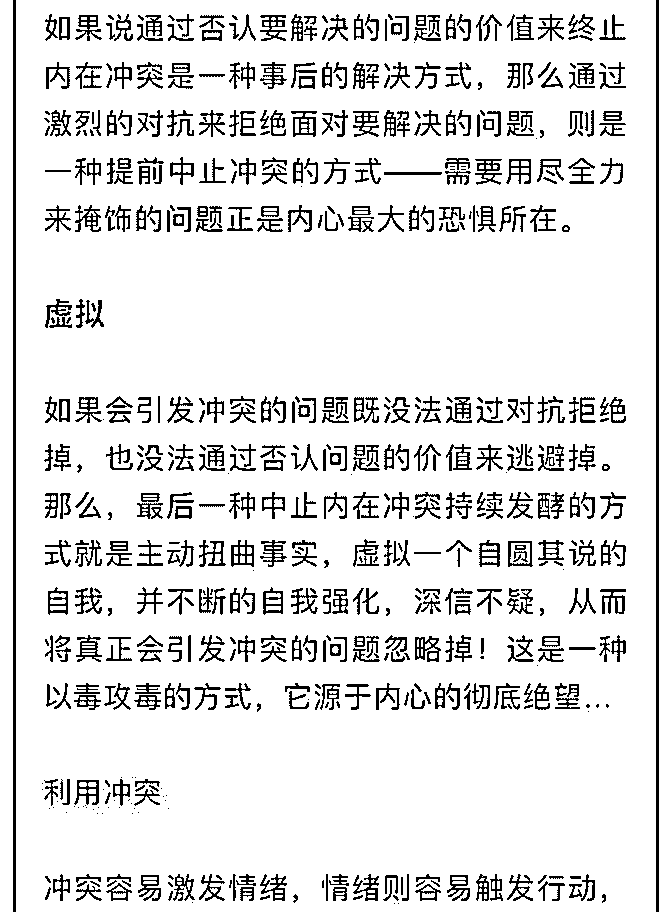
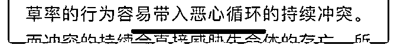

# 司令，文章中提到

(提问)匿名用户 : 司令，文章中提到 通过激烈对抗来拒绝面对 要解决的问题。我理解激烈对抗就是要解决问题，为啥是对 抗为了拒绝解决问题。还请司令赐教？

2018-10-26

回答：可能是我表述的不够通俗易懂。这句话过于学术化

了。他的意思就是说。以一种斗争的姿态,不让你提起这个事

情,不进入处理这个问题的流程。 那种否认这个事情的价值，

事先去处理过了。处理之后发现无能为力，陷入持续冲突中

了。这个时候通过否认这个事情有价值。然后解除这种冲

突。 我这里说的事情是根本就不去处理这件事情，他绕着

走。怎么样去规避处理这种事情呢，会以斗争的姿态，去掩

饰它。就好比通过发脾气就回避一个事情。(6 赞)

评论区：

airyxia : 感觉对抗是指最终解决方式是对权力和群体生存共识的妥协。否定价值和伪造事实是一种妥协后的自我安慰，获得

内心的稳定感？

杨小猛 : 解决问题最好的办法，就是忽略问题。

