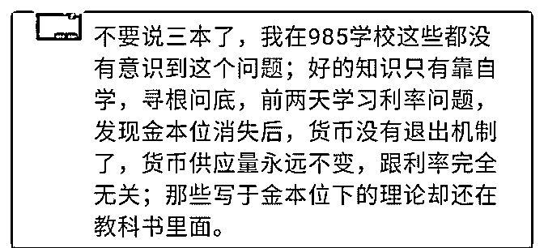

# 金本位消失后，货币

(提问)散落在指尖的风景 : 金本位消失后，货币没有退出机 制，货币供应量完全不变，跟利率无关，求解什么意思

2018-10-24

回答：怎么可能呢？法定信用货币的退出机制，就是回收流

动性嘛！不过它变得更复杂了而已。金本位的时候就等于说

全世界都以黄金为基准对标标量。但是废除金本位而以信用

货币为基本量的时候。在回收流动性的时候就变得够复杂

了。为什么呢？因为资金是全球流动的。你即便采取国内的

流动性回收。那么你是不是形成一个洼地了？有货币套利的

空间。你是回收流动性了，但是别人马上进来套利，大量热

钱涌入。所以你国内的利率不是唯一的决定因素 要统一回收

流动性需要全球主要央行同步进行。大家竞相放水很容易，

但是要协调一致来回收流动性，这很难！现在全世界都在放

水，相互比烂，看谁先倒下撑不下去。最后通过经济危机来

蒸发掉 美元也是一种法定信用货币，即便全世界都拿美元作

为对标基准，美元自己也有乱发的冲动啊，他站在上游，货

币的扩张与收缩就是割羊毛的。(7 赞)

评论区：

晓博 : 牛逼，长见识

