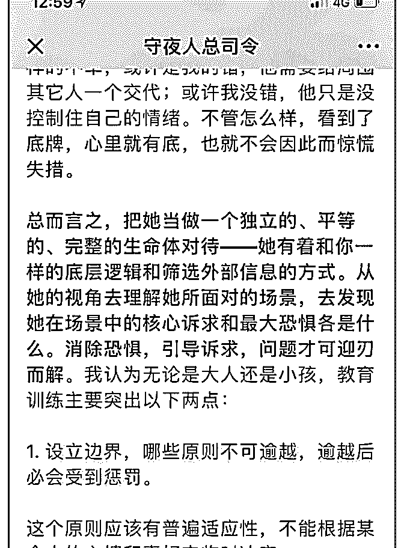
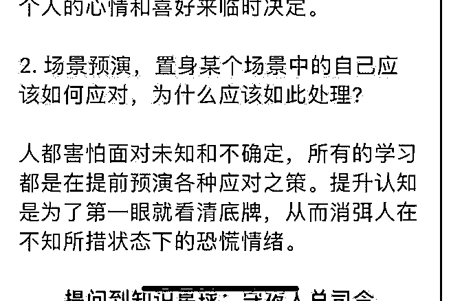

# 司令，如何和孩子建

(提问)airyxia : 司令，如何和孩子建立文章中提到的绝对信 任？截图中的第二点没有理解，能否举例说明下？

2018-10-24

回答：信任的建立是确定性的重复。情绪化和朝令夕改。不

管是面对大人还是小孩，都无法建立确定性的感知。对方不

知道你什么态度。我小时候父亲是想把我吊起来打，但是他

能够有效的把彼此信任的关键信息以一贯性的方式传递给

我。让我感知波动是暂时的，而那个基石是连贯的! 很多人自

己做事情绪化和应急反应。又怎么让别人相信你存在着某种

确定性的连贯? 如果有一个原则或者边界到那个边界上的自动

会克制则回。别人就会感知到，哦，你还是有底线的。他知

道你的边界在哪里了，那么在边界内的波动，他就能够心里

有底，能够接受。 关于第二点就更简单了。人们没有经历过

是一些事情，一旦面对的时候，往往就不知所措。军队里面

的所有训练。都是提前模拟战争环境下某个场景应该如何行

动。在那个场景中，士兵应该如何行动，指挥官应该采取什

么样的战术？为什么要这么做这样的训练让你变成一种惯

性，一种本能。一种能够举一反三的自身能力。但在战场上

遇到类似的场景的时候，大家都知道该怎么处理了，不至于

愣在那里任人屠杀。另外一个人在自己熟悉的场景之中，或

者遇到问题有预案的时候，他就会从容不迫。如果一个人遇

到自己没有见过的场景，而且没有任何预案的时候，很容易

慌乱。(11 赞)

评论区：

嗷··· : 这个问题我做个浅白的回答吧，我家有一对双胞胎男孩，马上四岁了。如何跟孩子建立信任，我觉得基础在于父母

能否情绪稳定不要反复无常，能否全然相信孩子。比如，我们家小孩应该是全小区最脏的孩子，出门以后，只要不捡东西

入口，想在地上打滚也行，摔跤也行，随便他们，这边天冷了他们路上遇到水坑还是想要踩过去把鞋子裤子打湿，那去就

行了……他们几乎做任何事情我都不会干预（除了电，火，家里没什么他们不能尝试的），包括剪刀，我第一次示范一下

怎么用以后，从此开零食的时候都跑去找剪刀不找我了。总而言之一句话，全然的相信他们，然后死远点，别干预他们。

你相信他们能做好能自己成长的很好，他们就会成长的很好，他们会对自己有信心，也会对父母全然的接受他信任他有信

心。0-6 岁就是建立人生底色的时候，悲观还是乐观，信任世界或者怀疑。

司令 :