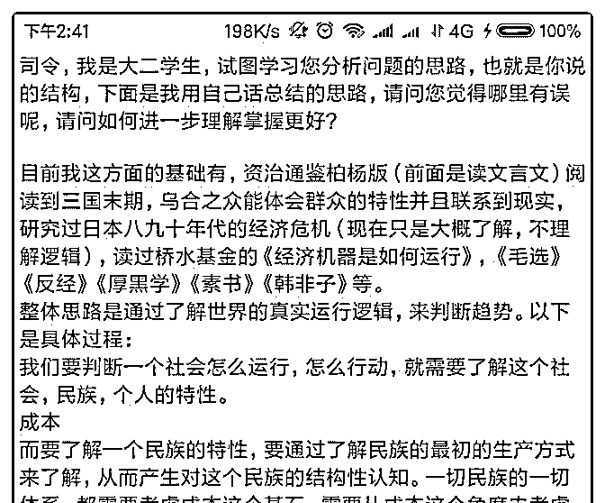
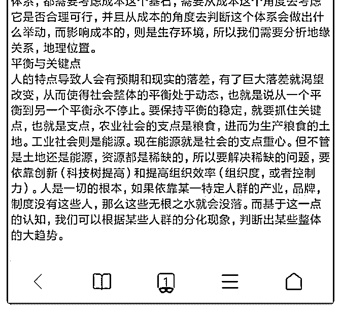

# 司令，我是大二学生

(提问)易水寒旗 : 司令，我是大二学生，试图学习您分析问题 的思路，也就是您说的结构，下面是我用自己话总结的思 路，请问您觉得哪里有误呢，请问如何进一步理解掌握更 好？

目前我这方面的基础有，资治通鉴柏杨版（前面是读文言 文）阅读到三国末期，乌合之众能体会群众的特性并且联系 到现实，研究过日本八九十年代的经济危机（现在只是大概 了解，不理解逻辑），读过桥水基金的《经济机器是如何运 行》，《毛选》《反经》《厚黑学》《素书》《韩非子》 等。欧神文集，王陶陶等都了解过。

2018-10-21

回答：相传有一位青年学了各个门派的功夫。跑到少林寺

去。对方丈大师滔滔不绝说，我会这个，我会那个，我会...

请问我还需要会什么？ 方丈不置一词，拿了一个茶杯放他面

前。然后拿了一壶茶，不停的往茶杯里面倒茶。茶从杯子里

溢了出来，流的满桌子都是。青年心里很着急，急切的说：

方丈！方丈！已经满了，已经满了！ 放到微微的抬起头，柔

和的说了一声：是啊，太满了！ 前面大山有一个关于经济周

期的提问。光一个经济周期都有那么多的周期交织混合而

成。你急于想找到某种独门绝技，然后独步武林。你的笔记

上写的那些东西都是表层的，你没有真正理解我的东西。我

的框架都没写完，你说你理解了，我都大惊失色！ 已经写出

的框架你都没有理解最关键的东西。哪有什么秘籍啊！所谓

军事天才不过是: 察地势，观天文，懂人心！山川河流的走

势，决定了哪个地方可以伏兵，哪个地方可以阻敌，哪个地

方可以屯粮。哪有放之四海可以套用的公式。我不卖钥匙

的，最多帮助你铸造自己的钥匙。你的钥匙才可以开你的

锁，才可以挥洒自如。 中学教科书上那些人类科学的基本原

理，会是结构力量的边界所在。我觉得提炼的东西唯一有价 值的地方就是为了呈现一种探索和验证的轨迹，以求去伪存 真，知行合一。 不要急于得出结论。沉下去，当你真正看清 楚的时候，你会看到非常清晰的脉络，你能脱口而出，并有 立刻采取行动的冲动。(12 赞)

评论区：

c z : 终极杀人王武器，要你命三千[呲牙]

易水寒旗 : 看了很多遍，您说的有道理，我确实是浮躁。我是想问一下我的思路哪里出现了问题，因为我担心读了那么多

和杂的东西，结果一无所获。

易水寒旗 : 还有就是[捂脸]，我真心没有说我理解了，不然我也不会提问。我举我看过那些书，是想让您更了解我的认知情

况，从而更容易知道我的缺点在哪里。并不是为了说我看了很多书

machelshan* : 小伙子，挺不错的，我上大二的时候，只会看武侠踢球，啥都不会，至少你已经见过好几个大门派了，很有

上进心，慢慢来吃透了大有可为[呲牙]

司令 : 你急于得出结论！一个招式，他为什么会是这样，你想过吗？你急于练出华丽的招式。你为什么如此急于展现出那

种招式呢。因为你内心潜意识中有一种渴望：一骑绝尘脱颖而出的渴望。说的通俗点就是追求优越感。你要克制它! 否则你

就像在远处观察蜂巢的结构一样。你会忽略到很多有价值的信息，并轻率的得出自以为是的结论。

司令 : 清空你的杯子，追踪溯源。

易水寒旗 : 谢谢大哥鼓励[呲牙]

易水寒旗 : 对！我会尽量克制自己的，主要是看不到自己是不是走正确的路，容易自卑啊

