# 思维导图妙思屋知识星球整理 2019 第四部分

# 589\. 🔆

🔆 ➠ 学习目标脑图

最近圈里很多爱学习的小伙伴儿，被「圈外的深度阅读训练营」成功圈粉。

在我看来，这门课程的价值在于「可以从自身职业发展的角度」来剖析学习这件事情。

打卡第一章内容之后，小叶有 2 点思考，和你分享❣️希望对你提升学习效果，有所启发～

☟☟☟

评论：

做最好的自己 : 请问，你这个图式两个思维导图拼接的么？

左右思维 | 小叶 : 是的，好眼力[强]

一个文件下，两张独立画布，导出后拼接

蛋蛋 : 问下小叶，为什么要用 2 张画布？

左右思维 | 小叶 : 原因一：分不同时间做的两张导图

原因二：解决两个标题过长的排版问题

做最好的自己 : 两张图分别用彩虹色最终在一张显示。

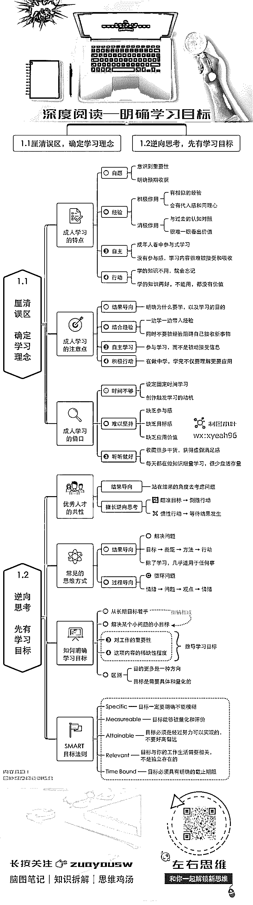

# 590\. 同一个演讲，189

同一个演讲，189 份作业 189 个思路，我再也不敢说写东西没思路了[捂脸]

评论：

小猫妮 | 探索自我* : 头图建议和内容同宽，会让画面有更好的平衡感哦

小猫妮 | 探索自我* : 在空间足够的情况下，可以尽可能的放大字号，保证适当留白的情况下，充分利用好每一块空间

翱翔万里需知己 : 请问，多少字号，导出图，清晰度最佳？你们一般导出图片的格式都是什么格式呀？

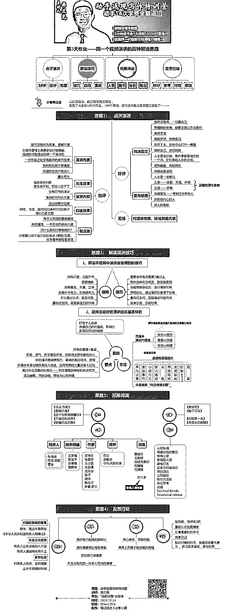

# 591\.

自我觉察表分享: 「感受反思表」

其中，「畏难」是最近困扰我的感受，想要整理一些制作竖屏思维导图的教程，然后看到了很多大我 10 岁、20 岁的「大咖」和「牛人」的积累和成果，思维训练内容的专业度都特别高，就会感觉很有压力，也就是「接受了外部的不恰当的信息」，提高了「自己的期待」，对自己原本要准备的内容，产生了畏难情绪。

但是现在我接纳自己的感受，相信每个人踏实的积累都是有意义的，每个人都有自己的时区。每次行动都会带来一个结果，这个结果不一定是自己所喜欢的，接纳这个现实，调整自己的心态，用平和的心态面对每件事，沉住气，相信自己的积累是有价值的。

----------------------

朋友反馈：总有比你厉害的，不能因为一个否定自己，把他们作为榜样和目标，自己学到的输出给身边需要的朋友，还可以进一步完善彼此的知识体系。

评论：

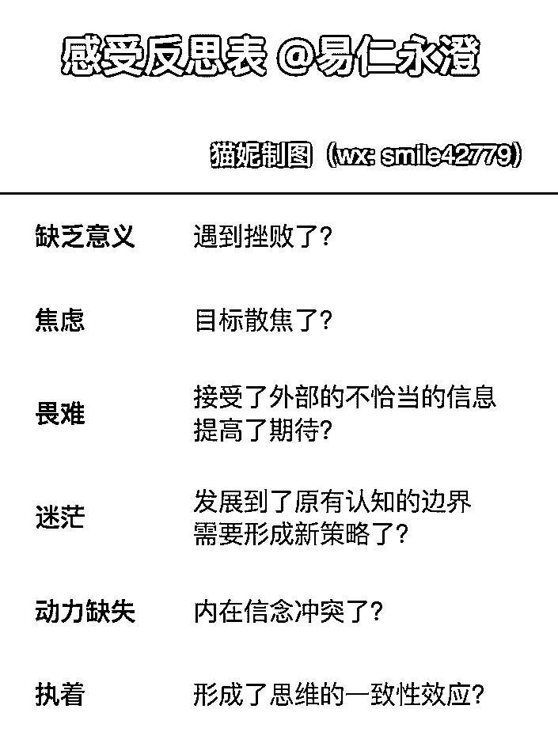

# 592\. 关

关于「元认知」，对自身的“思考过程”进行认知和理解。

成长慢，因为你不会飞

时刻思考，如果说学习和反思是静态的，那处于当下动态的自已又该如何保持主动元认知呢？

内容来源

[成长慢，是因为你不会“飞”！](https://mp.weixin.qq.com/s/hhYvzJtZaTSB4klAjWEUHg)

评论：

翱翔万里需知己 : 为什么你们做的图都是几 MB 的！我的都是几百 KB？

我是用 xmind8 直接导出 JPG 图片导图。

小猫妮 | 探索自我* : 会和字号，内容多少有关。

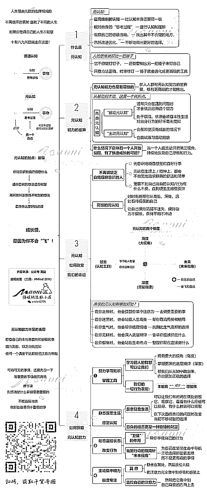

# 593\. 《阿何谈时间管理》

《阿何谈时间管理》

第 4 课：时间管理的理论：

- 大部分理论都是耳熟能详：28 法则，番茄工作法，四象限方法，GTD

- 刚开始我是从 GTD 起步，使用 omnifocus 软件

- 一段时间后感觉 hold 不住而放弃-

- 直到现在还望而却步，后面肯定要重新开始

- 目前从小开始，践行番茄工作法，提高专注度，使用 forest 软件

第 5 课：习惯养成法

-从心智模型出发，介绍好习惯养成的方法及步骤，个人觉得蛮实用。

-现在我在践行早起，刚起步不久。

一切都还是开始，希望和前辈们多多交流。[微笑]

评论：

小猫妮 | 探索自我* : 行动中每天都能看得到你的精进[强]

小猫妮 | 探索自我* : 是什么的第五课，建议标注在图中，比如时间管理第五课，你在未来查看内容检索重点时，会更加一目了然。

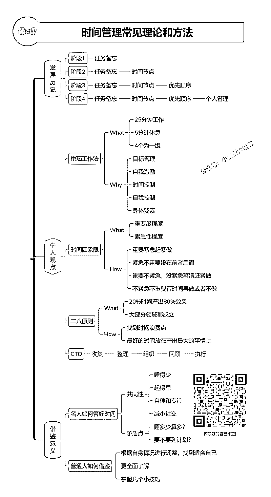

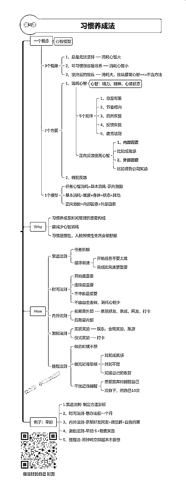

# 594\. 《阿何谈时间管理》

《阿何谈时间管理》第 2 课-第 3 课

-了解时间浪费点，合理分配时间。

-了解不同分类时间的特性及如何利用。

-碎片化时间不适合系统性的学习。

-工作不等于学习，个人成长必须需要个人时间进行系统性的学习。

评论：

蛋蛋 : 标题有创新

做最好的自己 : 谢谢，蛋蛋老师，和你们还有很大差距啊。

小猫妮 | 探索自我* : 主题结构的变化很灵活[强]

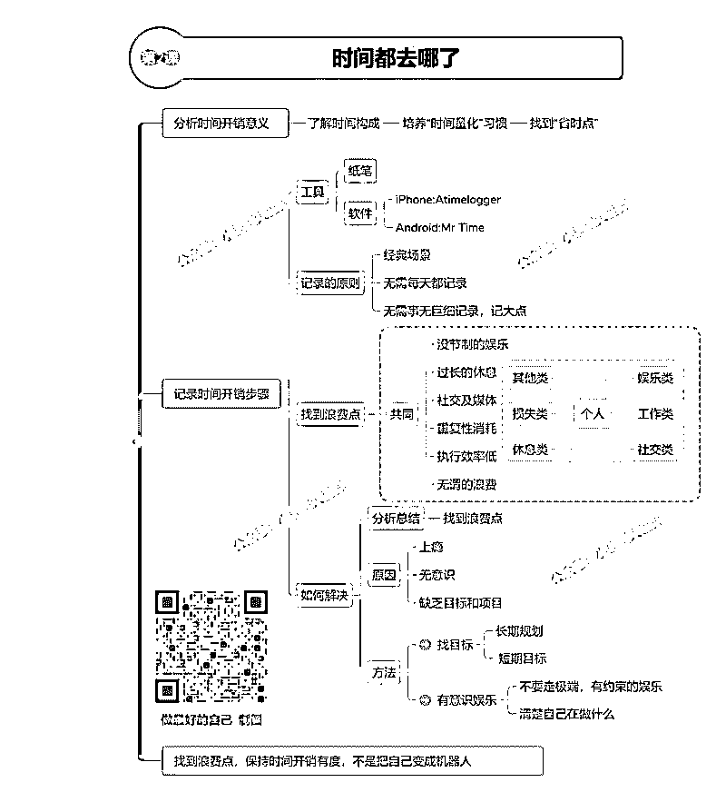

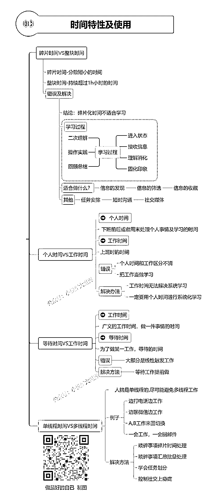

# 595\. 给

给新入职运营同事的六点建议。

1.归零心态

2.owner 意识

3.时间点观念

4.正能量心态

5.向上管理

6.自我学习

评论：

翱翔万里需知己 : 为什么你们做的图都是几 MB 的！我的都是几百 KB？

我的是用 xmind8 直接导出 JPG 图片。

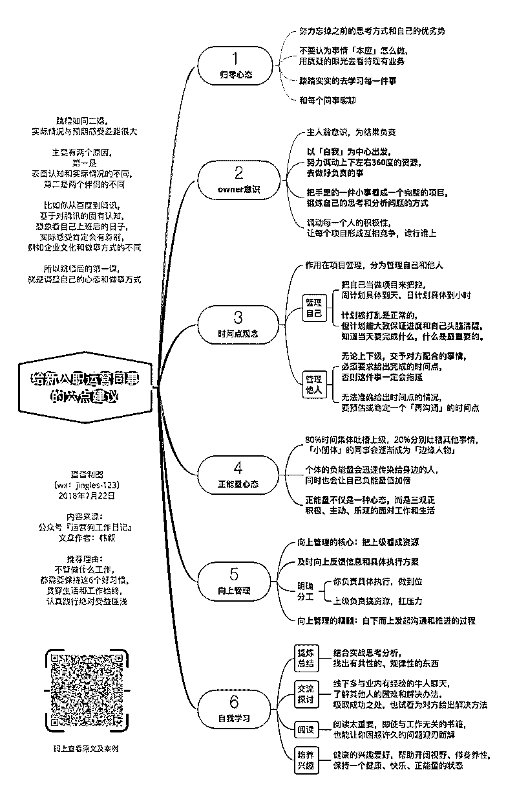

# 596\. 年

年薪百万的运营人都始于这 6 个好习惯。

1.文章编辑规范

2.坚持记录运营日志

3.学会用数据说话

4.善于记录

5.不断学习

6.执行力

评论：

# 597\. 怎

怎样能够更加高效的学习，把读过的书牢记于心？

方法论：有效输入--深度加工--持续输出

1.带着兴趣或者问题出发

2.进行主题阅读

3.快读+慢想（联想，拓展）

4.写卡片记录

5.教给别人（说，或者写）

6.运用到行动实践

不止是读书，学习课程、阅读文章同样是这样的道理。

评论：

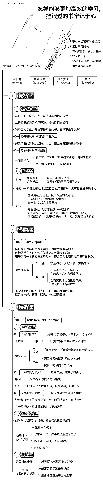

# 598\.

易仁永澄：关于减重的一个小总结

如果想要输出正确的结果，必须要在关键的原因上努力

结构化笔记

思维导图，如图↓

制图用时：30 分钟[181013+-+易仁永澄：关于减重的一个小总结+-+小猫妮](https://mubu.com/doc/LYeY0bctk)

评论：

做最好的自己 : 30 分钟，好厉害，我现在做，思维还是欠缺，到一个内容比较纠结，你还用幕布先做内容吗？

小猫妮 | 探索自我* : 90%以上的是先搞定幕布内容，需要随堂完成的可能直接用 XMind。不要着急，每次打通一个点，慢慢来，比较快

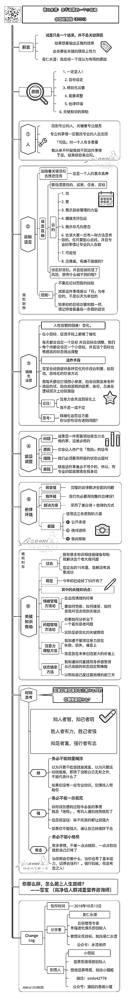

# 599\. 《阿何谈时间管理》

《阿何谈时间管理》大纲-第一课

评论：

小猫妮 | 探索自我* : [强] 赞，上手之后行动力很强！

做最好的自己 : 刻意练习才能进步啊[呲牙]

小猫妮 | 探索自我* : 我也会持续为你提供反馈的，有人带，可以少走很多弯路

翱翔万里需知己 : 亲们，你们都是怎么给导图添加水印的呀？

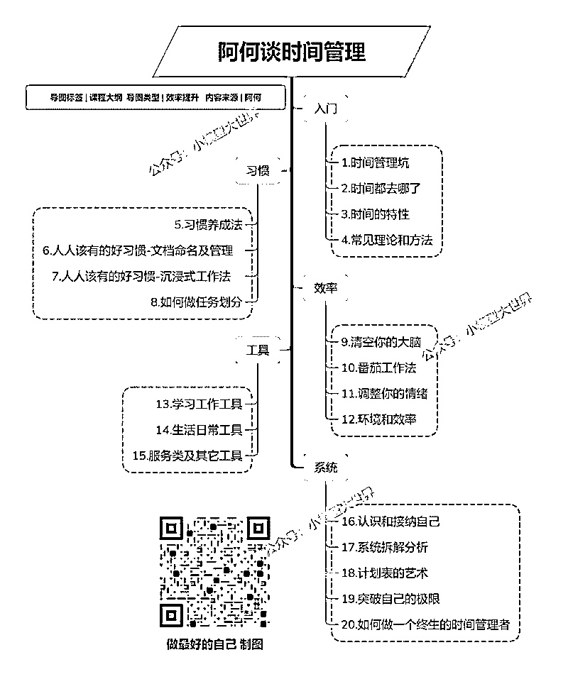

# 600\. 《沟通的艺术》Da

《沟通的艺术》Day 1 -Day 5

评论：

做最好的自己 : 请问下，你这一张图大概做了多久呢，是 Xmind 做的么？

HYN 飞弧空间|周波 : 一张图大概 30-45 分钟,使用 mindmaster

蛋蛋 : 一张图 30-45 分钟 速度与质量并存！

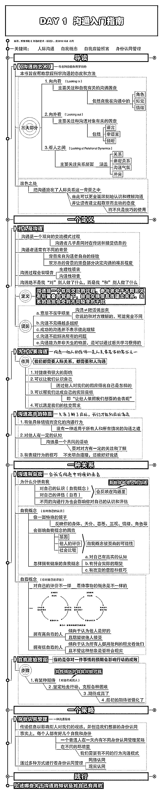

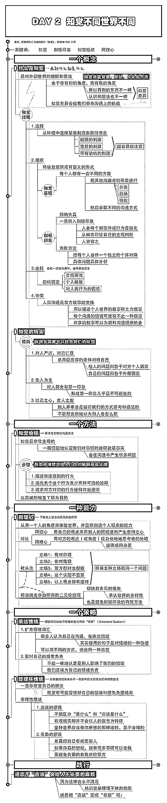

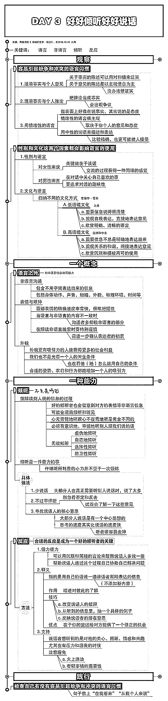

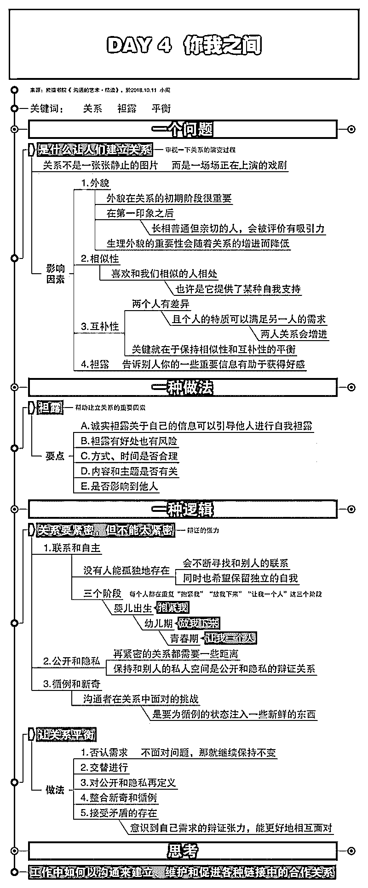

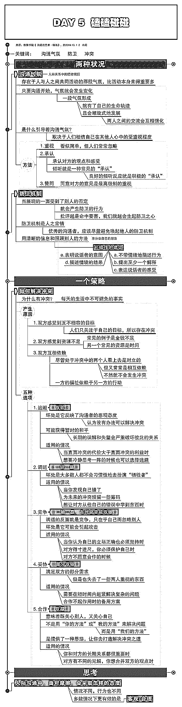

# 601\. / 笔记侠的读书

/ 笔记侠的读书笔记《干法》，付出不亚于任何人的努力才能成功。

初学者，第一次分享，希望各位多多指教。

评论：

小猫妮 | 探索自我* : 在顶部突出标题会更好[太阳]

小猫妮 | 探索自我* : 第九工场，这个网站可以免费做美化后的二维码，黑色的二维码在画面协调性上还有优化的空间

蛋蛋 : 😂初学者 排版和结构都很赞哦

做最好的自己 : 谢谢鼓励，模仿猫妮作品的，个人觉得排版都不算太难，难得是思维。

蛋蛋 : 嗯嗯 结构化思维可以刻意练习哦

小猫妮 | 探索自我* : 对的，思维导图重在思维，操作经过几次练习就可以掌握

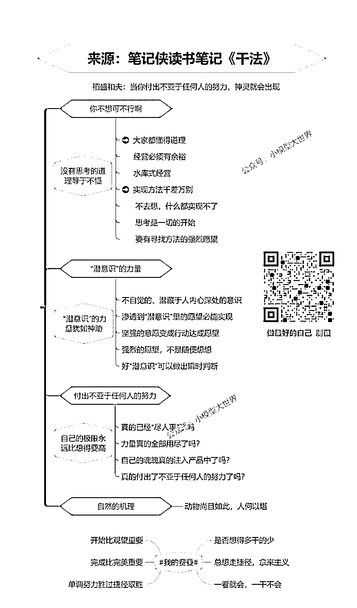

# 602\. 保险行业思维导图分

保险行业思维导图分享:一图看懂保险经纪人和代理人的区别，买保险到底找谁才能真正做到适合自己的保障？

评论：

小猫妮 | 探索自我* : 把竖屏思维导图用在自己的领域里，特别灵活简洁的体现了保险经纪人和经理人的区别，通过看图，内容给人感觉清晰很多[强]

蛋蛋 : 和掌柜学习保险知识哈哈哈

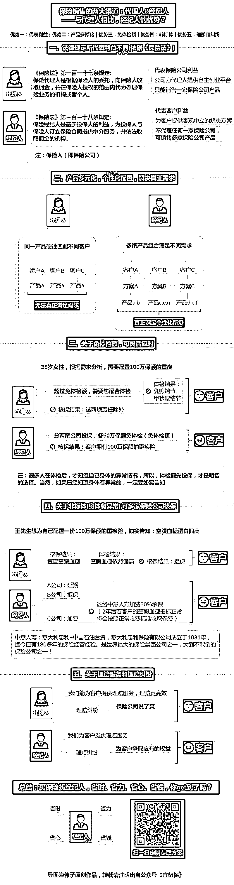

# 603\. 稻

稻盛和夫：

让我成功做出 2 大世界级企业的思维方式

一个人或一个企业，是否能够持续过得更好，取决于能力、热情和思维方式这三个因子的乘积：人生·事业=思维方式ｘ热情ｘ能力。

评论：

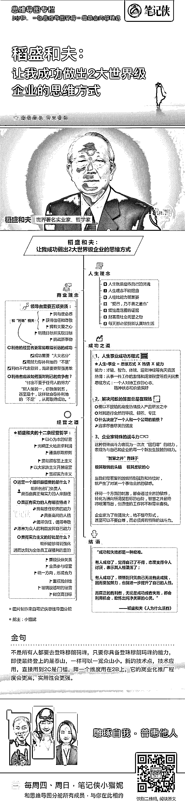

# 604\. 018/100

018/100

导图基础操作能量补给站

思维导图的基础层级关系

画布的设置和使用

思维导图结构的更改

评论：

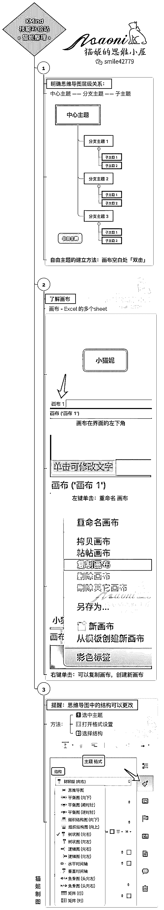

# 605\. 放弃你的低调内敛方

放弃你的低调内敛方式，用更符合人的认知规律来写作，CUCC 让你做到吸引人注意力，

要想到读者的心理是——与我有关+对我有用+挑动情绪+替我说话。

训练方式=自多看+多练+看数据+听意见+刻意练习

评论：

蛋蛋 : get 训练方式=自多看+多练+看数据+听意见+刻意练习

蛋蛋 : 难得看到使用多颜色却一点也不觉得杂乱的作品 图标也吼吼看

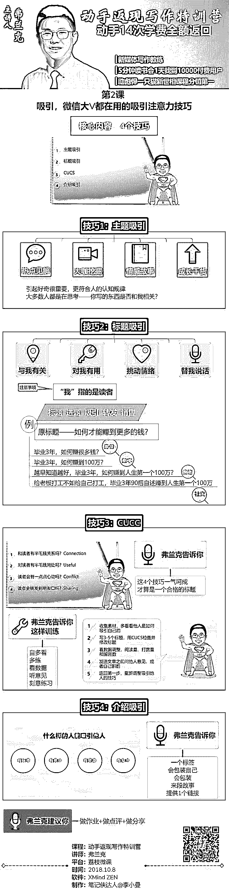

# 606\. 0

017/100 如何在 XMind 8 更改画布背景颜色？

提醒：要先点击画布的空白处，再进行格式设置

补充：XMind ZEN 暂时没有调整画布颜色的功能

（2018 年 10 月 10 日版本）

评论：

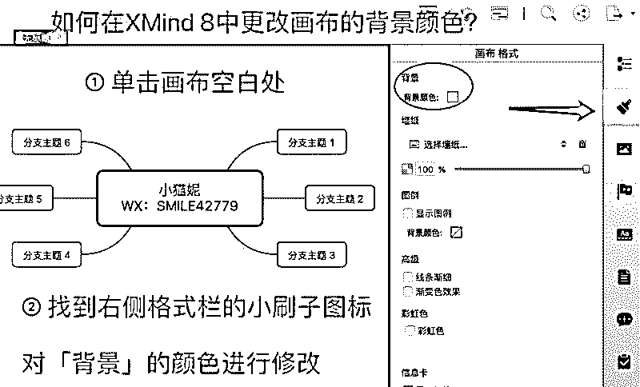

# 607\. 018/100

018/100

XMind 8 和 XMind ZEN 到底有什么区别？

具体分析

[制图心法+|+一文读懂 XMind+8+和+XMind+ZEN 的真正区别](https://mp.weixin.qq.com/s/e42sAWxodE_an3-OkpuPbQ)

评论：

蛋蛋 : 诚意干货

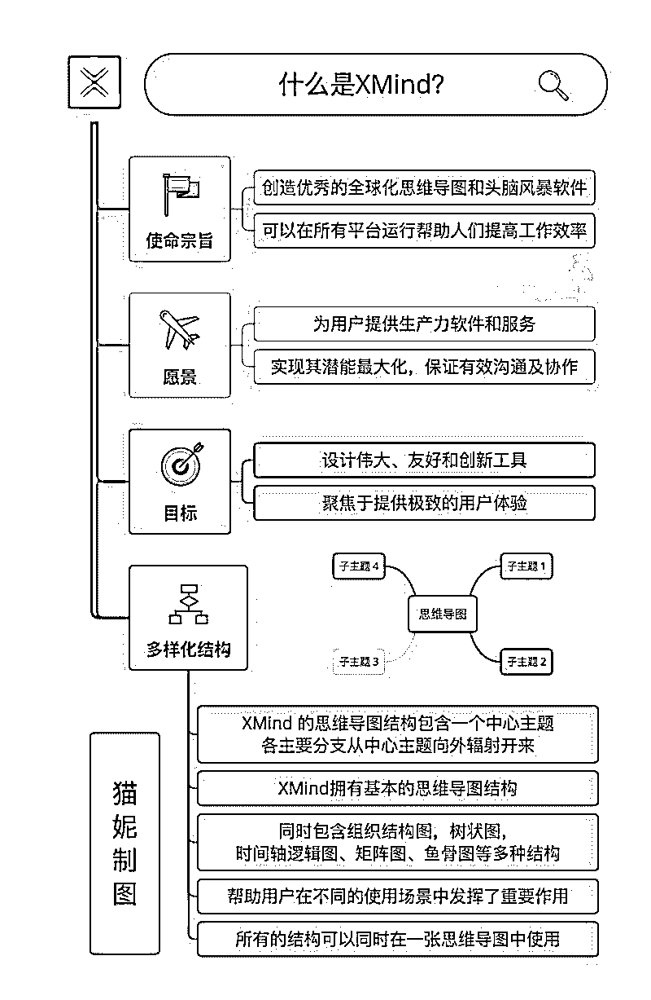

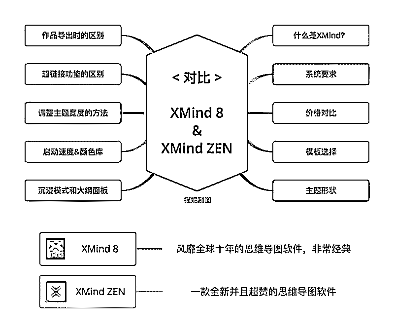

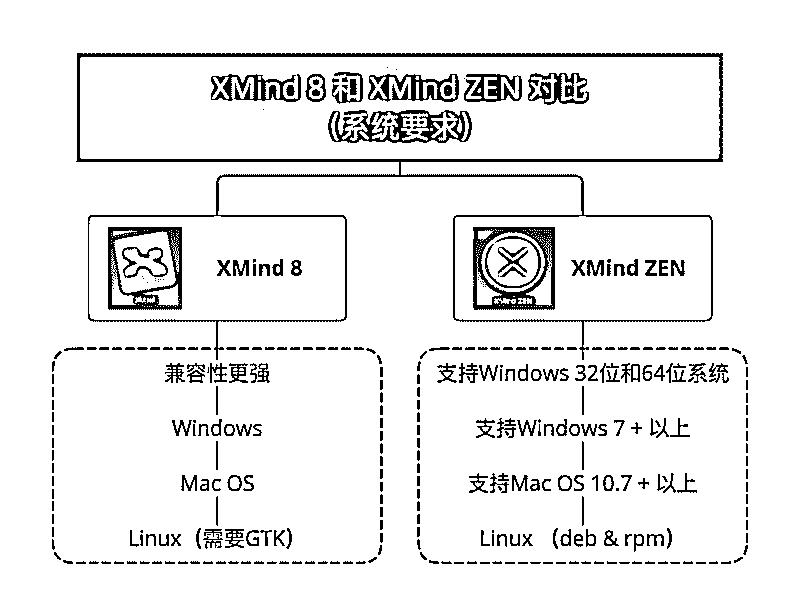

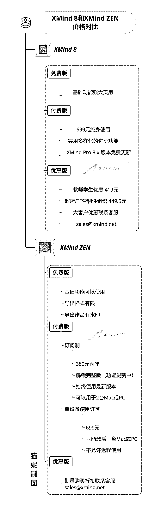

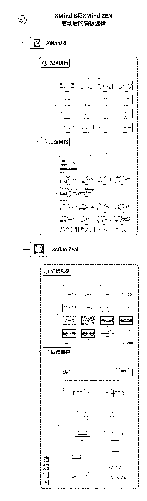

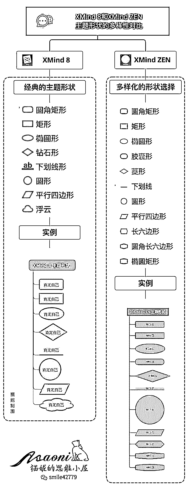

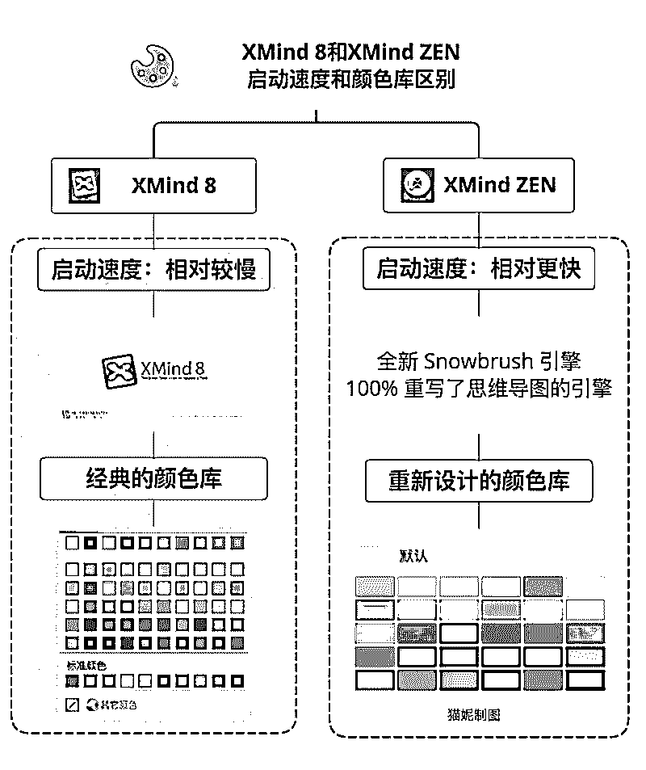

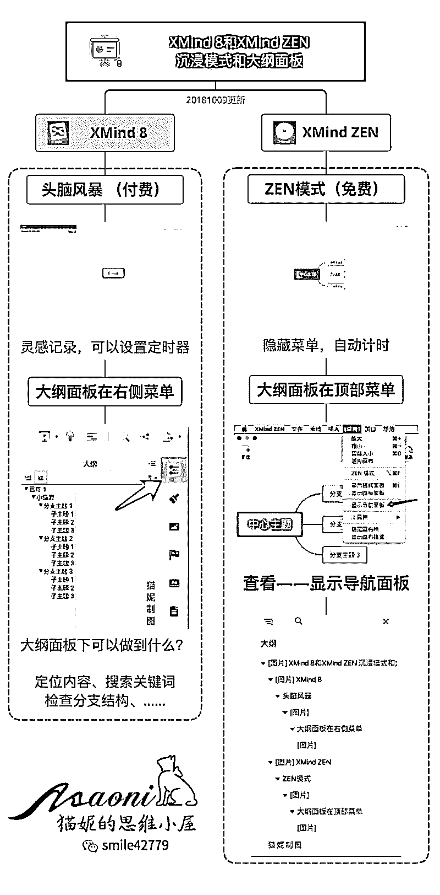

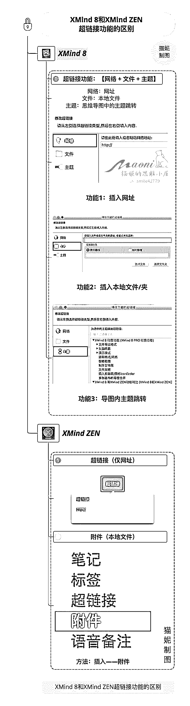

# 608\. 今晚的课程是特训营

今晚的课程是特训营邀请的嘉宾分享演讲，趁热乎赶紧记录一下，真正重要的演讲的心法，使用 Present 模型+表格帮助做好演讲前的准备工作，让演讲成为送给听众最好的礼物

评论：

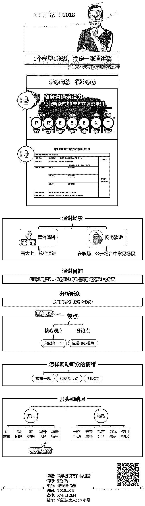

# 609\. 梳理了三天的方法论

梳理了三天的方法论

本圈大神都听过的课程

多多指导

评论：

蛋蛋 : 大胆分享 同样的内容不同的人输出出来 都会有新的收获

Rock : 感谢

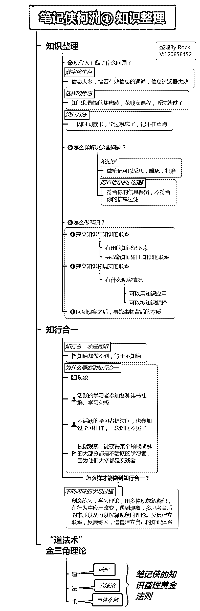

# 610\. 原来导图都是改出来

原来导图都是改出来的，感谢猫妮和文龙的好建议

评论：

小猫妮 | 探索自我* : 如果底色用深紫色，建议文字可以改成白色，多一点反差，可以有更高的文字可读性哦

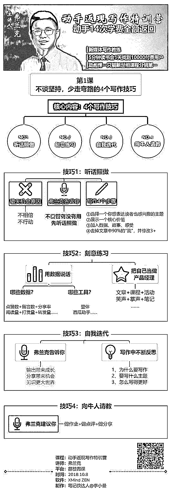

# 611\. 解

解读情绪背后的信息

负面情绪的正面价值

绝大多数负面情绪都有他的正面价值，要用一个好的心态去面对[爱心]

评论：

# 612\. 如何创造价值感？<

如何创造价值感？

评论：

123 : 什么是价值？如何才能创造价值？

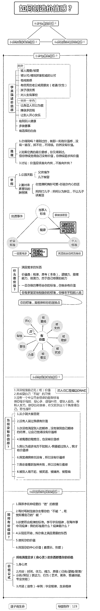

# 613\. ⛳️国庆假

⛳️国庆假期刚结束，2018 年仅剩 84 天~

你已经调整好状态，准备全力冲刺，迎接新一阶段的工作了吗？

下面这张【快速进入工作状态脑图】介绍了 12 条快速进入工作状态的方法✔

相信你能想到的方法还有更多~

2018 年最后的 84 天，在猫妮的星球，和伙伴们一起加油[嘿哈]

☟☟☟

评论：

蛋蛋 : 配色超级舒服

# 614\. 薇安演讲训练营第二

薇安演讲训练营第二课分享

评论：

小猫妮 | 探索自我* : 感谢许倩的无私分享！薇安的演讲训练营很用心 [玫瑰] 你的总结和细节处理也很用心[爱心]

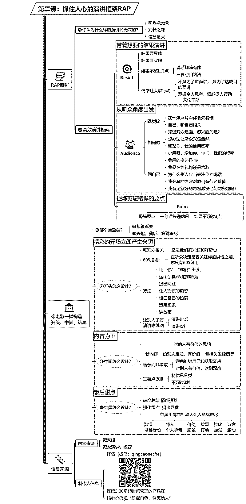

# 615\. 2

2018 年 10 烧脑节易仁永澄夜谈会清单笔记 by 猫妮

1\. 坚持是一个状态，要改前提假设，灵活和弹性更重要

2\. 打败坚持最好的方法是游戏化，玩游戏的时候要提问

3\. 动力 机制 技巧，竞争机制 / PK 机制

4\. 小数定律 （小样本反应的规律是假规律）

5\. 解决问题的方式，提问，让不同的人对自己提问，提问六次之后，可能会发现套路。

6\. 情绪的内耗来自于信念冲突，每个信念是有边界的

7\. 案例：永成在减重时不设定目标，设定目标之后，产生质疑 “这个目标我能完成吗？”，考虑设定目标，又不想实现，不愿意相信。

8\. 最重要的事情只有一件，事情多是维度低，嫌事儿多，要停下来，向上抽，思考只做一件最重要的事，生态逻辑，找到最重要的系统动力（能级）。

9\. 评价人不要看一时和一事

10\. 势能运作，获得势能之后，对方会有心理弱势，要懂人性。在人性弱点的地方温和的逞强

11\. 保持势能，概念红利很强，同时成为社交货币，形成传播

12\. 提升势能感，坚持做。调动感官刺激，学视觉展示，演讲力/戏精

13\. 练习可以在公开场合用的技能，一般人不练的

14\. 驱动人的要更高维度

1\. 解决问题时，可能 要升维

2\. 方式，想一个完全想不到的方案，人事网书

3\. 当别人 给你解决问题时，你感觉不靠谱，可能因为自己不知道。

15\. 自己已知的让人委屈的负面评价，不喜欢别人提出来

1\. 做列表，请对方给出解决方法，转移责任

2\. 首问负责制，提出问题的人来负责解决问题

3\. 每一个情绪都有他的积极意义，委屈的积极意义，自己应该主动成长

16\. 系统 1 的问题，要在系统 2 解决。系统一没办法确定权重（年度目标只定 3 个）

17\. 一切沉默都是语言的凝结

18\. 网红的一个特质，被陌生人迅速记住并喜欢。15 度仰望的，可以够得到的，又有一定的隔离感。可爱，可亲，可陪伴。

19\. 抱持技术，在圈外看着你们玩，在圈外抱持的空间。

20\. 社会协同价值，有一个点比别人好 10 倍，找到一个好 10 倍的点，砍到垂直领域的深度，深度策略和整合策略。放弃短期收益，被认定的价值，还会回来。才能快才能换轨道。

21\. 每一件事情都有价值，搞好一件事，赋予意义

22\. 没有边界的组织，超出适用范围的组织容易不自恰（系统的耗散理论）

23\. 思考的四个结构：理解 / 分析 / 表达 / 解构

24\. 戏精：策略明确，在合适的场景下，展示合适的姿态

25\. 协作的关键是产生成果和价值

评论：

# 616\. 《非暴力沟通》Da

《非暴力沟通》Day 1 -Day 5

评论：

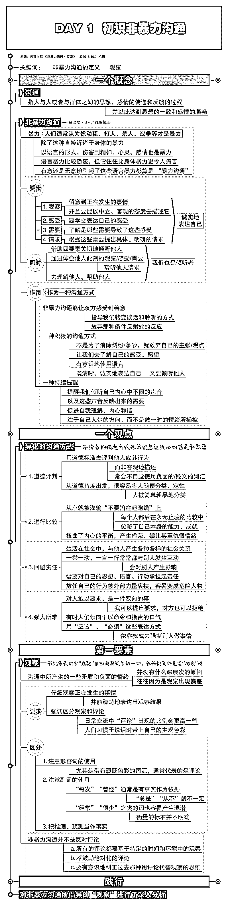

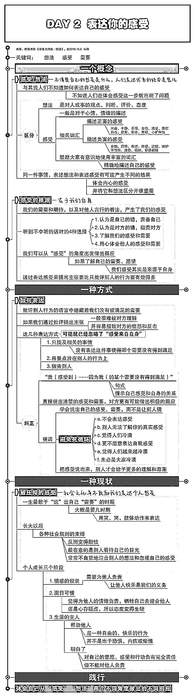

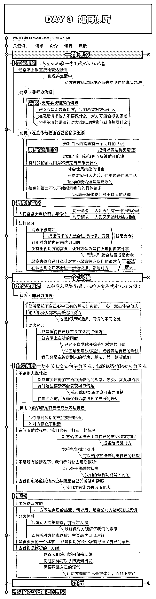

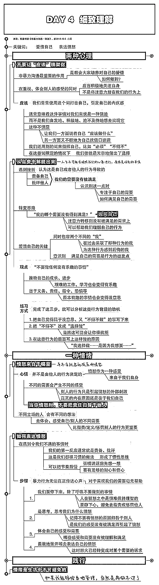

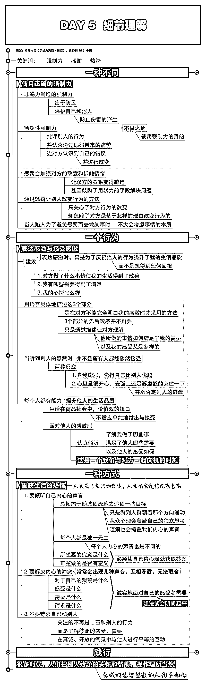

# 617\. 分析作图后才真正了

分析作图后才真正了解了什么是新零售，share[呲牙]

评论：

小猫妮 | 探索自我* : 一二三的分标题，建议放大字号、加粗框线突出显示。一张好的思维导图，要让人能够直观的抓取到重点，能够分出层次，避免同级信息堆砌。

许倩 : 好的，谢谢猫妮[爱心]

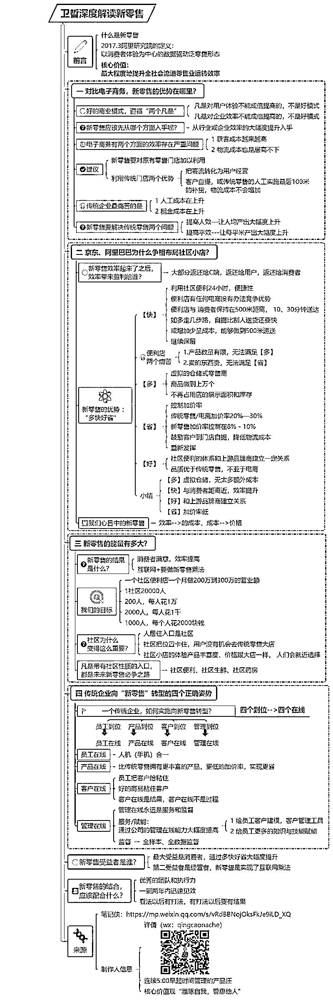

# 618\. 参加的一个很不错的

参加的一个很不错的演讲训练营的培训，总结第一课思维导图，与君共享（推荐有希望训练演讲的童鞋可以考虑下）~

评论：

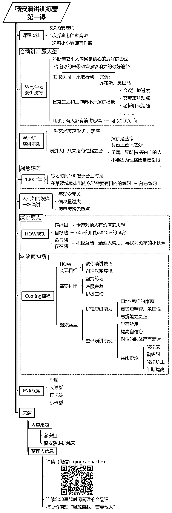

# 619\. 易

易仁永澄：面向未来，共创价值

Day 1 精华笔记节选

评论：

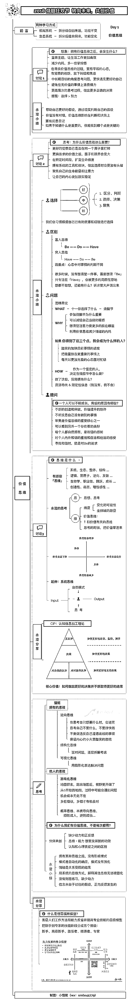

# 620\. 《精进》Day 1

《精进》Day 1 -Day 5

评论：

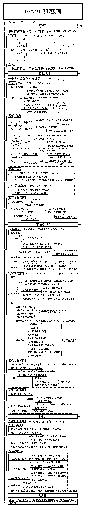

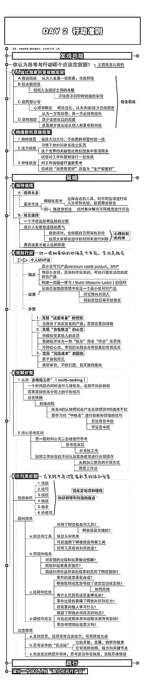

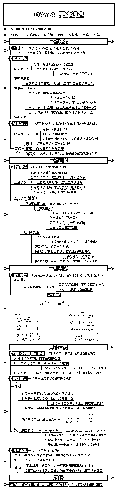

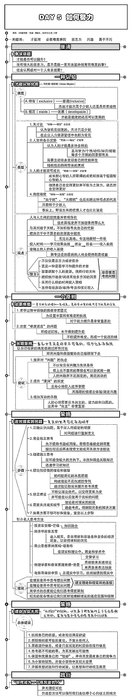

# 621\. 互

互联网图标素材包

密码：z3b1

商务图标素材：

密码：fb5v[`pan.baidu.com/s/1niW52QSLBZCMrL6isgQ8bg`](https://pan.baidu.com/s/1niW52QSLBZCMrL6isgQ8bg) [`pan.baidu.com/s/1ysWfXW2kEcYwwNh2FD4bAQ`](https://pan.baidu.com/s/1ysWfXW2kEcYwwNh2FD4bAQ)

评论：

子夜 : 图标库链接失效了

# 622\. 内

内容：一张图解读 XX 规则

来源：天猫官方制作

推荐人：

评论：

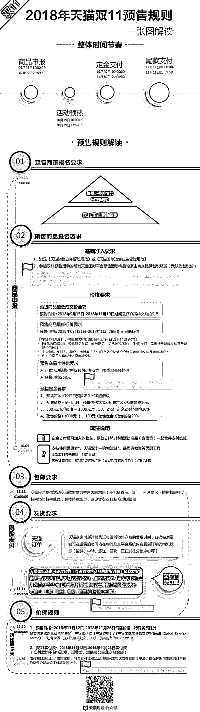


# 623\.

制图心法 100 问 16/100

思维导图做好之后，由于长度和大小限制，图片无法上传公众号，或者发朋友圈后模糊怎么办？

评论：


# 624\. 制

制图心法 100 问 15/100

如何在 XMind 8 中控制字母的大小写？

① 选中某个主题

② 在格式栏 「文字」部分 选中 【M】

③ 根据需求选择大小写的设置

评论：


# 625\. 猫妮 你的每日一签

猫妮 你的每日一签都非常赞，想要知道你是怎么创作每日一签的。

应该涉及到两个方面，一个是内容，这个内容一般是从哪里来的呢？那第二个就是这个图，你的每一张图都很精美，非常喜欢。

谢谢

评论：

小猫妮 | 探索自我* : 补充：配图来自 pexels 网站，或者自己拍的照片

[Free+stock+photos+·+Pexels](https://www.pexels.com)

许倩 : 谢谢猫妮[玫瑰]

关于我的日签，内容来自我的每日阅读，我会摘取自己感到有共鸣的一句话。 关于我的制图工具，这个链接有更详细的回答。手机可以试试图曰 app，电脑可以用 PPT。 <e type="web" href="https%3A%2F%2Fmubu.com%2Fdoc%2F1nNg3-eGlk" title="1809+%E5%85%B3%E4%BA%8E%E7%8C%AB%E5%A6%AE%E7%9A%84%E6%97%A5%E7%AD%BE%E5%92%8C%E5%AF%BC%E5%9B%BE%E6%B0%B4%E5%8D%B0+Q%26A" cache="" />

# 626\. 信

信息可视化结构参考

评论：

louis : 里面没图片了吗？？

小猫妮 | 探索自我* : 图片在的，用 app 可以看到


# 627\. MarginNot

MarginNote 3

这是一款功能强大的阅读和学习工具软件

适用平台：Mac, iPad, iPhone

革新性整合阅读标注工具,思维导图和学习卡,多维度构建知识连接,提升阅读学习生产力。

它将 PDF/EPUB 阅读器和多种学习工具集成起来，使得学习者可以在学习时从不同的维度将知识进行重组，连接，从而达到记住，领会的效果。

支持 iCloud 同步，14 天免费试用，试用期后 88 元解锁完整版

官网：

「少数派」的测评

MarginNote 官网教程

[Store](http://marginnote.webflow.io/store) [从阅读到复习，MarginNote+3+想要重塑你的学习方式+-+少数派](https://sspai.com/post/45881) [出错啦!+-+bilibili.com](https://www.bilibili.com/video/av23779868)

评论：


# 628\. 如

如何利用思维导图制作述职报告？

整理收获，进行回顾

反思不足，总结体会

模板下载：

密码:5yho

补充：来自友人霍霍的建议

述职报告主要是给领导和同僚看的，重点应该是做了什么，哪里好，下一步计划，要注意的是，着重在成绩的包装，要让领导和同事觉得，这个人很值得聘用，或者这个部门成绩出色。

建议调整：

1 加入概述，总体说一下此阶段的工作情况

2 弱化任职阶段，除非是特别情况，一般这点不用特别单独说明。

3 “参与活动”，一般叫“参与项目”

4 对应的“任务”，如果项目表现明显超出预期，那一定要写结果与目标的对比，以及为什么会超出。如果与目标持平或者没有特别好，直接说结果就好了。

5 明星项目要逐个写。

6 highlight，可以写总体的，也可以融合在每一个项目里。也可以写遇到了什么难点，怎么解决的，或者替代方案是什么，或者原因是什么，要注意，好事多说主观层面的，不好的多说客观层面的。

7 lowlight 也就是不足，这点永远是最难写的。如果必须写，要重点带来了什么收获、以后如何避免、或替代方案，要尽量往好了包装。

8 对领导和团队的致谢，不要写得太直白，要落实在项目里、实际的工作里，点到为止。不过这点要看企业文化。

9 对个人的期望，“自信”，最好不这么提，一般这么说是实习生或者刚入职，level 偏低，要是集中在情绪上，说明情绪已经影响了工作质量，这么提太负面了。

10 加入下阶段工作计划，还是概述加重点项目以及 KPI。

11 可以考虑加入建议，述职也是个告状的机会，但要注意表述技巧。具体怎么说，也要看企业文化。[百度网盘+请输入提取码](https://pan.baidu.com/s/1FY5LdEA_6WMnzEFinO1ZhA)

评论：

霍霍 : 不好意思，我又想了一下这个总结，有个想法想再补充一下。

最初看到这个模板的时候，我感觉这个模板偏个人，当时我的想法是给自己看的总结，可以多说说自己的缺点，以滋反省，弥补不足，激励成长。

但后来又想了一下，个人总结也要表扬自己的 highlight，直接看到进步，给予积极的心理影响和自我肯定，这种正向的反馈会促进继续向前的动力，把认知→肯定→成长→再认知…… 导向良性循环。

小猫妮 | 探索自我* : 👍


# 629\. 身

身处职场要避开的 10 个学习误区

无论是知识输入，还是知识的沉淀和调用，如果你的效率都会比同学、朋友、同事快上好几倍，在职场中自然机会更多[奋斗]

这个世上没有绝对正确的方法，所有的方法都需要迭代，看一下，你有没有中枪？

评论：

# 630\. 亚

亚马逊 CEO 提高工作效率的 2 法则和时间管理 5 技巧

提高工作效率的两大法则

①两个披萨法则

②简化决策

时间管理的 5 个小技巧

1\. 主动地去制定日程

2\. 放弃完美主义

3\. 懂得何时才委派

4\. 始终关注你的业务

5\. 保证充分的睡眠时间

要做成一些你以前从未接触过的事情，那么就必须顽强和专注，顽强和专注到别人或许认为不合情理的地步。——Jeff Bezos

内容来源

结构化笔记

[他一天最多赚+64+亿美金，他起床不用闹钟，他每天晚饭后还刷盘子](https://mp.weixin.qq.com/s/Q6i6K4hpIu_9JhmIrfjTzg) [【猫妮导图】亚马逊 CEO 提高工作效率的 2 法则和时间管理 5 技巧](https://mubu.com/doc/3de1wdqPug)

评论：


# 631\. 工

工作报告 （万能总结规划）

源文件模板下载：

链接:

密码:8tuk[百度网盘+请输入提取码](https://pan.baidu.com/s/1Cnuxfgl392IAYdRt_CRRsQ)

评论：


# 632\. 如

如何利用思维导图进行写作？

文章写作成文模型(分享版)

内容来源：

如星球内下载失效，可以使用百度云

链接:

密码:iwyq[文章写作成文模型：一个提高写作产出的思考辅助工具+-+简书](https://www.jianshu.com/p/b4fb144e1ea5) [百度网盘 请输入提取码](https://pan.baidu.com/s/1bVkwUZ5e80b4EV7ngJurAw)

评论：


# 633\. 如

如何有效提升你的职场说服力？

如何有效陈述一个主张？

评论：


# 634\. 如

如何开会？

三步设计你的会议：“ 目标—过程—人员 ” 模型

评论：


# 635\. 关

关于经验学习的五字心经：

问、想、仿、改、善

遇到问题要学会拆解，然后用不同的招法去有针对性地解决问题。注意经验借鉴，经验借鉴是管理者的主要工作，也是重要能力。

评论：


# 636\. 如

如何升级思维的操作系统？

把一个事物，按照某种有条理的结构，进行分解、审视，找出它的底层规律，再将自己的视野拔高，更全面地去理解它。

如何培养这种看待事物的能力呢？

第一，是大量的知识和模型积累

第二，是有意识的锻炼和联结

四个练习方法：

界定问题

审问思考过程

在脑中建立 checklist

概念提取和联想

内容来源

[如何升级思维的操作系统？](https://mp.weixin.qq.com/s/ALMxptqawKJglVVIltUyHA)

评论：


# 637\. 处

处理信息焦虑的 431 法则

碎片化学习 ≠ 碎片化信息

不断把自己的视角拔高，从更高的层次去审视信息

评论：


# 638\. 中

中欧教授亲授：如何成为高效能的终身学习者

保持谦卑之心

评论：


# 639\. 主

主题: 人际网络建设

风格：大连的跨海大桥风

我们成年之后的一切几乎都与「人际网络」有关，一个人自我觉醒的过程是什么？

在认识到自我价值的同时，认识到「人际网络」的重要性，从而主动的去建设，而不是漠视或者被动的等待。

评论：

# 640\. 刘

刘润：我的人生算法之“概率思维”

运气就是概率，只不过加了一点感情色彩

对我们有利的概率，称之为运气

对我们不利的概率，称之为倒霉

评论：


# 641\. 《

《新 100 个基本》自我更新指南

评论：

# 642\. 猫

猫妮制图心法 100 问 14/100

如何为导图增加水印

评论：


# 643\. 做一个“三高”的人

做一个“三高”的人

高觉察力、高逻辑力、高表达力

源 | 辉哥

评论：


# 644\. 持

持续保值的三种思维

解码思维：学习事物的底层框架

解构思维：最小学习单元的拆分与选择

解读思维：化繁为简的能力

源 | 良大师

评论：


# 645\. 视觉展示参考素材<

视觉展示参考素材

评论：

许倩 : 很漂亮，视觉 结构都很好~


# 646\. 应用思维导图的终极

应用思维导图的终极境界——

笔下无图，脑中有图

评论：

# 647\. 学

学以致用，用以致学。工具的价值，在于放大 人的能力，突破生物和物理极限。工具的突破，也是思维方式的突破。

20 分钟的突破极限挑战，XMind ZEN 直接出图，源文件已上传可供下载

没有用任何工具后加工，没有用电脑自带的预览工具裁剪四周空白，没有用亿图添加水印，水印是用图片形式插入自由主题然后覆盖，不想熬夜，不想中断，因此选择突破自己的极限！

评论：

许倩 : 有没有小伙伴像我一样 解压后是空的？~

小猫妮 | 探索自我* : 目前已知 Mac 在网页版下载会有这种情况，在手机没问题，类似情况我也会同时放上百度云，感谢理解[玫瑰]


# 648\. 感谢亮亮的分享 <

感谢亮亮的分享

我们对很多方面都要管理 ，健康管理，时间管理，财务管理

人脉也需要好好去经营管理，不是以功利心去想从朋友那获取

而是互相的价值传递，甚至共创价值。

看到大神们对亮亮的认可，就是因为他不断地输出价值， 他这些年来用来管理人脉的一套方法，昨晚也分享给大家。

听完课后，我也正在用亮亮的工具在整理我的人脉了，真是挺有启发

评论：


# 649\.

易仁永澄：如何做少得多

要有价值思维，价值是凝结在个体中无差别时间内的行为积累总和，这个积累可以来自自己也可以来自他人。

个人价值 = ∑（无差别的时间 X 有差别的行为 + 被动积累）

能级提升的关键是获得更高级别的人对自己的认同

评论：


# 650\. 很

很早就关注笔记侠，看着里面的导图模块，感觉很棒；

一直也有想着自己输出自己的导图知识，但没有坚持力，只在想的环节；

最近一个星期联系上了猫妮大大，在大大感染和指导下，做出了第一个屏读思维导图～很开心～谢谢猫妮大大～会继续输出哒～

有任何建议欢迎留言指出，帮我进步谢谢🙏

导图用时：6 小时（内容原创时间 3 小时）

评论：

小猫妮 | 探索自我* : 找到方向，立刻实践，为你大力点赞！


# 651\. 0

01 如何转换思维导图的结构？

02 如何手动调整主题长度

03 如何让线条变的更丰满，增加彩虹分支？

04 如何添加联系？文字被线条遮挡了怎么做？

05 如何改变联系线条的类型

06 如何添加概要

07 如何添加边框 并添加边框标题

08 如何选择个性化的风格

09 使用图标要注意简洁大方

评论：


# 652\. 谢谢小猫妮

谢谢小猫妮的邀请。大家一起分享快乐。

分享一个以前用 mindly 做的“人生链接聚合模型”

太大了，看个框架吧！

在软件里是可以折叠旋转的。

评论：

小猫妮 | 探索自我* : [强]人生链接聚合模型的框架，强大！谢谢你的分享


# 653\. 你手中的筹码，远比

你手中的筹码，远比你想象的要多

评论：

小猫妮 | 探索自我* : 用好手上的资源，是一项不可或缺的技能


# 654\. 《

《On Writing Well》

英文世界里被称为写作升级的一本书，整本书核心：简洁

普通人遵循书中写作指南，反复打磨，都可写出干净、漂亮的小文。

评论：

# 655\. 学

学会费曼技巧，不做囤积信息的小松鼠

用简单的话、用自己的话说出来、不带行话术语的描述自己所学，说给 80 岁的老太太听，说给 8 岁的小孩子听

明确目标 - 以教促学 - 化整为零 - 总结提炼

结构化笔记：

加餐：处理信息焦虑的 431 法则

碎片化学习 ≠ 碎片化信息，踏踏实实把事情做好，让别人得以依赖你，比「有话可说」重要得多。

关联文章

[费曼技巧+|+如何根治「只囤不用」的信息松鼠病？@猫妮整理](https://mubu.com/doc/explore/16178) [这套法则，治好你的信息焦虑](https://mp.weixin.qq.com/s/2pJ36mBlgT7htUQeUqveHQ)

评论：


# 656\. 2

20 条高效率技巧，每天节约 2 小时

20 分钟阅读+思考+出图

只有强迫自己去短时间做到极致

才会使极致成为习惯[爱心]

内容来源

结构化笔记

[20 条高效率技巧，每天节约 2 小时](https://mp.weixin.qq.com/s/EX783pUtWyhYaY37Xj26ug) [20 条高效率技巧，每天节约 2 小时+@猫妮导图](https://mubu.com/doc/explore/16208)

评论：


# 657\. 猫妮制图心法 100

猫妮制图心法 100 问 13/100

主题之间行距小怎么办？

方法：

主题之间增加子主题，

然后把线条形状设置为无，颜色改成白色

注意：仔细看第一张截图的线条设置。

提醒：如果想要控制间距，可以通过调整空白主题的字号大小实现

评论：


# 658\. 《

《演讲的力量》

《即兴演讲》

一场成功的演讲可以使你脱颖而出

评论：


# 659\. 不

不走寻常路的思维导图类 app

「Mindly」

官网：

系统要求：

iOS 9.0+ 安卓 5.0+ MAC OX10.11 +

相关评价

打开界面，主体部分就是中间的导图绘制区域，类似一个小的太阳系。

Mindly 绘制出来的导图全是类似这样的一个结构，每一个主节点都是一个小的太阳系，最中央的为主题，发散开的为具体，你可以参照自己列提纲的习惯，把大意和主旨放在中间，然后把各段的提纲分成围绕圆心的一个个圆点。

Mindly 的“太阳系”上的某个圆点又可以衍生出一个自己的“星系”，代表着更为细分的结构，举一反三，像这样在每个导图里，你都可以快速地观看、修改、调整你的思维大纲，应用中可以用键盘输入标题和文字简介，可以为某个细节插入图片，也可以插入网址链接，用以资料援引跟参考。

这片思维的宇宙里，每个“星球”的颜色都可以单独调整，同等级内容的颜色可以快速选择为同色或渐变色，让你回头看的时候不至于眼花缭乱。除了颜色，还可以添加 emoji 图像对文字内容进行提示。

应用的交互也属于简单活动的类型，点击右下角的小箭头你可以随时回到整个导图，也可以依次翻开每个层级让“星系”挨个跳出来，有利于向别人展示你的思路导图。

在圆圈上滑动手指，整个星系轨迹也会跟着转动，手指按住某个圆圈，可以进行复制粘贴，还可以扔进“黑洞”中删除。

Mindly 对于习惯了明晰思路、喜欢井井有条、重视完成度的人来说非常有意思，对提高自己的逻辑思维也有作用，操作非常简单，易上手，但是自定义的功能较少（形状也和传统导图方式相差较大），免费版的最多只支持三个文档，每个文档支持 100 个节点[Mindly+|+Organize+your+inner+universe](http://www.mindlyapp.com) [Mindly+-+简书](https://www.jianshu.com/p/ceb5647e56ff) [mindly 怎么用++mindly 使用方法 _ 历趣](http://www.liqucn.com/article/827029.shtml) [`www.isofts.org/mindly/`](https://www.isofts.org/mindly/)

评论：


# 660\. 《高效 15 法则》<

《高效 15 法则》

15 条时间管理法则和高效工作习惯

时间是很独特的东西，因为它是真正平等的。

我们每人每天只有 1440 分钟，要高效地利用时间去做自己喜欢/感兴趣/擅长地事情。

评论：


# 661\. 猫妮导图星球内作品

猫妮导图星球内作品标签汇总

关于星球已有思维导图快速定位

为了快速定位你需要的资源类型，本文特将星球内文章热门标签罗列在下方，点击对应标签，即可快速查看该分类列表下所有相关内容

【笔记类型】

【内容类型】

【课程平台】

【制图心法】

评论：

穿回力的国王 : 发现猫妮的宝库，贪心地想全部抱走。可惜脑容量有限，身陷其中难以自拔

小猫妮 | 探索自我* : 一次解决一个问题~

# 662\. 如何克服「知道的幻

如何克服「知道的幻觉」？@猫妮制图

什么是知道的幻觉？

我们以为我们知道了、懂得了，但实际上，我们只是「熟悉」而已，并没有真的将这些信息掌握和内化。

【我为什么要做这张图？】

自己常常以为自己知道某个知识，其实，「我只是熟悉，并没有掌握」，想要真的给别人讲明白，还需要花大量的时间去练习掌握。

如果只是沉迷于自己熟悉很多知识，后果是什么呢？自己不断的去追逐新事物，逐渐忽略了对旧知识的巩固。

【什么时候，我会用到这张图？】

我要摆脱「囤积」的习惯，脱离「熟悉」的束缚，建立自己的外部系统，内化流程。我要变得更加重视信息的再认和拆解能力。

【制图之后，我要如何开始行动？】

9 月坚持早起学习知识管理课程，通过对囤积的内容进行信息分类和建立索引，在今年逐渐完善并迭代自己的知识库，长期坚持，保持信息的流动

【制图工具】XMind ZEN

【配色考虑】参考图二右侧的配色条

【结构考虑】自由主题的应用 + 发散结构 + 逻辑图结构 + 树状图组合

评论：

小猫妮 | 探索自我* : 结构化笔记

文章内容来源

别让「知道的幻觉」，毁了你的学习和成长

[别让知道的幻觉，毁了你的学习和成长](https://mubu.com/doc/2TnVyPkpbg) [别让「知道的幻觉」，毁了你的学习和成长](https://mp.weixin.qq.com/s/dBjjMd_etzuXVARgmHYQ5A)


# 663\. 《拖延心理学》Da

《拖延心理学》Day 1 -Day 5

评论：


# 664\. 番茄工作法课程笔记

番茄工作法课程笔记

内容来源：小能熊学院（猫妮强烈推荐的一个高质量学习平台）

感谢：辛苦 的细致整理，课程笔记仅供星球成员内部学习，请勿外传

评论：

# 665\. 【复盘主题】思维导

【复盘主题】思维导图

柳传志独特的复盘思维与人才观（精选秘籍）

彼得 德鲁克：如何实现自我管理？

复盘的过程，也是将细节重新暴晒的过程。知道了哪些地方有可能更好，才能在下一次实践中迭代和升级。

评论：


# 666\. 【OKR 主题】思维

【OKR 主题】思维导图读书笔记

制图：小猫妮 / 燃灯

什么是 OKR 工作法？Objectives and Key Results，即目标与关键结果法，一套明确目标并跟踪其完成情况的管理工具和方法。

两大组成部分：

需要极致聚焦的明确目标

量化该目标的数个关键结果

评论：


# 667\. 【结构化干货笔记】

【结构化干货笔记】

易仁永澄：个人成长的 6 条元规范

评论：

# 668\. 关于产品交互设计的

关于产品交互设计的细节

评论：


# 669\. 《精力管理》Day

《精力管理》Day 1 -Day 5

评论：


# 670\. E 战到底特训营优秀

E 战到底特训营优秀学员神灯的优秀学习笔记。

评论：


# 671\. 「李开复关于 AI 的

「李开复关于 AI 的思考框架」李开复与人工智能的缘分，早在 1983 年就开始了，而在三十多年之后，人工智能技术随着深度学习的出现，迎来野蛮生长。

评论：


# 672\. 把番茄做到极致，它

把番茄做到极致，它会帮你找到并培养出一种长时间高效工作学习的节奏感，帮你打造出「人体内部的效率生物钟」。好番茄的三个标准，分别是分项目统计、简洁有效的数据反馈和培养节奏感。

内容来源：小能熊学院

绘图：@ke

评论：


# 673\. 得到精品课笔记：<

得到精品课笔记：

许岑：如何成为有效学习的高手

制图：笔记达人 燃灯

评论：


# 674\. 结构化思维 归纳总

结构化思维 归纳总结

绘制：木木

评论：


# 675\. 《如何阅读一本书》

《如何阅读一本书》Day 1 -Day 5

评论：


# 676\. 🍁 如何用新方式解

🍁 如何用新方式解决问题，取得显著效果？

猫妮用一张图送你一套创意工具箱[玫瑰]

任何优秀的创意，从事后看都应是符合逻辑的，但我们在未看到他之前，却通常无法以逻辑推导出来。

评论：

小猫妮 | 探索自我* : PS：星球内上传源文件会被自动压缩，打开时需要解压，有疑问可以随时找我：）

子夜 : 收到了，谢谢


# 677\. 《关键对话》读书笔

《关键对话》读书笔记 + 「思考的逻辑 」

制图：雪不落

工具：mori 手账

评论：


# 678\. 怎样从错误中吸取教

怎样从错误中吸取教训？

猫妮今日干货日签分享：双重回路学习，指的是自我省思和从中学习。严格来说，这并不是一个模型，而是成为万事通的技巧。

在双重回路学习中，你会思考自己在解决什么问题，并且试图打破本身的模式，不是单纯换个解决的方式，而是会思考为什么你会用这种方法来做。

在你的行动背后，有什么样的目的和价值观？如果你对这些都很清楚，或许便能加以改变。

思考：你上一次突破生活之中熟悉的模式，确实用不同的方式来做事情是什么时候？

你想要突破什么模式？什么因素让你难以突破?

评论：


# 679\. 用思维导图学习 Ex

用思维导图学习 Excel 还是很不错的哈😄

评论：


# 680\. 猫妮制图心法 100

猫妮制图心法 100 问

012/100 XMind 有没有格式刷的功能？

有复制格式，批量粘贴格式的功能。

【易掉坑点】复制格式的时候，选中【1】个你想要复制的主题，不要多选。

评论：


# 681\. 资料分享《设计师要

资料分享《设计师要懂心理学》

评论：

# 682\. 一组言简意赅，但感

一组言简意赅，但感觉很牛的句子。可以放在 ppt 里画龙点睛，可以写在文章里提高逼格，分享[呲牙]

来源：公众号（顶尖文案 TOPYS）

评论：


# 683\. 色

色卡灵感

评论：


# 684\. 时

时间轴格式参考

评论：


# 685\. 结

结构素材参考灵感～

评论：


# 686\. 分享书籍《

分享书籍《心流》

内容来源：樊登读书会

重点：

如何构建心流？

1、要具有挑战性。

2、知行合一，并且全神贯注。

3、明确目标与反馈。

4、掌控自如。

5、浑然忘我。

6、时间感异常。

评论：


# 687\. 【到底什么

【到底什么是厉害的决策法】

两个东西价格差不从多，一个质量好一个质量差，你选择了质量好的这个，这不叫决策。

决策是在面对不容易判断优劣的几个选项时，做出正确的选择。

评论：


# 688\. 猫妮短途出行清单<

猫妮短途出行清单

旅行想要避免遗落重要物品，离不开清单的提醒，一张思维导图，可以很好的把全部内容整理计划好[爱心]

走之前，拿好手机中的导图，检查一遍，心满意足[玫瑰]

评论：

# 689\. 今天看到很有意义的

今天看到很有意义的分享大家 -

订立了没有期限的目标 只是做了场梦

加上期限的梦想成为你的目的

目的加上计划成为你的意图

意图加上持续行动成就你的成功

你人生的意义就是源自不断的实践 ：

定立目标 ＋ 期限 ＋ 计划 ＋持续行动

by Fateh Singh

评论：


# 690\. #ACCA 职业规划

#ACCA 职业规划实战营课程思维导图#

职业生涯是可以被规划，值得被规划的。因为我们每个人的职业生涯周期都超过绝大部分公司的寿命。因为未来唯一的铁饭碗就是去哪都有饭吃。因为如果你不主动规划和获取自己想要的，你就会被迫应付生活强塞给你的。

中国最专业的职业生涯教育机构－新精英生涯授权发布

评论：

# 691\. 8 条经验，每一条都

8 条经验，每一条都可以帮你充满电

大家好，我是储君。今天为您分享一篇职场人士的八大经验，我的 Office 职场大学直播间突破 15 万粉丝，我能有这样的成绩，总结了以下 8 条高能经验。

评论：

小猫妮 | 探索自我* : 不是学一招就很牛，而是赢在点点滴滴。坚持做让自己活得价值的事情，坚持输入并且倒逼输出[拳头]

Excel 和思维导图在某种程度上也是相通的，感谢储君老师分享自己一路走来的经验[爱心]

# 692\. 猫

猫妮常用的十大效率工具

评论：


# 693\. 如

如何在你的设计中对颜色进行选用？

评论：


# 694\. 2

201808 结构素材分享

评论：


# 695\. 成功之道如此简单,

成功之道如此简单,就是做来不易...

评论：

蛋蛋 : 这是用 XMind 做的嘛

HYN 飞弧空间|周波 : 使用 亿图出品 mindmaster 制作

蛋蛋 : 嗷嗷 get 非常棒


# 696\. 自我发展心理学—改

自我发展心理学—改变

梁宁老师说，你的情绪是你的操作系统，你的理性是操作系统的 app，真正决定你的是操作系统。在这里，对应的就是大象。

大象才是真正有力量的角色，而骑象人是让大象走向正确的方向，所以说理解大象的习惯模式、行为方式，会对我们的行为改变产生很重要的影响。

■那么大象喜欢什么呢？

大象喜欢已有的行为，已经发生的改变。因为这些改变里边包含了环境因素，包含真实可靠的好处，而不仅仅是想象；

所以要想改变，就得努力创造一些新经验，好经验，这样才会在反馈中累积起来，才会让大象走向骑象人，也就是你想要到那个方向。

评论：


# 697\. 自我发展心理学—改

自我发展心理学—改变

关于改变，你一直有机会，一直有选择；

如果你觉得自己没有机会，或者没有选择，那是因为你觉得选择不够好。

选择不够好的时候，该怎么办呢？

努力去获取新信息，获取现实中的反馈。

评论：


# 698\. 猫妮制图心法 100

猫妮制图心法 100 问

011/100

使用树状图的时候，导图太长，空白处太多怎么办？

【修改方向】控制作品宽度，尝试不同结构

① 控制宽度的方法：使用标注功能（XMind ZEN 会更好控制）、使用覆盖主题的功能（适合用在标题处）、用画图软件或者 ps 后期调整

提醒：也可以控制好分支主题的字数，适当的时候用 shift+enter 换行

易踩坑点：换行时注意尽量让语句、词语完整表述，避免中间折断换行

② 考虑综合使用更换不同类型的结构，打好组合拳（方法：图 8）

③ 精简图中的文字内容，在空间足够的情况下，如果一行可以展示，可以适当合并

推荐阅读：

制图：daniel （图一 20180825）[技巧分享+|+掌握制作竖屏导图的四大心法，对“伪”导图说“NO！”](https://mp.weixin.qq.com/s/k_3jgsm-maWj2jnB97dsZA)

评论：


# 699\. 认知训练 05

认知训练 05 历史不会重复,但总是押韵

评论：


# 700\. 认知训练 03

认知训练 03

评论：

小猫妮 | 探索自我* : 既享受现实美好，又洞察其转瞬即逝


# 701\. 认知训练 02

认知训练 02

评论：


# 702\. 认知训练 01

认知训练 01

评论：


# 703\.

评论：


# 704\. Sunny 导图分享

Sunny 导图分享之《跃迁》第二章.《高手战略——在高价值区，做正确的事》

处处有机会，就等于处处没机会;竞争越是开放，个人越需要打磨深思熟虑后做选择的战略能力——找到那些更少但是更好的事。

评论：


# 705\. 配色网站推荐

配色网站推荐

[Color+Scheme+Designer+3_ 高级在线配色器 _ 配色网](http://www.peise.net/tools/web/) [Color+Hunt+-+Color+Palettes+for+Designers+and+Arti...](https://colorhunt.co) [Grabient](https://www.grabient.com/) [Colormind+-+the+AI+powered+color+palette+generator](http://colormind.io/) [配色网-致力色彩搭配方案的交流与学习](http://www.peise.net/) [中国色+－+中国传统颜色](http://zhongguose.com)

评论：

小猫妮 | 探索自我* : Ps: 特别感谢 Sunny 的补充和推荐分享～

谢彬 Sunny : [爱心][爱心]

e^x : 有推荐的图标网站吗[奸笑]

小猫妮 | 探索自我* : 制图心法 003，专门提到图标哦

# 706\. 猫妮的专注力修炼笔

猫妮的专注力修炼笔记

专心是一种勇气，敢于决定真正该做的和真正先做的工作。

——彼得德鲁克

关联主题推荐《深度工作》

评论：


# 707\. 知识经济实战营八月

知识经济实战营八月份思享会

《新零售进化论》作者陈欢老师带来的

知识付费怎么抢占新零售窗口

让人眼前一亮～非常有收获

评论：


# 708\. 猫妮制图心法 100

猫妮制图心法 100 问

010/100

想要移动包含图片的自由主题时，要选中主题移动，不要只拖拽图片

评论：


# 709\. 导图分享之如何快速

导图分享之如何快速读懂一家公司

像 CEO 一样地经营自己这家无限责任公司

像首席分析师一样理性思考

像初恋一样热爱这个世界[爱心]

评论：


# 710\. 思维导图分享之《跃

思维导图分享之《跃迁》第一章节-《利用规律，放大努力》

刻意练习只能产生渐进式进步，理解规律，引入资源，才能完成自己的跨越式成长，跃迁成为真正的高手。大家一起联机学习，聪明地努力，成为时代宠儿，享受时代红利~

评论：


# 711\. 猫妮制图心法 100

猫妮制图心法 100 问

009/100 竖屏思维导图的构图要点

1、画面有重点

2、主体突出

3、视觉平衡

4、色调和谐

（待补充）

评论：

不见青年 : 补充：可读性强，逻辑连贯，表达清晰

不见青年 : 补充：竖屏阅读中 自上往下是整体的逻辑为视觉重点，让读者一目了然大概是什么，然后才是具体的由左往右的阅读顺序

谢彬 Sunny : 补充

1.内容的易懂性，避免删减过度导致没读过原文的人无法理解。

2.逻辑的严谨性与架构层次的清晰度

3.尽可能的易记忆

# 712\. 猫妮制图心法 100

猫妮制图心法 100 问

制图心法 008/100：主题的分支线条设置彩虹色之后，线条没有变化怎么办？

【易掉坑点】只有的 分支线条 颜色可以设置彩虹色

如何判断某主题是否为中心主题？

中心主题无法单独拖动，如果想要拖动中心主题，整张画布都会移动。

【作品参考】有效提高自我效能的四种方式：顶部图片及文字通过自由主题的形式添加，左侧大标题为中心主题。

补充：文字竖向换行方法：shift + enter

评论：


# 713\. 图解《终结拖延症》

图解《终结拖延症》

三管齐下，终结拖延症：改变消极思考方式，缓解压力情绪，采取积极主动行为

第一步：透视拖延，学会觉察

第二步：练出情绪肌肉，建立对不愉快任务的忍耐力

第三步：坚持到底、攻克拖延 果断决策

【核心主线】搞定拖延症的三种方法：认知、情绪、行为。

【操作分享】添加外框及标题的方法可见动图演示

评论：

谢彬 Sunny : 动图是怎么制作的呀

小猫妮 | 探索自我* : Camtasia


# 714\. 如何在知识付费的红

如何在知识付费的红利期，用流量快速变现

☄️核心公式：爆款课=普适+痛点+干货+易用+好讲师+包装

这篇是荔枝微课商务负责人王彬宇老师，

在笔记侠 x 方军老师的知识经济实战营 7 月思享会，

直播分享的内容随堂导图笔记。

👇🏼关于随堂导图的建议：

✨提前尽可能的搜集相关内容信息，心里有个底

✨做好充分准备，包括提前构思好导图的大致排版、结构、配色，以及可能要用到的相关 logo 或小图标等等

👇🏼关于制图思路️

✨结构：采用分割线的形式，呈现内容的三大部分

✨配色：主打「黑色」为主，因为当时的课程宣传海报是黑色的，很大气哈哈

评论：


# 715\. 定位之父 杰克·特

定位之父 杰克·特劳特先生 生平年谱

关于他，猫妮也做过《定位》《22 条商规》等系列优质导图。

这篇关于特劳特的生平记事，也许再读他的书时能有一些帮助。

👇🏼关于制图思路

✨结构：因为人物生平记事，所以采用时间轴的形式（第一次尝试）

✨配色：颜色选择了「黑+红」，与作者的一系列书籍封面配色一致

✨内容：除了必要的记事外，增加了人物标签介绍和三本知名的书籍介绍

✨小心思：年谱必要要有年份，但出于好奇成功人士实现一个里程碑事件时的年纪，故而对应作了标注

评论：


# 716\. 《

《芳华》一图简读

此情可待成追忆，只是当时已惘然

书摘分享：“一个始终不被人善待的人，最能识得善良，也最能珍视善良”。

评论：


# 717\. 《

《恰如其分的自尊》#一图简读

自尊是“自信、自爱、自我观”的自我展现，全面了解自尊是怎样一会事，有助于我们将“现实的自己”

和“理想的自己”做一个很好的『水乳交融』，而不是『自相矛盾』的效果，让生活变得更好一点点。

评论：

墨雨 : 感谢猫妮的知识共享星球，一起成长吧！


# 718\. 《

《亲密关系》#一图简读

泰戈尔说过：“爱情不是因为看到而相信，是因为相信才看的到。”

好的亲密关系需要相互爱恋又有自我。电影『泰坦尼克号』结尾，一对老夫妇安静的躺在床上，微笑相拥，生死相依，就是一个被真实还原的故事，故事原型是来自美国著名百货公司“梅西百货”的创始人-斯特劳斯夫妇。

评论：


# 719\. 读

读《民国三大文妖》一书。

性学即使在现在，依旧会被部分人冠以“色情不雅”的帽子，不能光明正大的讨论，张竞生博士在 20 世纪，就敢于言论：“性快乐也是人生快乐之一种”，且公开征集性史资料并进行发印，行为是注定不能容于当时中国的，但其思想观念却已成为“先知”。

引用洛夫先生诗一首，赞美情爱的伟大和光明

《唇》

风景

在唇上燃烧

这时，我就在你体内

栽一株银杏

我们白昼长出来的叶子

一到晚上

说不定就甜了

评论：


# 720\. 时

时间轴结构参考

评论：

Annie Gu : 猫妮的标签，值得借鉴


# 721\. 作

作品分享：

发现优势，聚焦人生可能

个人成长的底层逻辑

用一个人的梦想，点燃一群人的理想

制图者：小周（经授权转发）

制图工具：亿图 MindMaster

制图思维：竖屏思维

评论：


# 722\. 创业者的财务思维<

创业者的财务思维

【经验分享】随堂导图，前期可以做的准备工作有哪些？

① 确认头图

② 确认嘉宾信息和分享大纲

③ 寻找主办方 logo 相关信息

④ 保证制图期间内不被打扰

【制图思路】内容很清晰的分为四部分：1 个概述，2 种思维，3 个平衡和 4 个阶段，因此我在顶部优先展示了作品的内容组成，可以让读图者更明确的了解到这张图包括什么信息，同时也方便事后回顾，在仔细读图之前，就能确认图中是否包含 XX 信息。

小标题的顶部，为了实现一目了然的信息展现，我展开了详细内容的框架，例如【三个平衡】，哪三个平衡？现金、盈亏、运营，在具体解释之前，再次提供了一个索引。

评论：


# 723\. 混沌创新课程 创造

混沌创新课程 创造力自信与设计思维笔记分享

内容来源：木木画书

评论：


# 724\. 猫妮制图心法 100

猫妮制图心法 100 问

制图心法 007/100

主题间联系线条的展示不整齐，带来了无序和杂乱感怎么办

【修改方向】修改线条形状为直线或折线，具体操作如动图所示

【作品参考】相见恨晚的管理思维： 认识自我太难，以下 7 个问题太重要

评论：


# 725\. 《22 条商规》思维

《22 条商规》思维导图

评论：


# 726\. 2018 年 6 月混沌

2018 年 6 月混沌大学年度大课思维导图笔记

评论：

慕哲 : 2019 年善友教授瘦了


# 727\. 六六 的裂变实验室

六六 的裂变实验室 第一期， 教大家如何被动引流

评论：

火火 : 哈，抓住你

【素味平生】 : 表情控，抓住你了


# 728\. 分享一个可

分享一个可以激发脑洞的 app～

Taguage 发现引擎 | 思维管家

一个通过标签式语言将你的笔记资料，自动精炼为思维地图的工具

如果你希望借用他人的思维体系来帮助自己拓展思考能力，那么就在 Taguage 里选择不同的外脑，然后搜索你需要的内容。

在搜索结果里你会看到不同的人对同样一件事有不一样的思考方式和结论。

思维笔记(Taguage)是一款通过标签式的语言将笔记资料精炼为思维地图的工具，直观反应你的思维脉络。

评论：

小猫妮 | 探索自我* : App 的名字: Taguage


# 729\. 分享一篇 Andre

分享一篇 Andrew Chen 有关 创业品牌的谬误， 创业初期对于品牌不必太在意，更应关注产品的核心，是否附合市场的需求 （ Product Market Fit )

评论：


# 730\. 猫妮制图心法 100

猫妮制图心法 100 问

006/100 一张思维导图中，某块区域使用的颜色多，导致杂乱怎么办？

【修改方向】

控制颜色数量，尽量不超过 3 种。如果是同一块内容，可以考虑使用同色系的颜色进行填充。

要利用颜色反差强调突出内容

修改前（图 1）: 重要的 4 个小标题是蓝色底色填充，2 和 4 的解释内容也用了相同的格式，弱化了标题的层级性

修改中（图 2）：图中颜色有所增加，黄蓝红黑橙灰六种颜色，虽然给人感觉很好看的样子，但是注意力被形式吸引，无法一目了然的关注在内容上。

修改后（图 3）：颜色集中在蓝色系上。深蓝底色+白色文字作为小标题的重要层级，解释内容使用蓝色边框进行强调，营造了较好的整体感。黑色的文字拥有更高的可读性，直观有效的对内容进行强调

【制图者】李小曼

评论：


# 731\. 信

信息可视化元素参考

评论：


# 732\.

评论：


# 733\. 猫妮和你一图简读《

猫妮和你一图简读《12 个工作的基本》

助你串联自己的职场竞争力

【制图思路】这张图包括 12 点工作基本，属于列表式的内容，因此在顶部计划了一个内容汇总的呈现，可以让读图者第一眼就 get 到是哪 12 点能力。

评论：

蛋蛋 : 去年还是前年在「改变自己」看到过《十二个基本》的推荐，猫妮的行动力[强]


# 734\. 《钱》读书笔记

《钱》读书笔记

很有意义的一张图，是猫妮在满满一天演讲培训后，新鲜赶制的思维导图，借着机会再次突破了自己的极限，重要的是要相信，相信自己有能力完成，相信自己可以迈出第一步，神奇的变化会随其自然而然的发生。

就像书里提到的，关注带来意义，意义带来激情，激情激发状态，状态激发行动——持续的行动，行动最终带来改变，从此改变你的人生。

【制图思路】书中的主线是简单七步投资法

评论：


# 735\. 大家眼里的注册会计

大家眼里的注册会计师是怎样的群体？呆板？固执？沉默？木讷？

世界上还有这样一群注册会计师，他们是 ACCAer，他们以 thank ahead 为核心理念，他们始终坚持拥抱时代，勇敢改变，引领国际，他们创造了大陆第一家会计师头马俱乐部。他们昨天还在 ACCA 全国会员主管 Nicky 的带领下专门就《如何打造个人 ip》进行了分享与交流。看看能不能也对最优秀的你们产生一些价值呢？

来自一个非传统的注册会计师 Sunny

评论：

谢彬 Sunny : 每幅作品都有它的生命力和感情。这幅图用的是 Nicky 喜欢的马卡龙色块，整体的小清新和多彩生命力也很搭她的个性。


# 736\. 一张图看懂什么是量

一张图看懂什么是量子通信，传说中的“量子纠缠”、“超距作用”，打造了可以自动反窃听、无法破解的终极密码。

评论：


# 737\. 用好这些技巧，你也

用好这些技巧，你也可以写出 1000 条好文案[色]

如何从引起注意开始，激发阅读者的兴趣，达到传播和促进销售的目的，是每一个文案必备的技能^_^

评论：

笔记侠文龙 : 这个厉害了[强]


# 738\. 猫妮制图心法 100

猫妮制图心法 100 问

005/100 自由主题如何随心所欲的放置，不被其他主题吸附？

【修改方向】

方法① 开启【允许自由位置】和【允许主题重叠】两个选项，方法如图

如果是 windows 版 XMind 8，可以在【编辑】选项卡中，打开【首选项】- 【高级】，进行勾选设置。

方法② 按住 shift，移动主题

评论：


# 739\. 让你终身受用的 5 个

让你终身受用的 5 个表达套路

① 总分总基本结构

② SCQA 故事框架套路

③ 钩子表达套路

④ 电梯演说套路

⑤ RIDE 说服套路

「不仅仅思考可以左右行动，行动也可以触发思考」。

【制图思路】五种表达方法，顶图对标题和方法进行了罗列，可以让读图者第一时间了解到是哪五点，随后内容展开，以分割线的形式，分别呈现

评论：

# 740\. 猫妮制图心法 100

猫妮制图心法 100 问

004/100 读书笔记的某一章，制作成时间轴结构的思维导图之后，手机阅读体验差怎么办？

【修改方向】考虑选择合适的结构，如果想在手机复习查看，可以把一张大图分成两三张小图，确保自己看得清内容，而不是辛苦的寻找蚂蚁字中的重点内容

【修改建议】导图结构从时间轴结构修改为向右树状图，可以改善一左一右的阅读体验，同时充分利用手机屏幕的面积。

分支主题下重要的关键点，建议加强对比，突出小标题的层级。比如图一第 3 小点【效率管理】中，有三个关键词，① 效率管理 ②效率管理 ③ 效率提升，重要的三个关键词可以放大字号，加粗，加框，突出显示。让未来的自己一目了然的掌握内容层级，找到树干，从而找到叶子。

【易踩坑点】分支主题可以选择圆角折线，避免使用曲线，可以保证画面的清爽简洁

导图作者：爽姑娘 / 内容来源：张萌 《加速》

评论：

# 741\. 结构素材参考

结构素材参考

评论：

# 742\. 李忠秋《透过结构看

李忠秋《透过结构看世界》

电子版手绘 ppt (第六章～第九章)

#结构库# #思维方式#

评论：

圣妮 : 内容来源

[透过结构看共识-帮团队，找到方案说明白【《透过结构看世界》第九章手绘 PPT】](https://mp.weixin.qq.com/s/aUjrGYTSP-rnPIGpF7_C8g)

# 743\. 李忠秋《透过结构看

李忠秋《透过结构看世界》

电子版手绘 ppt (第一章～第五章)

评论：

# 744\. 猫妮制图心法 100

猫妮制图心法 100 问

003/100 如何在一张思维导图中，添加合适的图标？

【方法 1】导入图片

“插入”——“本地图片/图片来自文件”

优点：图片大小可调节，图标位置可以移动

不足：需要建立自己的图标库，每次需要插入图片

【方法 2】利用 XMind 8，导入自己存的图标

操作：图一、图二

优点：一次性导入图标即可

不足：图标大小是默认尺寸，无法放大和移动

【易踩坑点】使用颜色过于花哨的图标，分散了内容的注意力

【推荐网站】

① www.iconfont.cn

中英文均可，可以下载不同颜色的图标

方法：图三

提醒：需要微博或者阿里账号登录

② www.iconfinder.com

③ www.freepik.com

④ www.flaticon.com

【作品参考】自卑、焦虑、社交障碍？ 这套思维方式可以帮到你@猫妮制图

评论：

# 745\. 猫妮制图心法 100

猫妮制图心法 100 问

002/100 在利用自由主题制图时，如何控制分割线两点之间的距离，更好的压缩作品宽度，从而实现手机上清晰的阅读体验？

【修改方向】

分别选中分割线两边的自由主题，向内移动，控制作品宽度，然后根据内容进行调整

① 结构上的优化（利用不同结构的组合）

② 文字上的精简（删除陈述重复观点的字眼/句子）

【易踩坑点】重新移动自由主题之后，忘记横向对齐。对齐方式：

控制画面的平衡性，避免出现导致画面失衡的空白区域。如果画面中出现突兀的空白，可以考虑重新优化主题结构，或者在空间足够的情况下，拉长主题宽度。（如图三所示）

制图作者：张晨

接触 XMind 的时间：小于一周

导图内容来源：

失业 3 个月后，我找到了匹配理想工作的思维模型

作品参考：如何提高对大脑的掌控力@猫妮导图[失业 3 个月后，我找到了匹配理想工作的思维模型](https://mp.weixin.qq.com/s/wxtzD5GTp76--_yWeo9vIw)

评论：

# 746\. 模块化结构参考

模块化结构参考

可借鉴之处: 利用和屏幕同宽的色块，来实现内容的划分

评论：

# 747\. 时间轴结构参考

时间轴结构参考

评论：

# 748\. 猫妮制图心法 100

猫妮制图心法 100 问

001/100 作品在手机阅读时，感觉内容过宽凸显文字很小怎么办？

修改方向：寻找瓶颈点

瓶颈点，也就是最影响你作品宽度的某个元素

寻找图中的最宽点之后，思考：

是否有可能把它的位置或者存在形式进行更改，比如拖出来的一个自由主题，放在了某片内容的右侧，有没有可能把他放在底部呢？

从攻克瓶颈的角度去思考，可以一步步解决画面中比较宽的内容

提醒：作品在手机上阅读的时候，需要多去考虑纵向构图

如果某句话比较长，在一行上，为了实现节省空间的目的，尝试把它转成 2-3 行呢？换行方法：shift + enter

【易踩坑点】在空间足够的情况下，一行就可以展示的某句话，避免每两三个字就一换行，要尽可能保证顺畅的阅读体验

导图作者：Taylor Lee

导图内容来源：

制图时间：2018.07.31

修改时间：2018.08.02 (图三)[轻小思的单词故事（一）——昆凌『摩天营救』](https://mp.weixin.qq.com/s/yqp0PqCl9M0RXzMR3LP0Lg)

评论：

小猫妮 | 探索自我* : ps：作者修改后的作品待补

# 749\. 深度思考时需要克服

深度思考时需要克服的 4 个误区：

1\. 把资料搜集当作思考

2\. 把分类和标签当作思考

3\. 把启发式当作思考

4\. 把一般性归纳当作思考

评论：

# 750\. 协同力量，建设团队

协同力量，建设团队的极简工具

评论：

# 751\. 如何随心所欲的移动

如何随心所欲的移动 XMind 中的自由主题

评论：

# 752\. 陈春花：成本是一种

陈春花：成本是一种价值牺牲

合理有竞争力的成本最核心的表现是产品和服务符合顾客的期望。顾客期望是一个管理过程，是一个沟通过程，也是一个达成共识的过程。

——陈春花

制图思路：

内容划分：文章一共分为六部分，因此在作品顶部添加了内容大纲，可以让读图者在滑动整张图之前，确认自己的关注点。

配色考虑：六大点是最需要突出显示的部分，起到内容划分的作用，因此使用了反差最大的一组颜色，黑底白字。

结构呈现：

自由主题+向下逻辑图+向右逻辑图

浅灰色为底的块状区域，使用向右逻辑图，子主题线条颜色修改为白色

评论：

小猫妮 | 探索自我* : 内容来源

[陈春花：成本是一种价值牺牲](https://mp.weixin.qq.com/s/wZqgWo8OaEEVwBUB7VTWsw)

# 753\. 设计素材参考

设计素材参考

一图看懂拼多多

评论：

# 754\. 傅盛认知三部曲+后

傅盛认知三部曲+后记

精进本身就是认知现实能力的不断升级，通过大量信息的不断输入，反复的思维模式训练，不断自我博弈与挑战。

评论：

# 755\. 如何培养结构化思维

如何培养结构化思维

思维决定了你的认知水平和成长速度！

评论：

小猫妮 | 探索自我* : 不愧是猫妮专门邀请的嘉宾[强] 蛋蛋的作品很用心，结构化思维的内容清晰，软件排版也巧妙灵活[爱心]

蛋蛋 : 猫妮毫无保留地指导分享和鼓励，我才能有这样的输出尝试。[爱心] 多谢猫妮竖屏导图的开拓和不断创新，与你陪伴前进💪

# 756\. 一款经典的思考框架

一款经典的思考框架：矩阵思维

应用举例：波士顿矩阵、电商 SKU、RFM 模型、绩效管理、销售管理、时间管理、搜索行为分析模型、KANO 模型

评论：

# 757\. 《财富自由之路》思

《财富自由之路》思维导图

财富自由根本不是终点站，那只是一座里程碑。

评论：

# 758\. 十一种全球

十一种全球著名的商业分析模型（下）

战略钟、波士顿分析矩阵、GE 行业吸引力矩阵....

评论：

小猫妮 | 探索自我* : 非常实用的商业分析模型[强]韵濛对自由主题的应用，又上了一个层次，潜力股，猫妮看好你哦[爱心]

沈韵濛 : 和球主一起坚持输出[奋斗][呲牙]

# 759\. 十一种全球

十一种全球著名的商业分析模型（上）

研究战略，绝不是浪费时间，画一张图就会知道问题所在，实用干货～

评论：

# 760\. 🍀 宁向东清华管理

🍀 宁向东清华管理学课笔记分享

重要的五种人生力量: 自我力、透视力、架构力、创业力、逆转力

其中，自我力是一切的核心，要有“认清自我、以我为主”的人生态度，自我力应该成为自己的立身之本。

评论：

# 761\. 《重塑心灵》读书笔

《重塑心灵》读书笔记之情绪篇

情绪是内心的感受，经由身体表现出来的状态。情绪应该为我们服务，而不应成为我们的主人。情绪感受未曾处理，谈事情细节不会有效果。

如何拥有足够的情绪管理能力？答案图中见：）

评论：

# 762\. 独立思考全指南

独立思考全指南

评论：

# 763\. 《终身成长》读书笔

《终身成长》读书笔记

导图大纲

一、人的两种思维模式

固定型和成长型

二、两种思维模式的区别

对自身评价的准确度不同

对成功的看法不同

对失败的看法不同

对努力的看法不同

三、能力和成就的真相

固定型思维模式限制人的成就

成长型思维模式帮助人们发展能力、取得成就

四、思维模式在不同领域的体现

体育：冠军的思维模式

商业：思维模式和领导力

人际关系：人们相处的思维模式

教育：思维模式和教育

五、培养成长型思维模式

1.如何将成长型思维模式传授给他人

掌握称赞的方法

正确面对孩子遇到的挫折

重视孩子对知识的深入理解

2.通往成长型思维模式的四个步骤

接受——观察——命名——教育 0

评论：

# 764\.

手机屏幕尺寸大全[手机屏幕尺寸大全-优优教程网](https://uiiiuiii.com/screen/)

评论：

# 765\.

评论：

沈韵濛 : 实用，收藏了

# 766\. 遇到情绪，解读情绪

遇到情绪，解读情绪背后的信息

评论：

# 767\. L 先生: 自卑、焦

L 先生: 自卑、焦虑、社交障碍？

这套思维方式可以帮到你✨

评论：

# 768\. 《领导力 21 法则》

《领导力 21 法则》思维导图

法则一 ~ 法则六

评论：

# 769\. 制作一张思维导图的

制作一张思维导图的时候，要保证内容的层次性和可读性。如果你想要通过设置底色来强调全部内容，读图者最后可能什么都没有 get 到。

不过度使用底色填充，适当的时候保证无底色的清爽处理效果，可以更好的强调出重点内容。

图一是修改前，图二为修改后的效果。

制图者 miya

评论：

# 770\. 一图掌握拍好一座桥

一图掌握拍好一座桥的五个套路

拍摄前先了解你的拍摄对象，知道你要拍什么，想要什么效果，再决定你的拍摄行程和拍摄方案。

评论：

# 771\. 《即兴演讲》思维导

《即兴演讲》思维导图

保持正确的思维方式，之后要做的事情自然会水到渠成。

评论：

# 772\. 结构参考<

结构参考

素材贡献者: 蛋蛋

评论：

笔记侠文龙 : 蛋蛋也是很有潜力

# 773\. 🔑 重磅工具箱分享

🔑 重磅工具箱分享

提升逻辑思维能力架构集

评论：

小猫妮 | 探索自我* : 内容来源: 《让会议抓住焦点》

蛋蛋 : 太有用太干的分享了！！谢谢猫妮！

小猫妮 | 探索自我* : 可以悄悄收藏一波，找机会应用起来哦

蛋蛋 : 必须应用，刻意练习[胜利]

# 774\. 🍀 一张思维导图<

🍀 一张思维导图

给你高效学习的五大策略

评论：

# 775\. 中性色配色工具网站

中性色配色工具网站

主要有三个功能：

1.生成漂亮的中性色配色方案

2.实时预览网站配色

3.上传图像，并智能抓取中性颜色

网站推荐者: 郑同学[Colormind+-+the+AI+powered+color+palette+generator](http://colormind.io/)

评论：

# 776\. 思维导图的不同结构

思维导图的不同结构

同时可以在 ppt 内展示

评论：

# 777\. 如何进行可视化思考

如何进行可视化思考？

评论：

# 778\.

评论：

小猫妮 | 探索自我* : 内容来源：（可能无法直接打开）

英文网站 [TRACC+Value+Chain+Improvement+Solution](http://traccsolution.com)

# 779\. 一图简读《上瘾》<

一图简读《上瘾》

上瘾模型的四个阶段：触发、行动、多变的酬赏、投入，将是你推动用户对产品形成依赖的有效途径。

评论：

小猫妮 | 探索自我* : 文字版结构化笔记

[180228+猫妮带你一图简读《上瘾》](https://mubu.com/doc/explore/13040)

# 780\. 如何使导图主题距离

如何使导图主题距离线条更近

评论：

# 781\. Logo 设计中的色

Logo 设计中的色彩心理学

评论：

小猫妮 | 探索自我* : 内容来源：英文设计网站

[Muse+Design+|+Calgary+Graphic+Design+|+Web+Design](http://www.musedesign.ca)

小猫妮 | 探索自我* : Muse Design is a Calgary-based design studio specializing in graphic design, web design, brand identity, logos and print marketing.

# 782\. 深度沉浸——进化双

深度沉浸——进化双刃剑的安全剑柄

评论：

小猫妮 | 探索自我* : 文字版结构化笔记

[【猫妮导图】深度沉浸——进化双刃剑的安全剑柄！](https://mubu.com/doc/explore/13410)

小猫妮 | 探索自我* : 内容来源：公众号‘清脑’

[深度沉浸——进化双刃剑的安全剑柄！](https://mp.weixin.qq.com/s/ARpDvwer1PcbYoZSs9C-xg)

# 783\. 一图简读清单革命<

一图简读清单革命

清单不是铁板一块，无法确保万无一失。要有勇气、睿智，有随机应变的能力。

评论：

小猫妮 | 探索自我* : 文字版结构化笔记

[一图简读+《清单革命》@猫妮制图](https://mubu.com/doc/explore/15104)

慕哲 : 终于刷到第一篇了，一个很深的感悟就是：一篇好的思维导图=好的选材+结构化+好的设计

# 784\. 我是竖屏导图创始人

我是竖屏导图创始人小猫妮，笔记侠思维导图分舵负责人，XMind 认证思维大师，幕布布道师。

这里聚集了一批擅长思维导图，拥有可视化思维和结构化思维的达人，在这里分享各自的作品和素材灵感，交流碰撞，沉淀优质内容。

🤗 「思维导图妙思屋」我为大家准备精彩内容，你可以获得 :

1\. 打造的优质资源社群，帮大家拓展知识边界，在这里，我会每日分享不同领域的思维导图，以及我在做每张图时的制图心法，还有笔记侠思维导图分舵成员的个人优秀作品分享，同时，我会不定期邀请优秀的思维导图达人作为嘉宾，在星球输出自己的制图经验

2\. 星球内，内容干湿结合，这里不仅有适合手机阅读的高清结构化思维导图笔记，还会有制图者背后的逻辑思维和内容拆解心法，理论与实践并行让你刷新自己的技能外挂。

3\. 星球内沟通是双向的，在这里，你可以获得与分享：结构化的思维方式，少走弯路的制图方式，竖屏思维

也许你无法解决的某个问题，可以在这里得到解答，寻找到更轻松的解决方案；也许你的一个 idea 可以启发别人，然后彼此碰撞出意想不到的思维交流

4\. 在这里，你可以向我提问，我会每日筛选 5 个有含金量的问题，回答大家，希望可以通过我的平台帮大家解决具体问题，也希望大家可以通过我的平台彼此启发，我们一起告别混乱的无序内容，升级思维方式

PS：星球内接受带二维码的思维导图作品，这里尊重每张导图的版权，欢迎感觉同频的伙伴之间相互链接，同时也请你注意隐私安全和财产安全，保持警惕意识。

评论：

